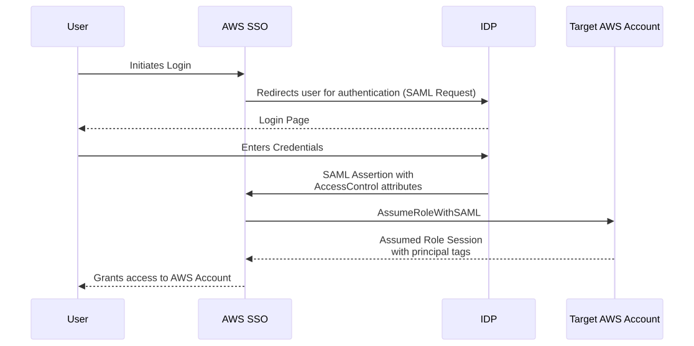
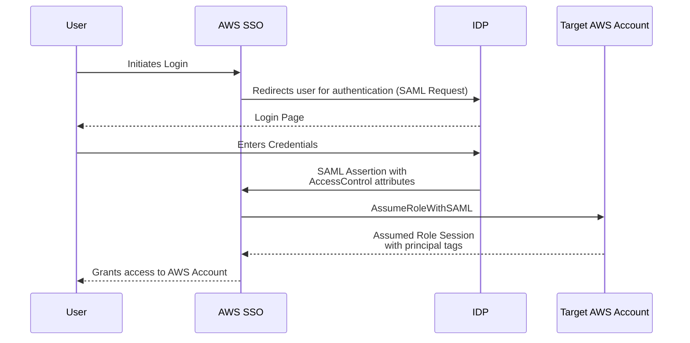
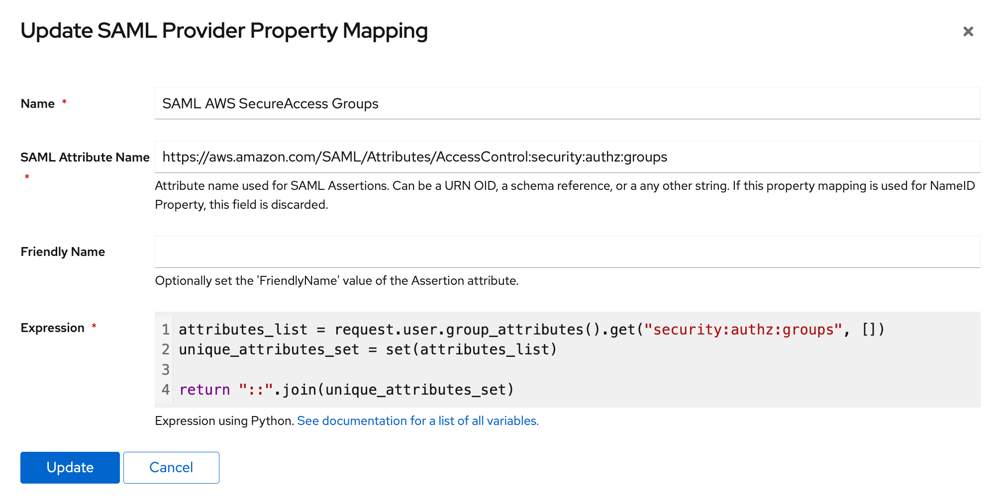

## Intro
Most security teams want to limit developers' access to only their own resources in AWS. This is especially true for databases.
Previously, we solved this by creating multiple IAM roles, where users would choose the appropriate role to access specific cloud resources.
This works fine on a small scale, but doesn't scale beyond 3+ roles or teams.

Instead, we can use attribute-based access control (ABAC) to compare user properties with resource tags and determine access permissions.

I decided to write this article because I couldn't find a guide on how to do it. The [AWS Doc][1] is quite limited.

## AWS SAML vs AWS SSO

The AWS SAML auth provider linked with an IAM role has many more capabilities for SAML attributes and is [well-documented][2].

AWS SSO has limited functionality and does not support:
- Multi-valued SAML attributes
- `TransitiveTagKeys`

To pass attributes from an IdP via SAML to an assumed session's `PrincipalTag`, you can use only `https://aws.amazon.com/SAML/Attributes/AccessControl:<name>` with string-typed values up to 460 bytes long.

We use `::` as a separator for concatenating multiple values and `:` as a logical separator within individual entities.

## Schema

Authentication and authorization flow:






## IdP

To configure role attributes, we'll use Authentik (our SAML identity provider) that's already configured with AWS SSO.
The first step is to create the `Property Mappings`.



```python
attributes_list = request.user.group_attributes().get("security:authz:groups", [])
unique_attributes_set = set(attributes_list)

return "::".join(unique_attributes_set)
```

This code collects properties from the user's assigned groups, deduplicates them, and concatenates the results using `::`.

After configuring the property mappings, log out of AWS SSO and log back in to test the configuration.



You should see a new record for `AssumeRoleWithSAML` in your CloudTrail events. The `principalTags` from this event can be used in IAM conditions.

```json
{
  "requestParameters": {
      "sAMLAssertionID": "_550580ed-e988-46da-bebd-38d9bcd1f156",
      "roleSessionName": "XXXXX@qdo.ee",
      "principalTags": {
          "security:authz:dbusers": "beta:developer-iam::prod-us:developer-iam",
          "security:authz:groups": "beta:pfr:project::any:rpsql:project"
      }
}
```


### IAM

As mentioned in the beginning, to limit developers to certain resources in their domain of responsibility, we'll match the passed `aws:PrincipalTag/security:authz:groups` with a regexp formed from the `ResourceTag` assigned to the database:

```
    condition {
      test = "StringLike"
      values = flatten([
        [for env in var.allowed_environment : "*${env}:$${ssm:ResourceTag/security:access:st}:$${ssm:ResourceTag/security:access:group}*"],
        ["*any:$${ssm:ResourceTag/security:access:st}:$${ssm:ResourceTag/security:access:group}*"]
      ])

      variable = "aws:PrincipalTag/security:authz:groups"
    }
```

[1]: https://docs.aws.amazon.com/singlesignon/latest/userguide/attributesforaccesscontrol.html
[2]: https://docs.aws.amazon.com/IAM/latest/UserGuide/id_roles_providers_create_saml_assertions.html
