## The Constraint

SIP and RTP care about address ownership.

With SIP, the address in the packet is not enough. The application also writes addresses into SIP headers and SDP. RTP then uses those addresses for media. If the application advertises one `IP:port` tuple and the peer sees packets arriving from another one, the call may still signal successfully while media goes nowhere.

That was the constraint I had to design around: a Kubernetes pod needed a stable public identity, and the UDP source port had to remain the port the application advertised.

The examples below are sanitized. Names are generic, addresses are placeholders, and the code is intentionally written as pseudocode rather than something to copy into production.

---

## The Packet That Broke the Assumption

The first failure was not subtle. A pod sent SIP from a private address, Kubernetes or the VPC rewrote the packet on the way out, and the remote side tried to send media to the address found in SDP.

Signaling could still limp along because replies followed the NAT mapping. RTP did not have that luxury.



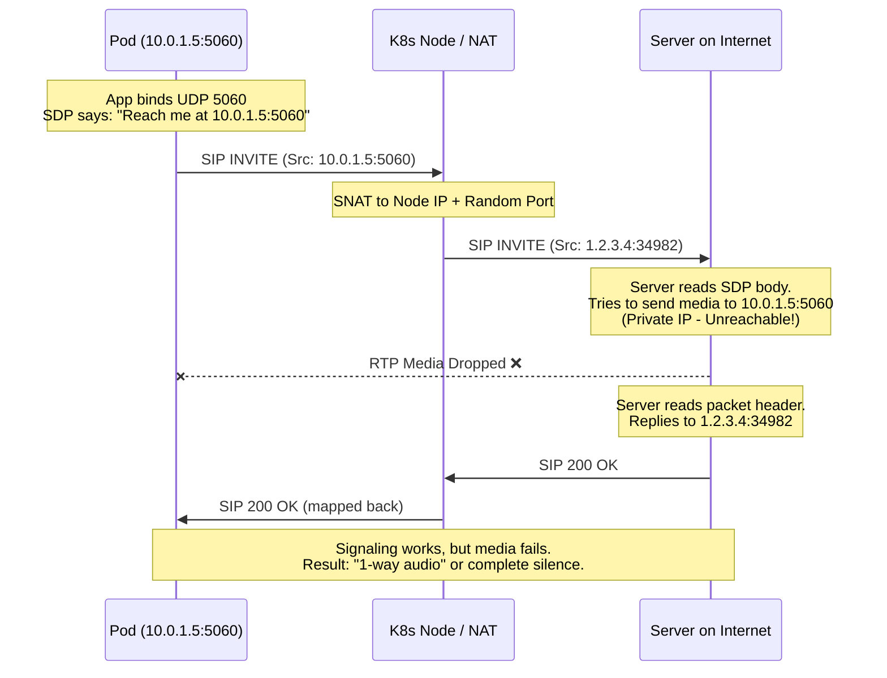


The important part is not SIP syntax. The important part is that a middlebox changed the network tuple after the application had already told the peer what tuple to use.

Once that happens, there are only three broad options:

1. Make the application aware of the translated address.
2. Relay the media through something that owns a reachable address.
3. Stop translating the media path.

For this workload, I wanted option 3.

---

## Why NAT Keeps Showing Up

UDP does not establish a connection in the way TCP does. A NAT device can create a temporary mapping after an outbound packet, but that mapping is usually scoped to the peer that was contacted. With restrictive or symmetric NAT, the translated port may change per destination.

When both sides are behind NAT, direct communication needs help.



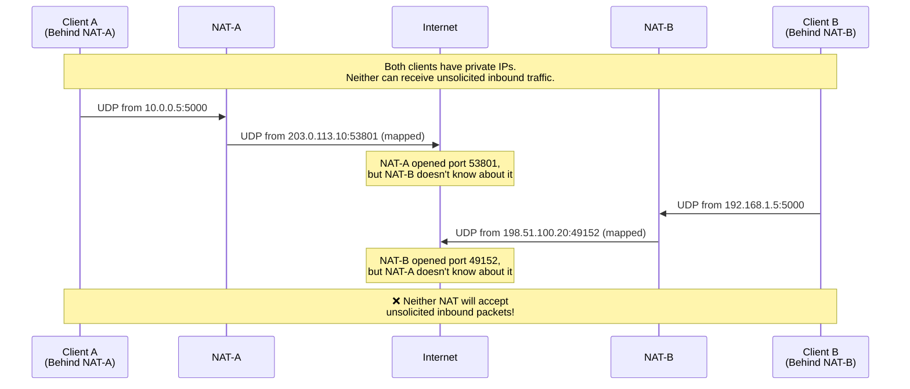


WebRTC deals with this using [ICE][rfc-ice]. [STUN][rfc-stun] tells a client what address it appears to have from outside. [TURN][rfc-turn] gives up on direct media and relays it.



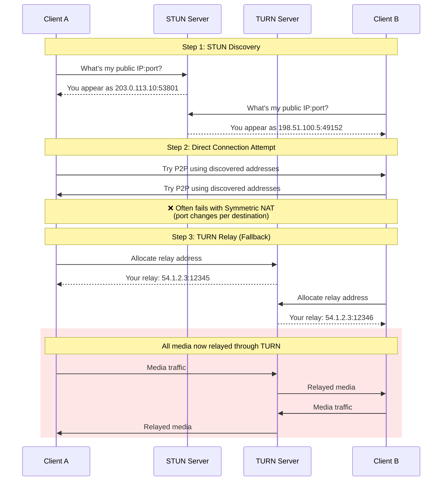


TURN is the correct fallback for many browser-to-browser cases, but it is not free. It adds relay latency, consumes relay bandwidth, and moves media capacity into a shared service.

Core [SIP][rfc-sip] does not solve NAT by itself. There are SIP-related NAT traversal tools, including symmetric response routing with `rport` ([RFC 3581][rfc-rport]), SIP Outbound ([RFC 5626][rfc-sip-outbound]), and ICE usage in SDP/SIP flows ([RFC 8839][rfc-ice-sdp], [RFC 8840][rfc-trickle-ice-sip]). Session Border Controllers can also hide a lot of complexity, but that still means adding a media-aware intermediary. For a server-side SIP/RTP workload that should own its media path, I needed the pod to own the reachable address.

---

## EKS Added More Translation

The default EKS shape made the problem worse. A pod in a private subnet could cross kube-proxy rules, the node stack, and a NAT Gateway before the packet reached the Internet.



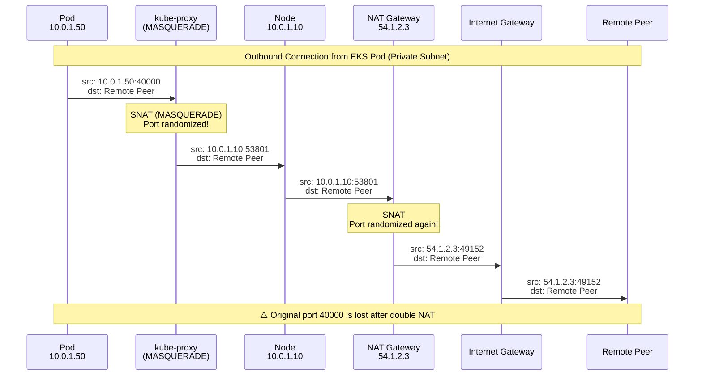


That flow is fine for traffic where only the remote service needs to be reachable. It is bad for a media server that has already advertised `203.0.113.50:40000` and expects the peer to send RTP there.

Bare EC2 instances in public subnets avoid most of this. That is why telecom stacks often end up there. The tradeoff is operational: slower rollout, less bin-packing, more custom lifecycle work, and less of the Kubernetes machinery that teams already use.

So the question became narrower: can a pod keep Kubernetes for lifecycle, but bypass Kubernetes for the media address?

---

## Wrong Assumption 1: Public Nodes and hostNetwork

The first idea was to put a node group in public subnets and run the workload with `hostNetwork: true`.

The assumption was simple:

1. The pod binds UDP `40000`.
2. The node has a public IP.
3. The peer sends packets to `<node-public-ip>:40000`.

The measurement said otherwise.

```bash
# Test pod using the host network namespace
kubectl run udp-test --image=alpine --restart=Never \
  --overrides='{"spec":{"hostNetwork":true}}' \
  -- sh -c "apk add socat && socat -v UDP-LISTEN:40000,fork EXEC:'/bin/cat'"

# Look at conntrack state
sudo conntrack -L -p udp | grep 40000

# Look for source NAT rules
sudo iptables-save | grep -E 'MASQUERADE|random-fully'
```

The useful observation was the `--random-fully` MASQUERADE behavior in the path. Even when the packet originated from the host network namespace, the source port could still be rewritten by rules installed for Kubernetes service traffic and hairpin behavior.

`hostNetwork` also had a design problem independent of that measurement:

| Problem | Why it mattered |
|---------|-----------------|
| Port collisions | Multiple pods cannot all bind `5060` on the same node |
| Shared identity | The node IP is not a per-pod identity |
| Scheduling coupling | Placement decides external identity |
| Security boundary | The pod shares the host network namespace |

The correction was to stop trying to make the node IP behave like a pod IP.

---

## Wrong Assumption 2: Put an NLB in Front

The second idea was a Network Load Balancer with UDP listeners.

That solved reachability. It did not solve identity.

The main issue was not simply that UDP stickiness can be awkward. The real problem was that the application still did not own the address it needed to advertise.

NLBs do support UDP listeners. The difference is what the protocol gives the load balancer to work with. For TCP, a connection has a clear lifetime, and the load balancer can keep that connection associated with one target. For UDP, there is no connection, but it is still not round-robin per packet: the NLB hashes the flow tuple: protocol, source IP, source port, destination IP, and destination port ([AWS docs][aws-nlb-routing]).

Packets with the same UDP tuple should keep landing on the same target while that flow is active. If the client changes source port, the packet reaches a different NLB IP, or the UDP flow sits idle past the NLB timeout, the next packet is a new flow and can be hashed to a different target. AWS documents the UDP flow idle timeout as 120 seconds and not configurable ([AWS docs][aws-nlb-idle-timeout]).

That can work for a simple UDP request/response service where each flow is self-contained. SIP/RTP is not that shape. SIP signaling may be one flow, while RTP media uses separate ports negotiated in SDP. Those media flows can hash independently from signaling.

There is also a practical listener problem: RTP usually needs a port range. An NLB listener is configured for a specific protocol and port, not "whatever UDP port this pod negotiated in SDP". You can create many listeners, but that turns the RTP range into load balancer configuration, and Network Load Balancers have finite listener quotas ([AWS quotas][aws-nlb-quotas]). A media range of thousands of ports does not map cleanly to NLB listeners and target groups.

The workload still has to advertise an address and port that the peer can send media to directly. The NLB address is reachable, but it is not the pod's own identity, and it is not a good representation of the pod's RTP port range.

With an NLB:

1. The peer sends traffic to the NLB address.
2. The pod receives traffic through a load-balanced path.
3. The pod still has to decide what IP to put into SIP headers and SDP.
4. Replies must return through a path that keeps the peer seeing the advertised address.

If the pod replies directly, the peer sees a different source address. If the pod always replies through the NLB, the media path is no longer owned by the pod and the design becomes tightly coupled to load balancer behavior.

That can be fine when the load balancer is the service identity. For SIP/RTP, where the workload needs to advertise and source the same tuple, it is the wrong abstraction.

---

## The Shape That Matched the Protocol

The design that held up was to treat the pod like a small VM for media traffic:

1. Keep `eth0` for normal Kubernetes traffic.
2. Add `net1` with Multus for SIP/RTP.
3. Put `net1` in the public-subnet path.
4. Associate an Elastic IP with the private IP used by `net1`.
5. Force packets sourced from that identity to leave via `net1`.



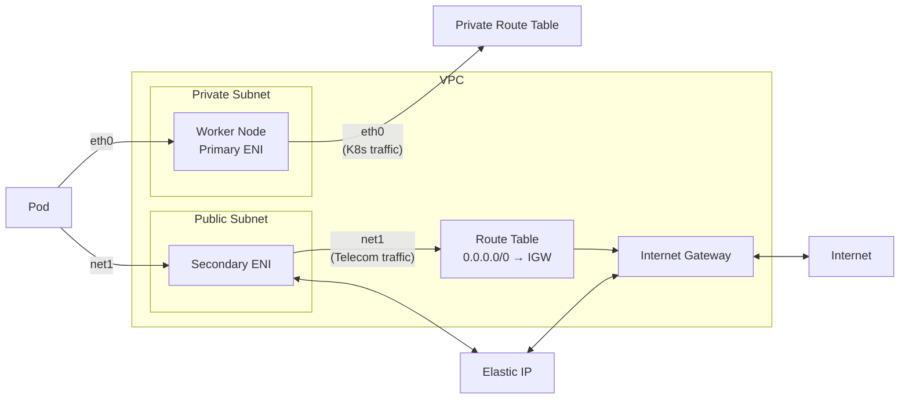


This keeps the control plane boring. Kubernetes API traffic, probes, logs, and metrics stay on `eth0`. Media traffic gets a separate interface, route table, and public identity.

---

## Multus Gave Me the Second Interface

[Multus][eks-multus-docs] is a CNI meta-plugin. It does not replace the default pod network; it asks another CNI plugin to attach extra interfaces.




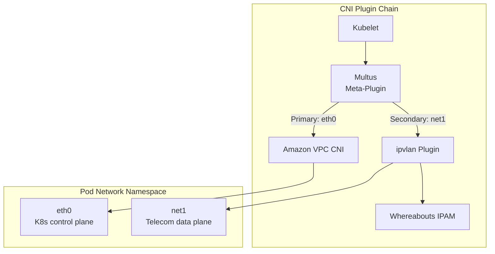


For the secondary interface I evaluated two practical modes:

| Mode | What it gives you | Cost |
|------|-------------------|------|
| `ipvlan` | Multiple pod interfaces over the host ENI | Needs careful IPAM and routing |
| `host-device` | One physical or virtual device moved into the pod | Lower density; scheduling is harder |

`ipvlan` was the better default. It gave pod density and kept scheduling practical. `host-device` still makes sense when the network device itself is the unit of isolation, for example with SR-IOV-style setups.

The NetworkAttachmentDefinition is small, but every value matters:

```yaml
apiVersion: "k8s.cni.cncf.io/v1"
kind: NetworkAttachmentDefinition
metadata:
  name: telecom-net-az1
  namespace: kube-system
spec:
  config: |
    {
      "cniVersion": "0.3.1",
      "type": "ipvlan",
      "master": "eth1",
      "mode": "l2",
      "ipam": {
        "type": "whereabouts",
        "range": "10.0.2.128/26",
        "gateway": "10.0.2.1"
      }
    }
```

And a pod opts in explicitly:

```yaml
metadata:
  annotations:
    k8s.v1.cni.cncf.io/networks: telecom-net-az1
```

---

## IPAM Was a Real Part of the Design

Whereabouts can assign an address to `net1`, but AWS VPC DHCP also assigns addresses from the subnet. If both systems believe they own the same range, sooner or later they can pick the same address.




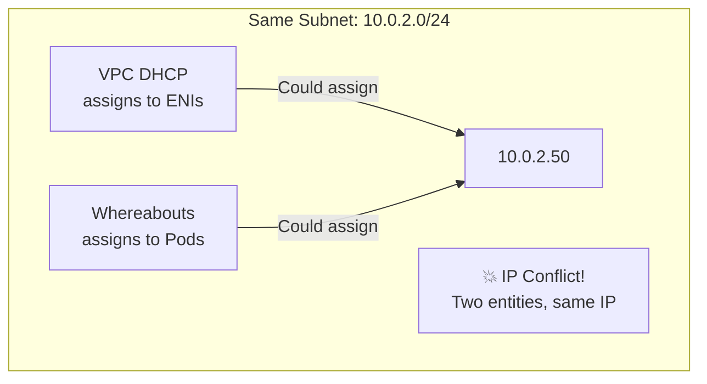


The fix was to reserve the pod range at the subnet level with a [subnet CIDR reservation][aws-subnet-cidr-reservation] and make Whereabouts use exactly that range.



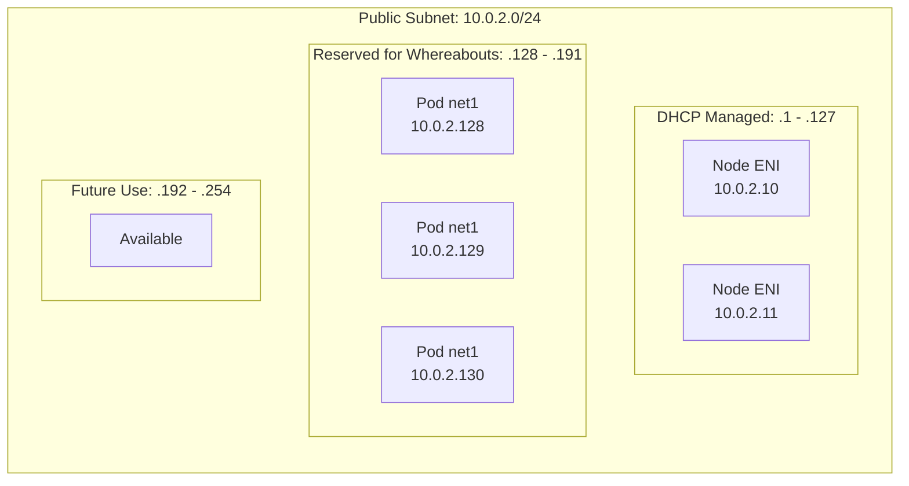


In Terraform, the important bit is the matching pair:

```hcl
resource "aws_ec2_subnet_cidr_reservation" "whereabouts_az1" {
  cidr_block       = "10.0.2.128/26"
  reservation_type = "explicit"
  subnet_id        = aws_subnet.public_az1.id
  description      = "Reserved for Multus/Whereabouts pod IPs"
}
```

```yaml
ipam:
  type: whereabouts
  range: "10.0.2.128/26"
  exclude:
    - "10.0.2.128/30"
```

One easy trap: Whereabouts assigning `10.0.2.128` inside the pod is not enough. AWS must also know that this private IP belongs to the ENI before an Elastic IP can be associated with it; EC2 treats these as [secondary private IPs on the network interface][aws-secondary-private-ips]. In practice that means the controller or sidecar must reconcile both worlds:

1. Observe the `net1` address assigned by Whereabouts.
2. Ensure the private IP is registered on the right ENI.
3. Only then associate the Elastic IP with that private IP.

If step 2 is missing, the design looks right from inside Linux and wrong from the VPC control plane.

---

## An Elastic IP Is Only Half the Path

AWS Elastic IPs are a 1:1 NAT mapping at the Internet Gateway. An EIP can be [associated with a private IP on a network interface][aws-associate-address], and incoming Internet traffic to the public IP is translated to that ENI private IP.



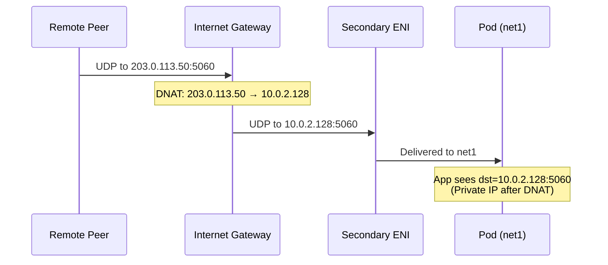


The return packet has to leave through the same public path. If Linux sends it through `eth0`, the packet is either dropped or exits through a path that does not match the advertised address.



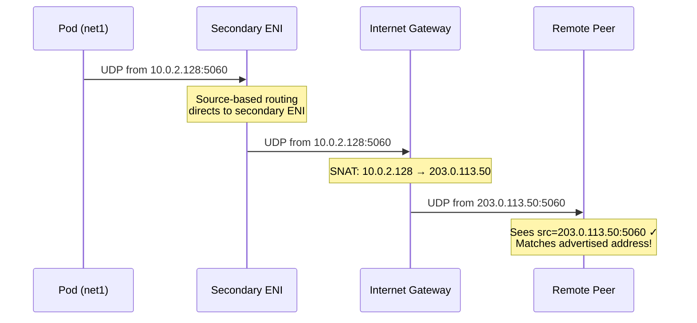


The sidecar/controller logic is therefore not "allocate an EIP" and stop. It has to reconcile address ownership, association, routing, and cleanup.

I prefer to describe that logic like this:

```go
func reconcilePublicIdentity(ctx context.Context, pod Pod) error {
    privateIP := ipv4Address("net1")

    eniID := ensurePrivateIPOnSecondaryENI(ctx, privateIP)
    publicIP := claimElasticIP(ctx, "telecom-pool")

    associateElasticIP(ctx, publicIP, eniID, privateIP)
    replaceVPCRoutes(ctx, publicIP+"/32", eniID)

    addLocalAddress("net1", publicIP+"/32")
    addPolicyRoute("from "+privateIP+"/32", "telecom")
    addPolicyRoute("from "+publicIP+"/32", "telecom")

    writeFile("/shared/public-ip", publicIP)
    return nil
}
```

That is deliberately incomplete. A real implementation needs idempotency, retries, tag-based ownership, stale route cleanup, race handling, and a safe answer for "what if the pod dies before cleanup runs?"

---

## Replies Must Leave Through net1

Linux chooses routes primarily by destination. A packet received on `net1` does not automatically reply through `net1`.



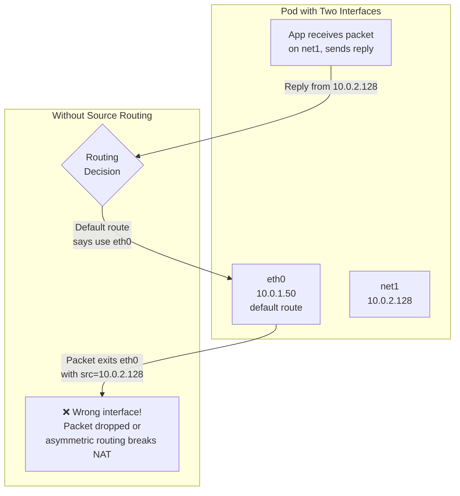


Policy routing is the correction:

```bash
echo "200 telecom" >> /etc/iproute2/rt_tables

ip route add 10.0.2.0/24 dev net1 src 10.0.2.128 table telecom
ip route add default via 10.0.2.1 dev net1 table telecom

ip rule add from 10.0.2.128/32 table telecom priority 100
```



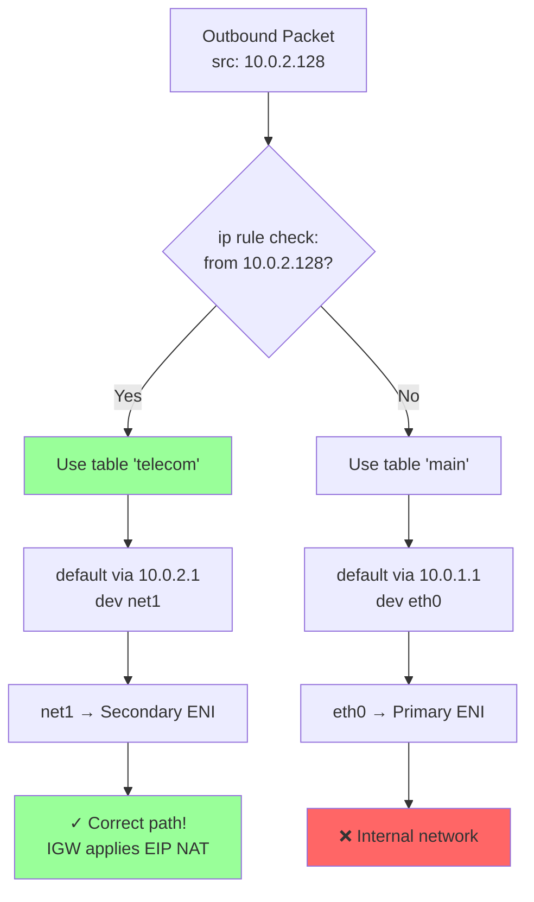


Reverse path filtering is another quiet failure mode. Strict `rp_filter` can drop packets in setups where the kernel's best return path does not match the ingress interface during startup or failover.

```bash
sysctl -w net.ipv4.conf.all.rp_filter=2
sysctl -w net.ipv4.conf.net1.rp_filter=2
```

And on the secondary ENI, source/destination checks have to be disabled:

```bash
aws ec2 modify-network-interface-attribute \
  --network-interface-id eni-xxx \
  --no-source-dest-check
```

The rule I ended up using was this:

> The pod may have two interfaces, but the advertised media identity gets exactly one return path.

---

## The tcpdump Detail I Did Not Expect

After the public path worked, the next surprise came from internal traffic.

Internet-originated traffic to an EIP is DNATed by the Internet Gateway. By the time it reaches the pod, the destination is the private IP:

```bash
tcpdump -i net1 udp port 5060
# 198.51.100.50.5060 > 10.0.2.128.5060: UDP
#                       private IP after IGW DNAT
```

But VPC-internal traffic sent through a `/32` route to the public IP can arrive with the public IP still as the destination:

```bash
tcpdump -i net1 udp port 5060
# 10.0.1.100.5060 > 203.0.113.50.5060: UDP
#                   public IP, no IGW DNAT
```

Without an explicit VPC route, the internal path is not reliable:



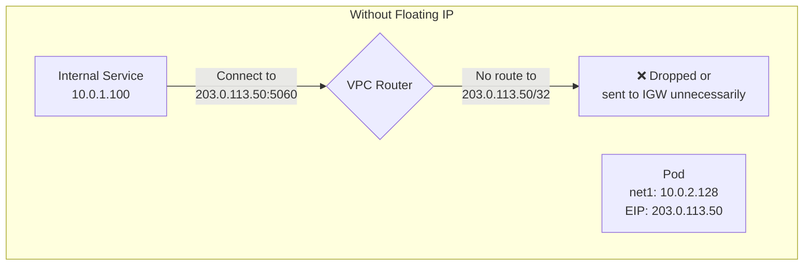


With a floating `/32` route, the VPC can deliver traffic directly to the ENI:



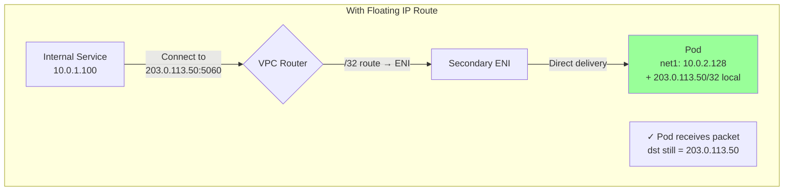


That leaves an application decision:

| Option | Behavior | Tradeoff |
|--------|----------|----------|
| Bind `0.0.0.0` | Accept either destination address | Simple, broad listener |
| Bind both IPs | Explicit sockets for private and public IPs | More application logic |
| Local DNAT | Normalize public destination to private IP | More iptables state |

For a service that only expects traffic on `net1`, local DNAT can be acceptable:

```bash
iptables -t nat -A PREROUTING -i net1 \
  -d 203.0.113.50 -j DNAT --to-destination 10.0.2.128
```

The main point is to notice the difference. Otherwise you debug the wrong layer.

---

## Lifecycle Is Part of the Design

Creating routes and EIP associations at pod startup means cleanup has to be a first-class path, not a best-effort shell trap.

[Kubernetes native sidecars][k8s-sidecars] help because a restartable init container can start before the main container and terminate after it. That makes it a reasonable place to hold the public identity for the lifetime of the pod.



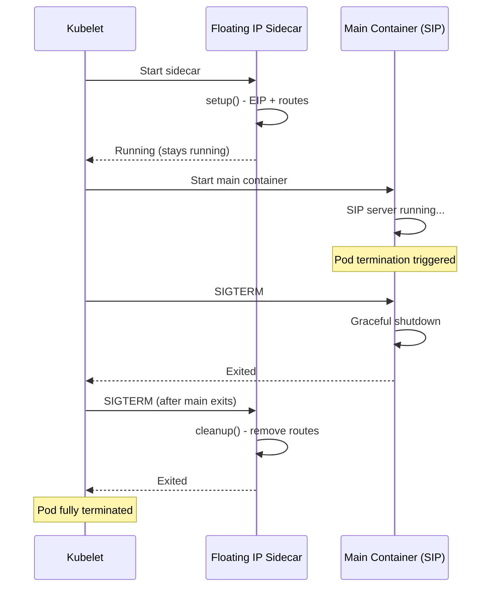


Version detail matters here. Native sidecars were introduced behind a feature gate before becoming a stable API. On current Kubernetes, the pattern is:

```yaml
spec:
  initContainers:
  - name: floating-ip-manager
    image: my-registry/floating-ip-manager:latest
    restartPolicy: Always
    securityContext:
      capabilities:
        add: ["NET_ADMIN"]
```

I would still not rely only on pod shutdown. Node termination, forced deletion, control-plane interruptions, and cloud API timeouts can all leave stale routes or associated EIPs. A separate reconciler should be able to find resources by tag and clean up anything whose owning pod no longer exists.

The IAM policy should also be scoped as far as the implementation allows. A tutorial often shows `Resource: "*"`, but the real policy should use tag conditions and only the route tables, ENIs, and EIPs this controller is allowed to manage.

---

## Node Bootstrap Still Matters

The secondary ENI has to be attached, ignored by the VPC CNI, and ready before Multus starts scheduling workloads that depend on it.

The node-level work was roughly:

```bash
# Discover instance identity using IMDSv2.
TOKEN="$(curl -s -X PUT http://169.254.169.254/latest/api/token \
  -H 'X-aws-ec2-metadata-token-ttl-seconds: 21600')"

INSTANCE_ID="$(curl -s -H "X-aws-ec2-metadata-token: $TOKEN" \
  http://169.254.169.254/latest/meta-data/instance-id)"
REGION="$(curl -s -H "X-aws-ec2-metadata-token: $TOKEN" \
  http://169.254.169.254/latest/meta-data/placement/region)"

# Find the secondary ENI attached for the media path.
SECONDARY_ENI="$(aws ec2 describe-network-interfaces \
  --region "$REGION" \
  --filters "Name=attachment.instance-id,Values=$INSTANCE_ID" \
            "Name=tag:Purpose,Values=multus-telecom" \
  --query 'NetworkInterfaces[0].NetworkInterfaceId' \
  --output text)"

aws ec2 modify-network-interface-attribute \
  --region "$REGION" \
  --network-interface-id "$SECONDARY_ENI" \
  --no-source-dest-check

aws ec2 create-tags \
  --region "$REGION" \
  --resources "$SECONDARY_ENI" \
  --tags Key=node.k8s.amazonaws.com/no_manage,Value=true
```

I also prefer to taint these nodes until the Multus config is present. Otherwise a pod can land on a node that looks schedulable but cannot attach `net1` yet.

```yaml
taints:
- key: multus-not-ready
  effect: NoSchedule
```

A tiny untainter DaemonSet can remove the taint after `/etc/cni/net.d/00-multus.conf` exists. The exact mechanism is less important than the invariant: do not schedule media pods before the second network path exists.

---

## What I Would Validate Before Trusting It

I would not call this design working until these checks pass on a fresh pod:

```bash
ip addr show net1
ip rule
ip route show table telecom
ip route get 198.51.100.50 from 10.0.2.128
```

From AWS:

```bash
aws ec2 describe-network-interfaces \
  --filters "Name=addresses.private-ip-address,Values=10.0.2.128"

aws ec2 describe-addresses \
  --filters "Name=public-ip,Values=203.0.113.50"

aws ec2 describe-route-tables \
  --filters "Name=route.destination-cidr-block,Values=203.0.113.50/32"
```

From the wire:

```bash
tcpdump -ni net1 udp port 5060
conntrack -L -p udp | grep 5060
```

And after deletion:

```bash
kubectl delete pod sip-server

# Then verify:
# - the EIP is disassociated or returned to the expected pool
# - /32 routes are gone or point to the new owner
# - no stale private IP remains assigned to the ENI
```

If cleanup only works in the happy path, it is not cleanup. It is a demo.

---

## What This Design Commits You To

This design gives a pod a stable public media identity without moving the whole workload back to bare EC2. It also makes network identity part of workload lifecycle.

The useful properties are:

- SIP/RTP can advertise an address that matches the packet path.
- Multiple workloads can run in the same cluster without sharing a node IP.
- Kubernetes still owns rollout, placement, and normal service operations.
- Media traffic is separated from normal pod traffic.

The constraints are now explicit:

- Capacity is bounded by EIPs, public IPv4 cost, subnet reservations, and ENI private IP quota before CPU or memory may become relevant.
- The controller needs cloud API permissions, careful tagging, and ownership checks.
- Stale routes, EIP associations, and secondary private IP assignments need reconciliation.
- Public UDP exposure needs security groups, monitoring, and abuse handling.
- Multi-AZ placement must match the selected NAD, subnet, ENI, and route tables.

For SIP/RTP workloads that need stable public tuples, this is the Kubernetes design that matched the protocol constraint instead of hiding it behind another translation layer.

---

## References

- [Amazon EKS Multus Support][eks-multus]
- [EKS Multus Installation Guide][eks-multus-guide]
- [Amazon EKS Multus User Guide][eks-multus-docs]
- [Automated IP Management for Multus Pods][ip-management-article]
- [Whereabouts IPAM][whereabouts]
- [Floating Virtual IP on EKS][floating-ip]
- [GCP Multus with ipvlan][gcp-multus]
- [ICE: RFC 8445][rfc-ice]
- [STUN: RFC 8489][rfc-stun]
- [TURN: RFC 8656][rfc-turn]
- [SIP: RFC 3261][rfc-sip]
- [SIP rport: RFC 3581][rfc-rport]
- [SIP Outbound: RFC 5626][rfc-sip-outbound]
- [ICE SDP usage: RFC 8839][rfc-ice-sdp]
- [Trickle ICE for SIP: RFC 8840][rfc-trickle-ice-sip]
- [Kubernetes Sidecar Containers][k8s-sidecars]
- [AWS Subnet CIDR Reservations][aws-subnet-cidr-reservation]
- [AWS EC2 Secondary Private IPs][aws-secondary-private-ips]
- [AWS EC2 AssociateAddress][aws-associate-address]
- [AWS Network Load Balancer routing][aws-nlb-routing]
- [AWS Network Load Balancer idle timeout][aws-nlb-idle-timeout]
- [AWS Network Load Balancer quotas][aws-nlb-quotas]

[eks-multus]: https://aws.amazon.com/blogs/containers/amazon-eks-now-supports-multus-cni/
[eks-multus-guide]: https://github.com/aws-samples/eks-install-guide-for-multus
[eks-multus-docs]: https://docs.aws.amazon.com/eks/latest/userguide/pod-multus.html
[ip-management-article]: https://aws.amazon.com/blogs/industries/automated-ip-address-management-for-multus-workers-and-pods/
[whereabouts]: https://github.com/k8snetworkplumbingwg/whereabouts
[floating-ip]: https://aws.amazon.com/blogs/industries/automated-application-failover-across-availability-zones-with-floating-virtual-ip-on-amazon-eks/
[gcp-multus]: https://cloud.google.com/kubernetes-engine/docs/concepts/multus-ipvlan-whereabouts
[rfc-ice]: https://www.rfc-editor.org/rfc/rfc8445
[rfc-stun]: https://www.rfc-editor.org/rfc/rfc8489
[rfc-turn]: https://www.rfc-editor.org/rfc/rfc8656
[rfc-sip]: https://www.rfc-editor.org/rfc/rfc3261
[rfc-rport]: https://www.rfc-editor.org/rfc/rfc3581
[rfc-sip-outbound]: https://www.rfc-editor.org/rfc/rfc5626
[rfc-ice-sdp]: https://www.rfc-editor.org/rfc/rfc8839
[rfc-trickle-ice-sip]: https://www.rfc-editor.org/rfc/rfc8840
[k8s-sidecars]: https://kubernetes.io/docs/concepts/workloads/pods/sidecar-containers/
[aws-subnet-cidr-reservation]: https://docs.aws.amazon.com/vpc/latest/userguide/subnet-cidr-reservation.html
[aws-secondary-private-ips]: https://docs.aws.amazon.com/AWSEC2/latest/UserGuide/instance-secondary-ip-addresses.html
[aws-associate-address]: https://docs.aws.amazon.com/AWSEC2/latest/APIReference/API_AssociateAddress.html
[aws-nlb-routing]: https://docs.aws.amazon.com/elasticloadbalancing/latest/network/introduction.html
[aws-nlb-idle-timeout]: https://docs.aws.amazon.com/elasticloadbalancing/latest/network/network-load-balancers.html#connection-idle-timeout
[aws-nlb-quotas]: https://docs.aws.amazon.com/elasticloadbalancing/latest/network/load-balancer-limits.html
