## Introduction

One day I realized a truth I had danced around for a while: if your RTP/SIP stack doesn't control its public IP and source UDP ports end-to-end, the network will betray you. Double NATs, port remapping, and asymmetric routing—any of these can break flows in subtle, heartbreaking ways.

I was tasked with running telecom workloads (SIP signaling and WebRTC media) on Amazon EKS. I needed a Kubernetes-native way for pods to own their public identities with zero port translation.

This is the story of how I got there: the false starts, the traps I fell into, and the architecture I ship today using **Multus CNI**.

---

## The Problem: Why NAT Breaks Real-Time UDP

In a standard web application, Kubernetes Services and Ingress controllers hide the complexity of networking. HTTP doesn't care if its source port changes—requests go out, responses come back, and the protocol is happy.

Telecom protocols are fundamentally different. They encode network addresses directly inside the application-layer payload:

- **SIP** writes the Contact IP and port in headers and the SDP (Session Description Protocol) body
- **WebRTC** exchanges ICE candidates containing exact `IP:Port` tuples
- **RTP** media streams expect bidirectional connectivity on specific ports

If your application advertises `203.0.113.10:40000` in the signaling payload, the peer expects to reach *that exact tuple*. The moment a middlebox rewrites your source port from `40000` to `53801`, the signaling payload and packet headers no longer match—and everything breaks.

### The Double-NAT Problem for UDP

Here's the fundamental challenge. With port remapping, the only way to "open" an inbound port through NAT is to first send an outbound packet. The NAT creates a mapping and will accept reply traffic on that mapped port—but only from the specific destination you contacted.

This creates an impossible situation when *both* endpoints are behind NAT:

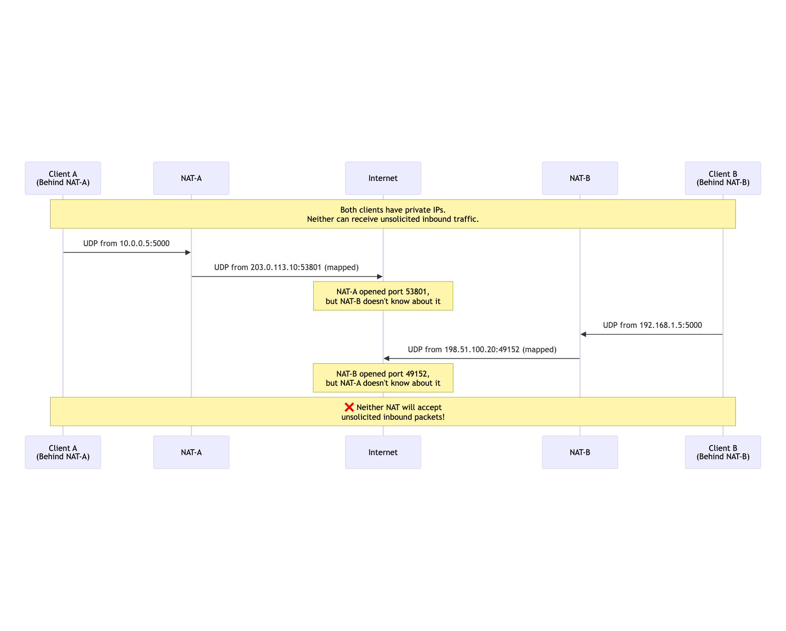


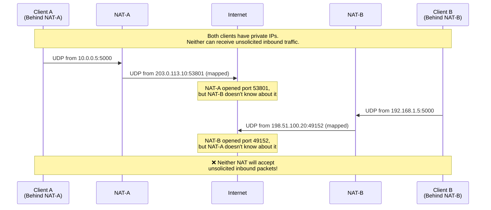
```mermaid
sequenceDiagram
    participant ClientA as Client A<br/>(Behind NAT-A)
    participant NAT_A as NAT-A
    participant Internet as Internet
    participant NAT_B as NAT-B
    participant ClientB as Client B<br/>(Behind NAT-B)
    
    Note over ClientA,ClientB: Both clients have private IPs.<br/>Neither can receive unsolicited inbound traffic.
    
    ClientA->>NAT_A: UDP from 10.0.0.5:5000
    NAT_A->>Internet: UDP from 203.0.113.10:53801 (mapped)
    Note over Internet: NAT-A opened port 53801,<br/>but NAT-B doesn't know about it
    
    ClientB->>NAT_B: UDP from 192.168.1.5:5000  
    NAT_B->>Internet: UDP from 198.51.100.20:49152 (mapped)
    Note over Internet: NAT-B opened port 49152,<br/>but NAT-A doesn't know about it
    
    Note over ClientA,ClientB: ❌ Neither NAT will accept<br/>unsolicited inbound packets!
```


Both sides have "opened" ports, but neither knows the other's mapped address. Without a rendezvous mechanism, direct communication is impossible.

### The 1-Way Audio Problem

Here's what happens in practice when Kubernetes networking interferes with SIP:

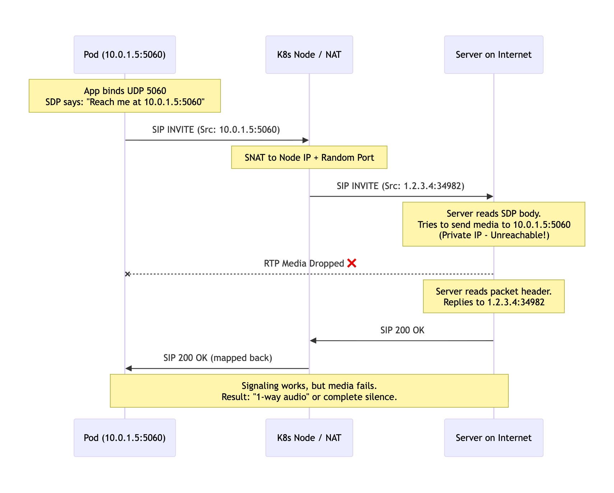


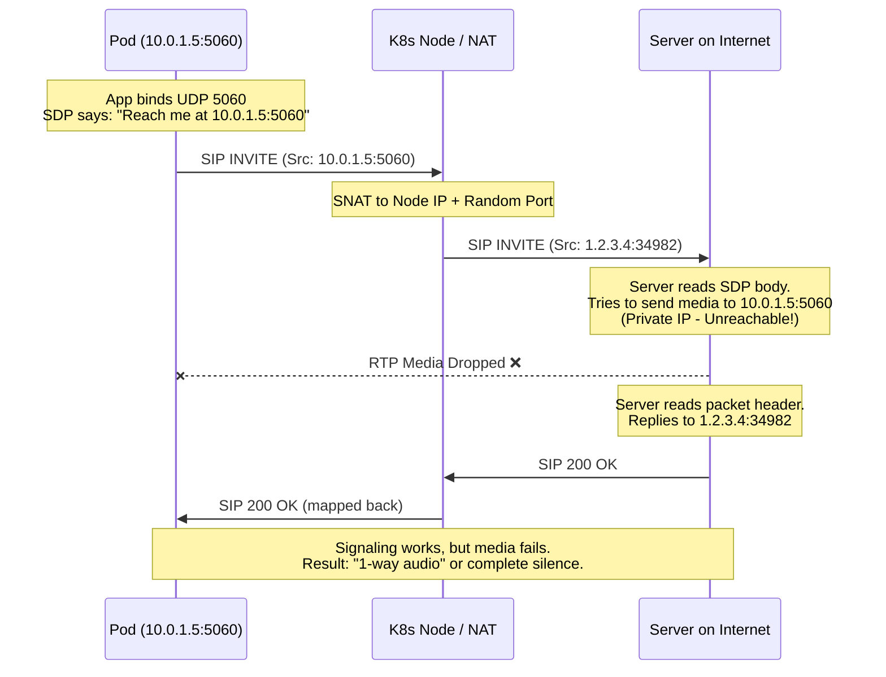
```mermaid
sequenceDiagram
    participant P as Pod (10.0.1.5:5060)
    participant N as K8s Node / NAT
    participant I as Server on Internet
    
    Note over P: App binds UDP 5060<br/>SDP says: "Reach me at 10.0.1.5:5060"
    
    P->>N: SIP INVITE (Src: 10.0.1.5:5060)
    Note over N: SNAT to Node IP + Random Port
    N->>I: SIP INVITE (Src: 1.2.3.4:34982)
    
    Note over I: Server reads SDP body.<br/>Tries to send media to 10.0.1.5:5060<br/>(Private IP - Unreachable!)
    I--xP: RTP Media Dropped ❌
    
    Note over I: Server reads packet header.<br/>Replies to 1.2.3.4:34982
    I->>N: SIP 200 OK
    N->>P: SIP 200 OK (mapped back)
    
    Note over P,I: Signaling works, but media fails.<br/>Result: "1-way audio" or complete silence.
```


The signaling might succeed because responses follow the established NAT mapping. But RTP media streams require *generic* open ports that can receive from any source—not just established flows.

### How WebRTC Addresses This

WebRTC uses ICE (Interactive Connectivity Establishment) with STUN and TURN servers:

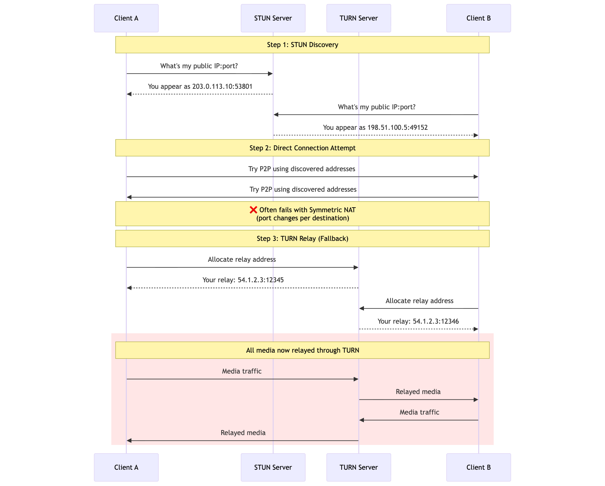


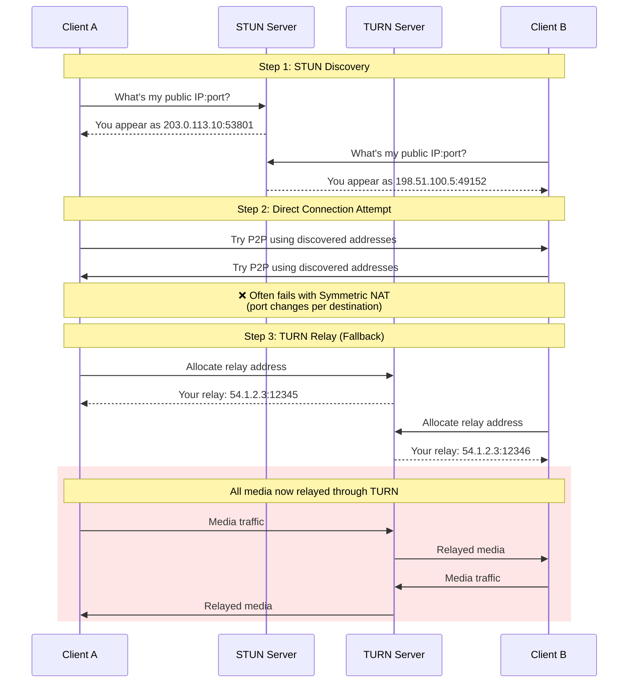
```mermaid
sequenceDiagram
    participant CA as Client A
    participant STUN as STUN Server
    participant TURN as TURN Server
    participant CB as Client B

    Note over CA,CB: Step 1: STUN Discovery
    
    CA->>STUN: What's my public IP:port?
    STUN-->>CA: You appear as 203.0.113.10:53801
    
    CB->>STUN: What's my public IP:port?
    STUN-->>CB: You appear as 198.51.100.5:49152
    
    Note over CA,CB: Step 2: Direct Connection Attempt
    
    CA->>CB: Try P2P using discovered addresses
    CB->>CA: Try P2P using discovered addresses
    
    Note over CA,CB: ❌ Often fails with Symmetric NAT<br/>(port changes per destination)
    
    Note over CA,CB: Step 3: TURN Relay (Fallback)
    
    CA->>TURN: Allocate relay address
    TURN-->>CA: Your relay: 54.1.2.3:12345
    
    CB->>TURN: Allocate relay address
    TURN-->>CB: Your relay: 54.1.2.3:12346
    
    rect rgb(255, 230, 230)
        Note over CA,CB: All media now relayed through TURN
        CA->>TURN: Media traffic
        TURN->>CB: Relayed media
        CB->>TURN: Media traffic
        TURN->>CA: Relayed media
    end
```


The problem? **TURN relaying eliminates most benefits of peer-to-peer communication.** All media flows through the relay server, adding 50-200ms of latency, increasing bandwidth costs (you pay for relay server egress), and creating a single point of failure. Industry data suggests 10-30% of WebRTC sessions require TURN due to restrictive NAT configurations.

### Why SIP Is Even Harder

SIP was designed in the 1990s before NAT became ubiquitous—the protocol assumed end-to-end IP connectivity. Unlike WebRTC, **SIP has no native TURN-like mechanism** built into its core specification.

Workarounds exist (Session Border Controllers acting as Back-to-Back User Agents, OASIS ICE extensions), but they introduce complexity, cost, and latency. For a media server or PBX that needs to handle thousands of concurrent calls, relaying is simply not viable.

### EKS Default Networking: Stacked Against You

In EKS, the defaults create multiple layers of address translation working against telecom workloads:

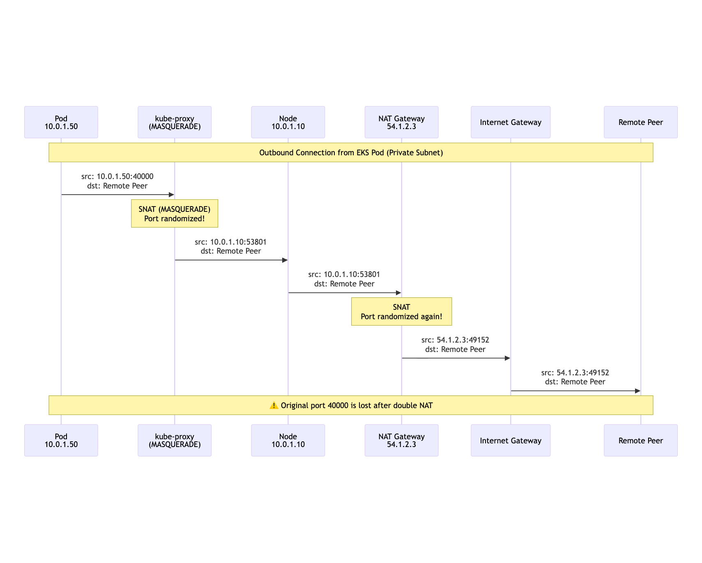


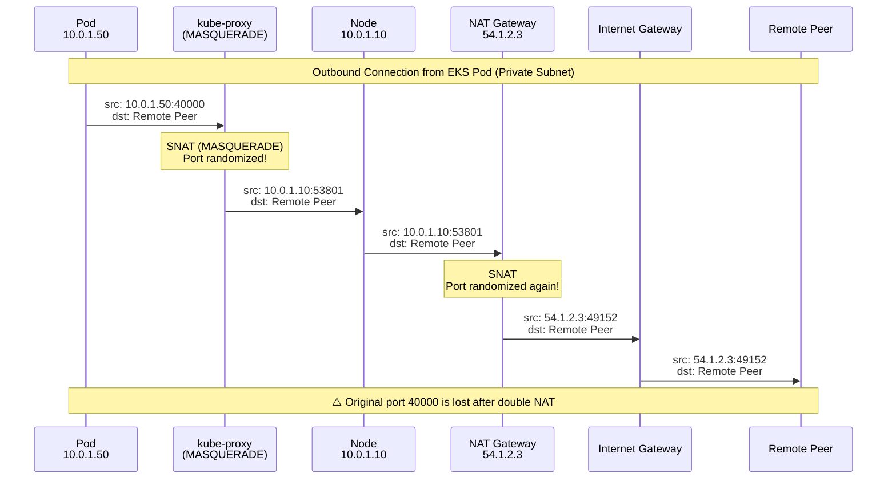
```mermaid
sequenceDiagram
    participant Pod as Pod<br/>10.0.1.50
    participant KP as kube-proxy<br/>(MASQUERADE)
    participant Node as Node<br/>10.0.1.10
    participant NAT as NAT Gateway<br/>54.1.2.3
    participant IGW as Internet Gateway
    participant Peer as Remote Peer

    Note over Pod,Peer: Outbound Connection from EKS Pod (Private Subnet)
    
    Pod->>KP: src: 10.0.1.50:40000<br/>dst: Remote Peer
    
    Note over KP: SNAT (MASQUERADE)<br/>Port randomized!
    
    KP->>Node: src: 10.0.1.10:53801<br/>dst: Remote Peer
    
    Node->>NAT: src: 10.0.1.10:53801<br/>dst: Remote Peer
    
    Note over NAT: SNAT<br/>Port randomized again!
    
    NAT->>IGW: src: 54.1.2.3:49152<br/>dst: Remote Peer
    
    IGW->>Peer: src: 54.1.2.3:49152<br/>dst: Remote Peer
    
    Note over Pod,Peer: ⚠️ Original port 40000 is lost after double NAT
```


**Result:** Your pod bound port 40000, but the peer sees traffic from a completely different IP *and* port. When the peer tries to reply to your advertised address, nothing is listening.

### The Industry Standard: Bare EC2

The traditional solution is straightforward: run telecom applications on bare EC2 instances in public subnets with Elastic IPs. No containers, no NAT, no port remapping.

But this approach has significant drawbacks:

| Concern | Bare EC2 | Kubernetes |
|---------|----------|------------|
| Deployment | SSH + scripts or custom AMIs | `kubectl apply`, Helm, GitOps |
| Scaling | Manual ASG configuration | HPA, Karpenter, pod replicas |
| Resource efficiency | One instance per workload | Bin-packing, shared nodes |
| Developer experience | Inconsistent tooling | Unified platform |
| Iteration speed | Slow (instance spin-up) | Fast (pod scheduling) |

We decided to build a Kubernetes-native solution. The key insight: developers could deploy the same telecom stack multiple times within the same cluster using namespaces, enabling parallel iteration without infrastructure overhead or port conflicts.

---

## False Start 1: HostNetwork in a Public Subnet

My first idea felt obvious: schedule a Node Group in a public subnet, give nodes public IPs, and run pods with `hostNetwork: true`. Boom—public IP identity, right?

**Wrong.**

### What I Expected

The pod binds UDP 40000 on the host. The node's public IP is visible to the world. External peers send traffic to `<node-public-ip>:40000`, and life is good.

### What Actually Happened

1. Outbound UDP source ports kept changing
2. The remote peer saw randomized high ports (e.g., `51234`) instead of `40000`
3. Replies to my advertised port were dropped—nothing matched the NAT state

### Debugging the Issue

I SSH'd into the node to investigate:

```bash
# 1. Start a test pod with hostNetwork
kubectl run udp-test --image=alpine --restart=Never \
  --overrides='{"spec":{"hostNetwork":true}}' \
  -- sh -c "apk add socat && socat -v UDP-LISTEN:40000,fork EXEC:'/bin/cat'"

# 2. Check connection tracking to see translations
sudo conntrack -L -p udp | grep 40000
# Output: src=10.0.0.5 sport=40000 ... src=1.2.3.4 sport=51234
#         ^^^ Original                  ^^^ After MASQUERADE

# 3. Find the culprit iptables rules
sudo iptables-save | grep -E 'MASQUERADE|random-fully'
# Output:
# -A KUBE-POSTROUTING -m comment --comment "kubernetes service traffic requiring SNAT" \
#   -j MASQUERADE --random-fully

# 4. Capture traffic to see the mismatch
sudo tcpdump -ni eth0 udp port 40000 -vvv
```

### The Culprit: kube-proxy

In `iptables` mode, kube-proxy installs MASQUERADE rules with `--random-fully` to prevent port collisions and enable hairpin routing. Even hostNetwork traffic traversing certain chains gets caught:

The `--random-fully` flag was added to work around a Linux kernel issue where multiple flows could map to the same source port, causing packet drops. While this improves general Kubernetes networking, it's fatal for telecom workloads.

### Additional Problems with hostNetwork

Even if you could bypass the MASQUERADE rules:

- **Port collisions** — Multiple pods wanting port 5060 cannot coexist on the same node
- **No per-pod identity** — A single node IP ≠ per-pod public identity
- **Scheduling constraints** — Pods become tightly coupled to specific nodes
- **Security** — Pods share the host's network namespace entirely

### Lesson Learned

**HostNetwork in a public subnet ≠ stable, per-pod public identity.** Use `hostNetwork` for CNI daemons or control planes, not for workloads requiring distinct network identity.

I needed a second interface under my control and a public IP association tied to that path—not the node's primary stack.

---


## False Start 2: Just Put an NLB in Front

Next, I tried an AWS Network Load Balancer (NLB) with UDP listeners targeting NodePorts.

This solves reachability but fails on **Identity**:
1.  **Stickiness Limitations:** UDP is stateless. If the fleet scales, the NLB mechanism to route established flows to specific pods is fragile.
2.  **IP Visibility:** The SIP logic sees the NLB's IP, not the Pod's IP. The pod cannot introspect the NLB API to find out "who it is" to put that IP in the SIP header.
3.  **Symmetric Routing:** If the pod replies, it must reply *through* the NLB. If it replies directly to the client (to reduce latency), the client sees a Source IP mismatch (Pod IP vs NLB IP) and drops the packet.

---

## The Breakthrough: Multus CNI

I decided to make each pod look to the Internet like a tiny VM with a dedicated network interface and public IP.

### The Core Insight

**Treat the pod like a small VM with its own public identity.**

This led to a specific architecture:

1. **`eth0` (Default)** — Managed by Amazon VPC CNI. Handles K8s API traffic, probes, metrics, and control-plane communication.
2. **`net1` (Multus)** — The "data plane" interface. A dedicated interface attached to a secondary ENI on the host.
3. **Public Identity** — An AWS Elastic IP associated directly with the private IP used by `net1`.

### Architecture Overview

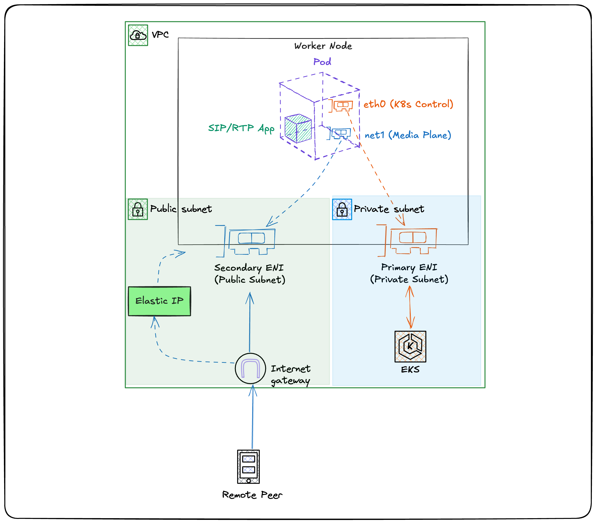


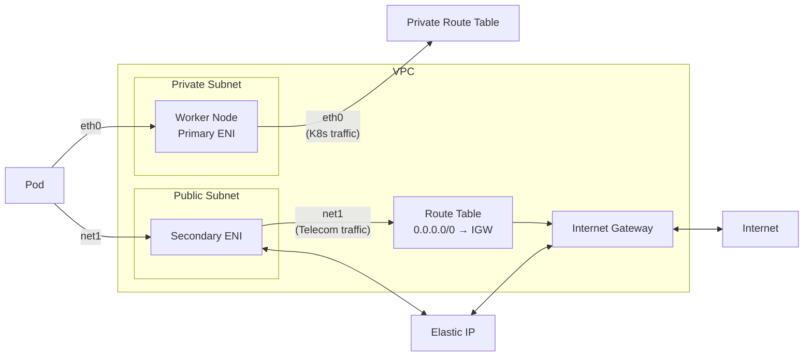
```mermaid
flowchart LR
    subgraph "VPC"
        subgraph "Private Subnet"
            Node[Worker Node<br/>Primary ENI]
        end
        subgraph "Public Subnet"
            SecENI[Secondary ENI]
        end
        IGW[Internet Gateway]
        RT[Route Table<br/>0.0.0.0/0 → IGW]
    end
    
    Node -- "eth0<br/>(K8s traffic)" --> PrivateRT[Private Route Table]
    SecENI -- "net1<br/>(Telecom traffic)" --> RT
    RT --> IGW
    
    Pod[Pod] -- "eth0" --> Node
    Pod -- "net1" --> SecENI
    
    SecENI <--> EIP[Elastic IP]
    EIP <--> IGW
    IGW <--> Internet[Internet]
```


### Network Topology: Split-Subnet Approach

The worker node itself can live in a private subnet. We attach a **secondary ENI** that resides in a **public subnet** with a route to the Internet Gateway:

This separation keeps your control plane traffic isolated from your data plane, with independent routing and security groups.

---

## Multus CNI Deep Dive

Multus is a **CNI meta-plugin** that enables attaching multiple network interfaces to Kubernetes pods. It acts as a delegator, invoking other CNI plugins for each additional interface.


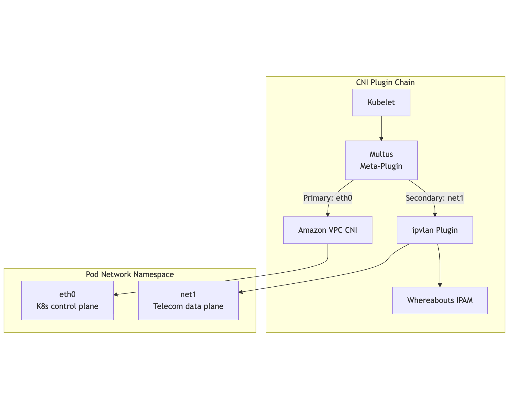



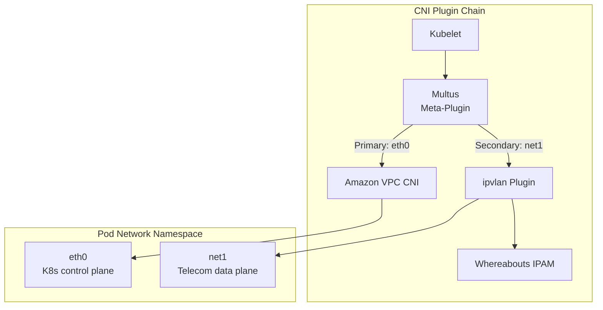
```mermaid
flowchart TB
    subgraph "CNI Plugin Chain"
        Kubelet[Kubelet] --> Multus[Multus<br/>Meta-Plugin]
        Multus -->|"Primary: eth0"| VPCCNI[Amazon VPC CNI]
        Multus -->|"Secondary: net1"| IPVLAN[ipvlan Plugin]
        IPVLAN --> Whereabouts[Whereabouts IPAM]
    end
    
    subgraph "Pod Network Namespace"
        eth0_result[eth0<br/>K8s control plane]
        net1_result[net1<br/>Telecom data plane]
    end
    
    VPCCNI --> eth0_result
    IPVLAN --> net1_result
```


### Interface Modes: ipvlan vs host-device

I experimented with two underlying CNI plugins for `net1`:

| Aspect | ipvlan (L2 mode) | host-device |
|--------|------------------|-------------|
| How it works | Virtual interface off host's ENI | Physical NIC moved into pod namespace |
| Pod density | Multiple pods share one ENI | One pod per ENI |
| IPAM | Whereabouts assigns IPs | DHCP or static |
| Isolation | Shared L2 domain | Exclusive device ownership |
| Latency | Very low | Lowest possible |
| Use case | General telecom | Ultra-low-latency, SR-IOV |

**Winner for most cases: `ipvlan`.** It's simpler to schedule, supports higher pod density, and integrates cleanly with Whereabouts. `host-device` remains useful for specialized ultra-low-latency requirements or when using SR-IOV virtual functions.

### NetworkAttachmentDefinition

Multus uses `NetworkAttachmentDefinition` (NAD) resources to configure additional interfaces:

```yaml
apiVersion: "k8s.cni.cncf.io/v1"
kind: NetworkAttachmentDefinition
metadata:
  name: telecom-net-az1
  namespace: kube-system
spec:
  config: |
    {
      "cniVersion": "0.3.1",
      "type": "ipvlan",
      "master": "eth1",
      "mode": "l2",
      "ipam": {
        "type": "whereabouts",
        "range": "10.0.2.128/26",
        "gateway": "10.0.2.1"
      }
    }
```

Pods request the additional interface via annotation:

```yaml
apiVersion: v1
kind: Pod
metadata:
  name: sip-server
  annotations:
    k8s.v1.cni.cncf.io/networks: telecom-net-az1
spec:
  containers:
  - name: sip-server
    image: my-registry/sip-server:latest
```

---

## Whereabouts and VPC CIDR Reservations

For ipvlan to work correctly, you need coordinated IP address management between two systems:

1. **Whereabouts** — Cluster-wide IPAM for pod interfaces
2. **AWS VPC DHCP** — Assigns IPs to ENIs attached to EC2 instances

### The Conflict Risk

Without coordination, both systems might assign the same IP:

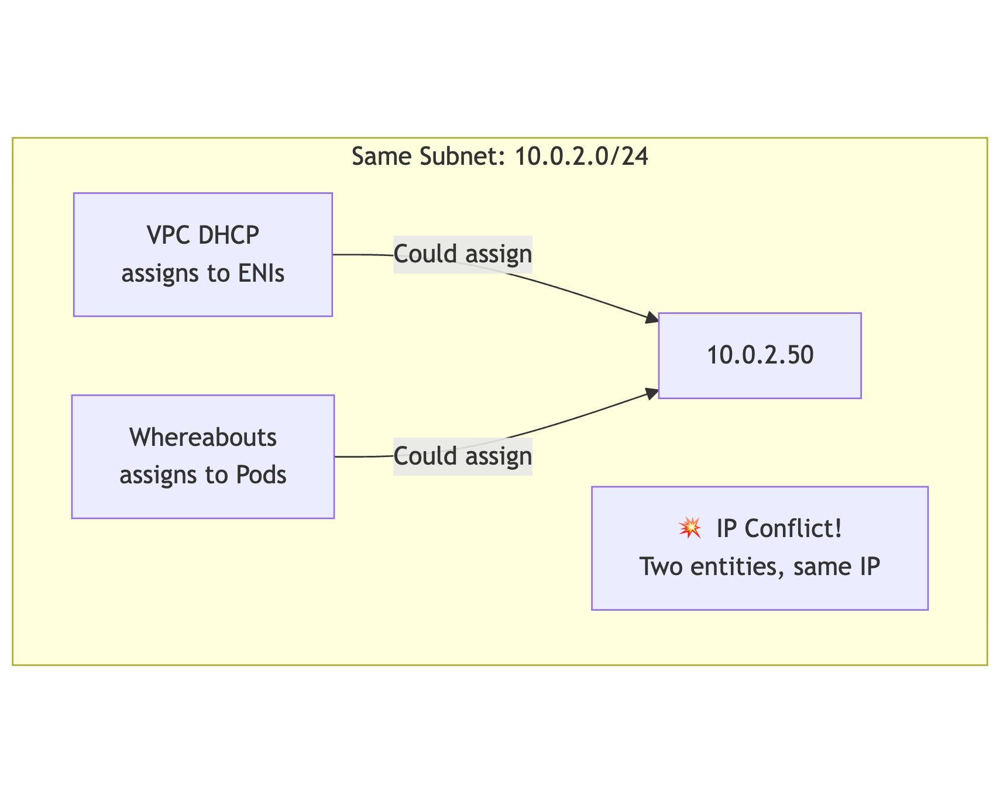



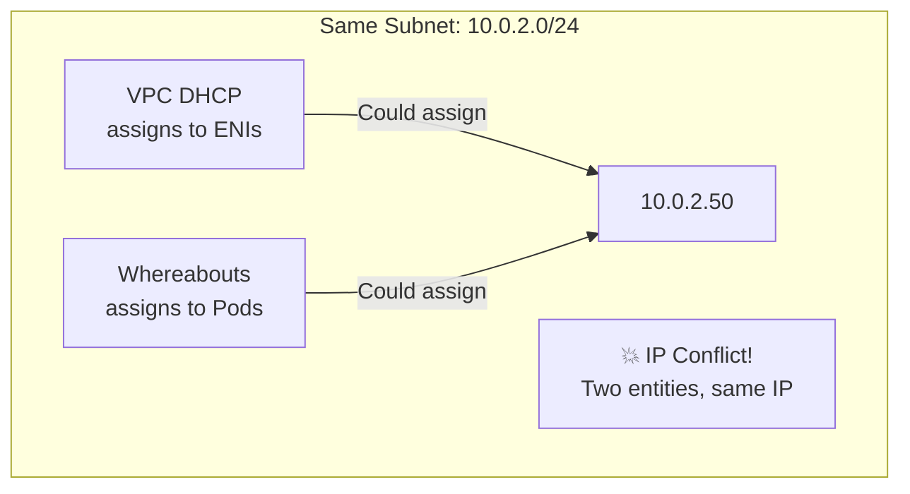
```mermaid
flowchart TB
    subgraph "Same Subnet: 10.0.2.0/24"
        DHCP[VPC DHCP<br/>assigns to ENIs] 
        WA[Whereabouts<br/>assigns to Pods]
        
        DHCP -->|"Could assign"| IP1[10.0.2.50]
        WA -->|"Could assign"| IP1
        
        Conflict[💥 IP Conflict!<br/>Two entities, same IP]
    end
```


### The Solution: Subnet CIDR Reservations

AWS supports **Subnet CIDR Reservations** that prevent DHCP from assigning addresses in specific ranges:

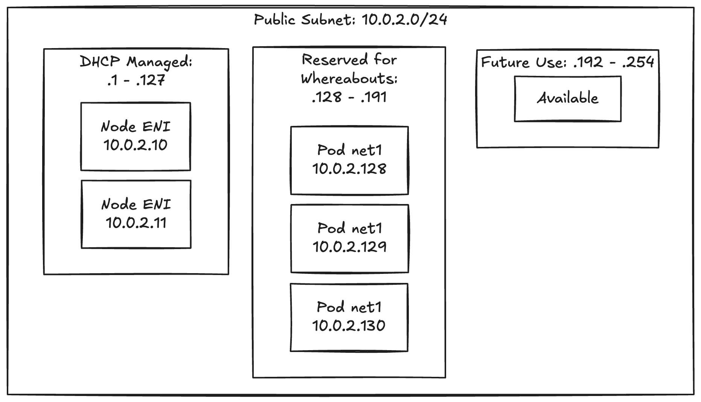


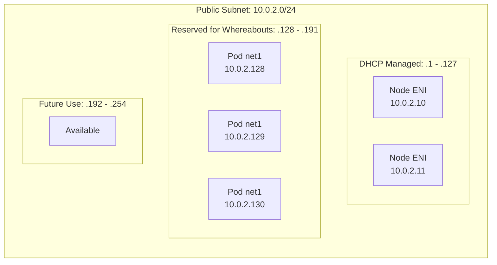
```mermaid
flowchart LR
    subgraph "Public Subnet: 10.0.2.0/24"
        subgraph "DHCP Managed: .1 - .127"
            ENI1[Node ENI<br/>10.0.2.10]
            ENI2[Node ENI<br/>10.0.2.11]
        end
        
        subgraph "Reserved for Whereabouts: .128 - .191"
            Pod1[Pod net1<br/>10.0.2.128]
            Pod2[Pod net1<br/>10.0.2.129]
            Pod3[Pod net1<br/>10.0.2.130]
        end
        
        subgraph "Future Use: .192 - .254"
            Reserved[Available]
        end
    end
```


### Terraform Implementation

```hcl
# Reserve a CIDR block for Whereabouts
resource "aws_ec2_subnet_cidr_reservation" "whereabouts_az1" {
  cidr_block       = "10.0.2.128/26"
  reservation_type = "explicit"
  subnet_id        = aws_subnet.public_az1.id
  description      = "Reserved for Multus/Whereabouts pod IPs"
}

# Whereabouts uses this exact range
resource "kubernetes_manifest" "nad_az1" {
  manifest = {
    apiVersion = "k8s.cni.cncf.io/v1"
    kind       = "NetworkAttachmentDefinition"
    metadata = {
      name      = "telecom-net-az1"
      namespace = "kube-system"
    }
    spec = {
      config = jsonencode({
        cniVersion = "0.3.1"
        type       = "ipvlan"
        master     = "eth1"
        mode       = "l2"
        ipam = {
          type    = "whereabouts"
          range   = "10.0.2.128/26"  # Matches reservation
          gateway = "10.0.2.1"
        }
      })
    }
  }
}
```

You can also exclude specific addresses (like the gateway) from Whereabouts:

```yaml
ipam:
  type: whereabouts
  range: "10.0.2.128/26"
  exclude:
    - "10.0.2.128/30"  # Reserve first 4 IPs
```

---

## EIP Association: Making Pods Internet-Routable

With `net1` configured and an IP assigned by Whereabouts, the next step is associating an Elastic IP to make the pod publicly reachable.

### How EIP Association Works

AWS Elastic IPs perform **1:1 static NAT** at the Internet Gateway. You can associate an EIP with a specific private IP on an ENI.

### Traffic Flow: Inbound

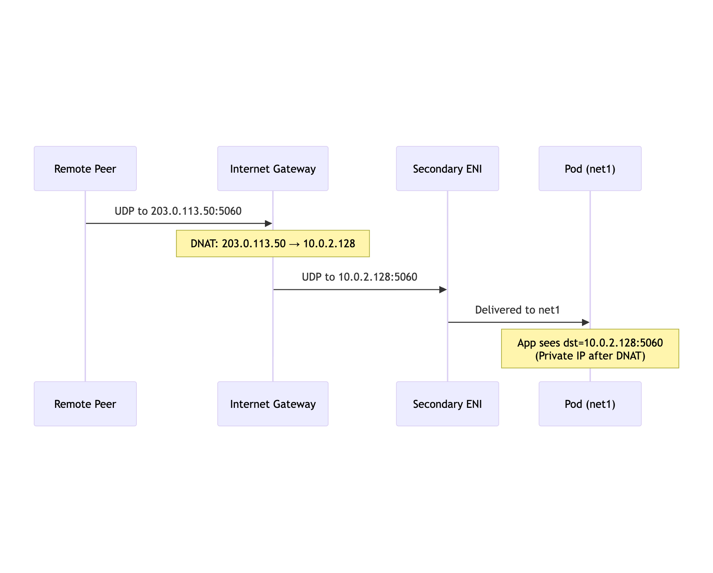


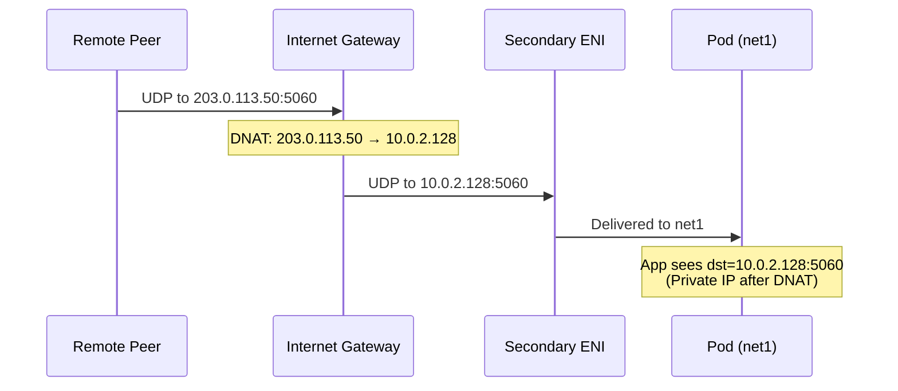
```mermaid
sequenceDiagram
    participant Peer as Remote Peer
    participant IGW as Internet Gateway
    participant ENI as Secondary ENI
    participant Pod as Pod (net1)
    
    Peer->>IGW: UDP to 203.0.113.50:5060
    Note over IGW: DNAT: 203.0.113.50 → 10.0.2.128
    IGW->>ENI: UDP to 10.0.2.128:5060
    ENI->>Pod: Delivered to net1
    Note over Pod: App sees dst=10.0.2.128:5060<br/>(Private IP after DNAT)
```


### Traffic Flow: Outbound

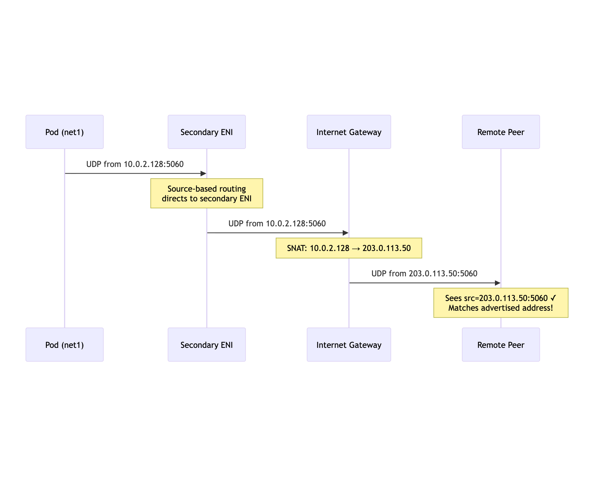


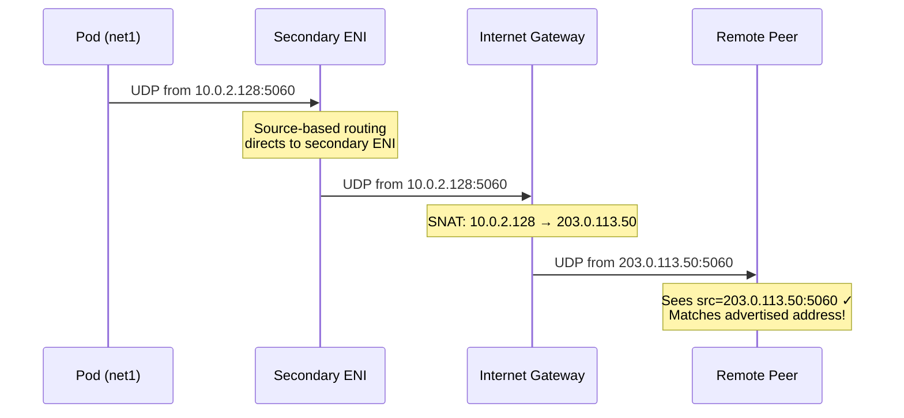
```mermaid
sequenceDiagram
    participant Pod as Pod (net1)
    participant ENI as Secondary ENI
    participant IGW as Internet Gateway
    participant Peer as Remote Peer
    
    Pod->>ENI: UDP from 10.0.2.128:5060
    Note over ENI: Source-based routing<br/>directs to secondary ENI
    ENI->>IGW: UDP from 10.0.2.128:5060
    Note over IGW: SNAT: 10.0.2.128 → 203.0.113.50
    IGW->>Peer: UDP from 203.0.113.50:5060
    Note over Peer: Sees src=203.0.113.50:5060 ✓<br/>Matches advertised address!
```


### IP Manager Sidecar

The EIP association must happen dynamically as pods start. I implemented this as an init container:

```yaml
apiVersion: v1
kind: Pod
metadata:
  name: sip-server
  annotations:
    k8s.v1.cni.cncf.io/networks: telecom-net-az1
spec:
  initContainers:
  - name: ip-manager
    image: my-registry/ip-manager:latest
    securityContext:
      capabilities:
        add: ["NET_ADMIN"]
    env:
    - name: POD_NAME
      valueFrom:
        fieldRef:
          fieldPath: metadata.name
    - name: INTERFACE
      value: "net1"
    - name: EIP_POOL_TAG
      value: "telecom-pool"
  containers:
  - name: sip-server
    image: my-registry/sip-server:latest
```

The init container workflow:

```python
def setup_public_ip():
    # 1. Get net1 IP assigned by Whereabouts
    net1_ip = get_interface_ip("net1")  # 10.0.2.128
    
    # 2. Find ENI that has this private IP
    eni_id = find_eni_by_private_ip(net1_ip)
    
    # 3. Allocate or find available EIP from tagged pool
    eip = get_available_eip(pool_tag="telecom-pool")
    
    # 4. Associate EIP with the specific private IP
    ec2.associate_address(
        AllocationId=eip['AllocationId'],
        NetworkInterfaceId=eni_id,
        PrivateIpAddress=net1_ip,
        AllowReassociation=False
    )
    
    # 5. Set up source-based routing (critical!)
    setup_source_routing(net1_ip, interface="net1")
    
    # 6. Write EIP to file for main container
    write_file("/shared/public-ip", eip['PublicIp'])
    
    return eip['PublicIp']
```

Your SIP/WebRTC application reads the public IP from the shared volume and advertises it in signaling messages.

---

## Source-Based Routing: The Linchpin

This is the most critical piece. Without it, nothing works.

### The Problem

Linux routes by destination using the `main` routing table. With multiple interfaces, the kernel doesn't automatically know which interface to use for replies:

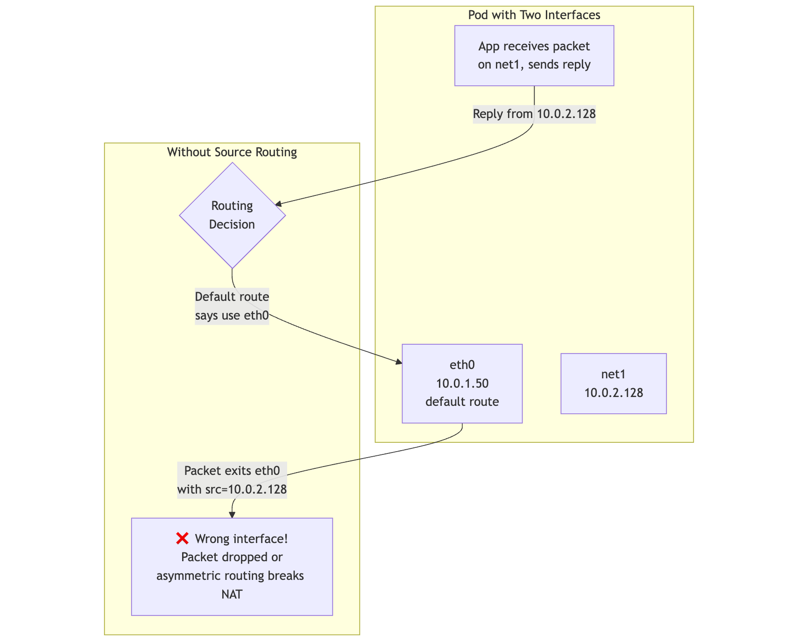


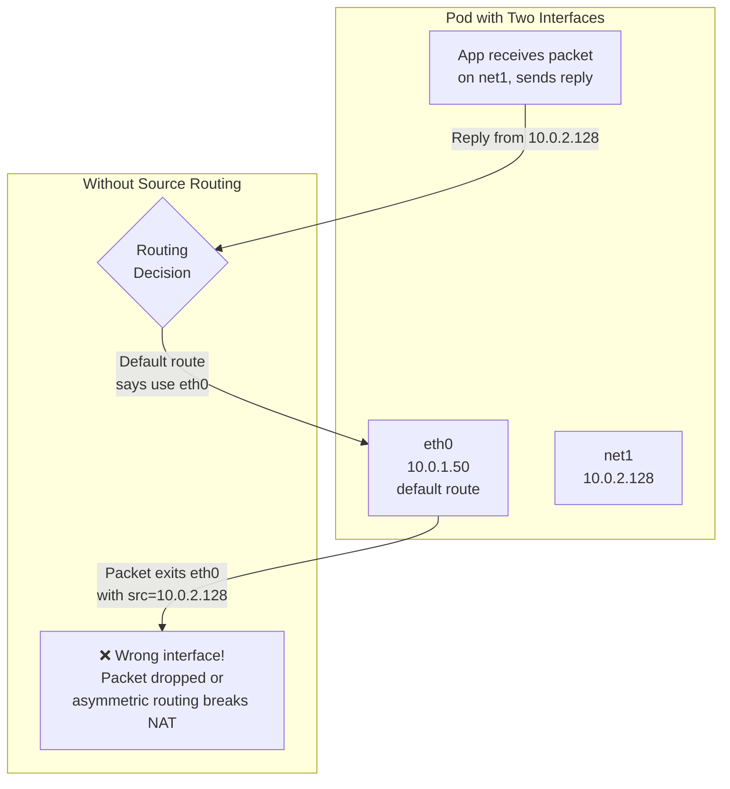
```mermaid
flowchart TB
    subgraph "Pod with Two Interfaces"
        App[App receives packet<br/>on net1, sends reply]
        eth0[eth0<br/>10.0.1.50<br/>default route]
        net1[net1<br/>10.0.2.128]
    end
    
    subgraph "Without Source Routing"
        App -->|"Reply from 10.0.2.128"| Decision{Routing<br/>Decision}
        Decision -->|"Default route<br/>says use eth0"| eth0
        eth0 -->|"Packet exits eth0<br/>with src=10.0.2.128"| Wrong[❌ Wrong interface!<br/>Packet dropped or<br/>asymmetric routing breaks NAT]
    end
```


### The Solution: Policy-Based Routing

We add rules that say: "If traffic originates from `net1`'s IP, use a different routing table."

```bash
# 1. Create a custom routing table
echo "200 telecom" >> /etc/iproute2/rt_tables

# 2. Add routes to the custom table
ip route add 10.0.2.0/24 dev net1 src 10.0.2.128 table telecom
ip route add default via 10.0.2.1 dev net1 table telecom

# 3. Add policy rules: traffic FROM this IP uses table telecom
ip rule add from 10.0.2.128/32 table telecom priority 100

# 4. (Optional) Traffic TO this IP also uses table telecom
ip rule add to 10.0.2.128/32 table telecom priority 100
```

### Visualized

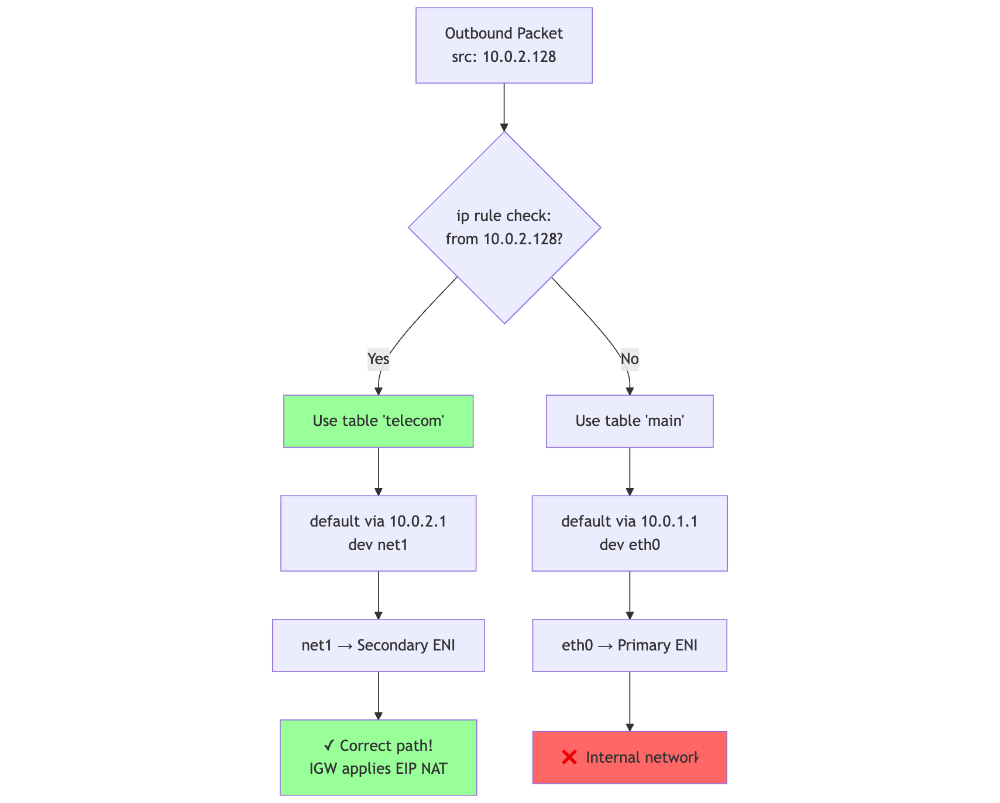


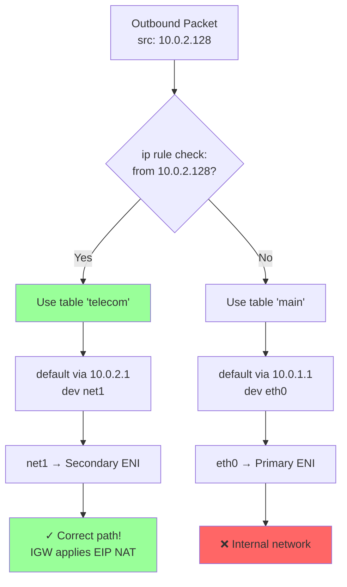
```mermaid
flowchart TB
    Packet[Outbound Packet<br/>src: 10.0.2.128]
    
    Rule1{ip rule check:<br/>from 10.0.2.128?}
    Packet --> Rule1
    
    Rule1 -->|"Yes"| Table200[Use table 'telecom']
    Rule1 -->|"No"| MainTable[Use table 'main']
    
    Table200 --> Route200[default via 10.0.2.1<br/>dev net1]
    Route200 --> net1_out[net1 → Secondary ENI]
    net1_out --> Correct[✓ Correct path!<br/>IGW applies EIP NAT]
    
    MainTable --> RouteMain[default via 10.0.1.1<br/>dev eth0]
    RouteMain --> eth0_out[eth0 → Primary ENI]
    eth0_out --> Wrong[❌ Internal network]
    
    style Table200 fill:#9f9
    style Correct fill:#9f9
    style Wrong fill:#f66
```


### Critical: Disable Strict rp_filter

Linux's Reverse Path Filtering can drop packets during asymmetric routing scenarios common during pod startup:

```bash
# Set to loose mode (2) instead of strict (1)
sysctl -w net.ipv4.conf.all.rp_filter=2
sysctl -w net.ipv4.conf.net1.rp_filter=2

# Persist across reboots
cat >> /etc/sysctl.d/99-multus.conf << EOF
net.ipv4.conf.all.rp_filter = 2
net.ipv4.conf.default.rp_filter = 2
EOF
```

### ENI Configuration Requirements

On the secondary ENI:

```bash
# Disable source/destination check (required for non-default routing)
aws ec2 modify-network-interface-attribute \
  --network-interface-id eni-xxx \
  --no-source-dest-check

# Enable DeleteOnTermination for cleanup
aws ec2 modify-network-interface-attribute \
  --network-interface-id eni-xxx \
  --attachment AttachmentId=eni-attach-xxx,DeleteOnTermination=true
```

### The Golden Rule

> **Associate the public IP to the ENI's private address, and force packets sourced from that private address to leave via that ENI.**
> 
> Everything else is table stakes.

---

## Floating IP: Consistent Identity Inside and Outside VPC

### The Asymmetry Problem

With standard EIP association, there's an asymmetry in how traffic arrives:

| Traffic Source | What Pod Sees as Destination |
|---------------|------------------------------|
| Internet (via IGW) | Private IP (10.0.2.128) — IGW performs DNAT |
| VPC Internal | ??? — No automatic translation |

By default, VPC internal traffic sent to a public IP either fails to route or gets dropped:

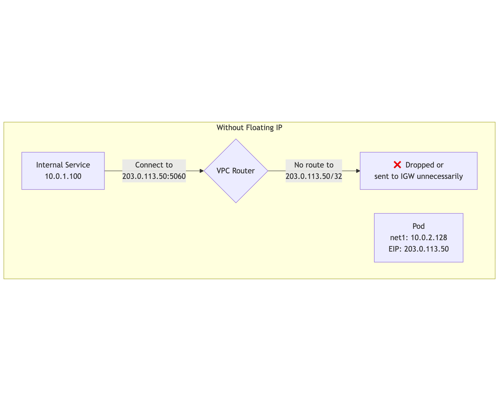


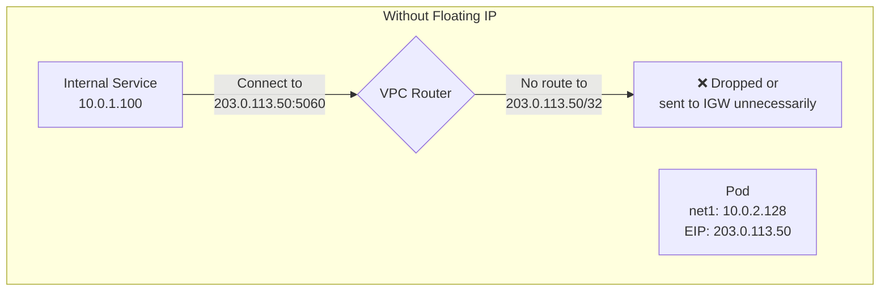
```mermaid
flowchart TB
    subgraph "Without Floating IP"
        InternalClient[Internal Service<br/>10.0.1.100]
        Pod[Pod<br/>net1: 10.0.2.128<br/>EIP: 203.0.113.50]
        
        InternalClient -->|"Connect to<br/>203.0.113.50:5060"| VPCRouter{VPC Router}
        VPCRouter -->|"No route to<br/>203.0.113.50/32"| Dropped[❌ Dropped or<br/>sent to IGW unnecessarily]
    end
```


### The Floating IP Solution

Add a `/32` route for the public IP pointing directly to the ENI:

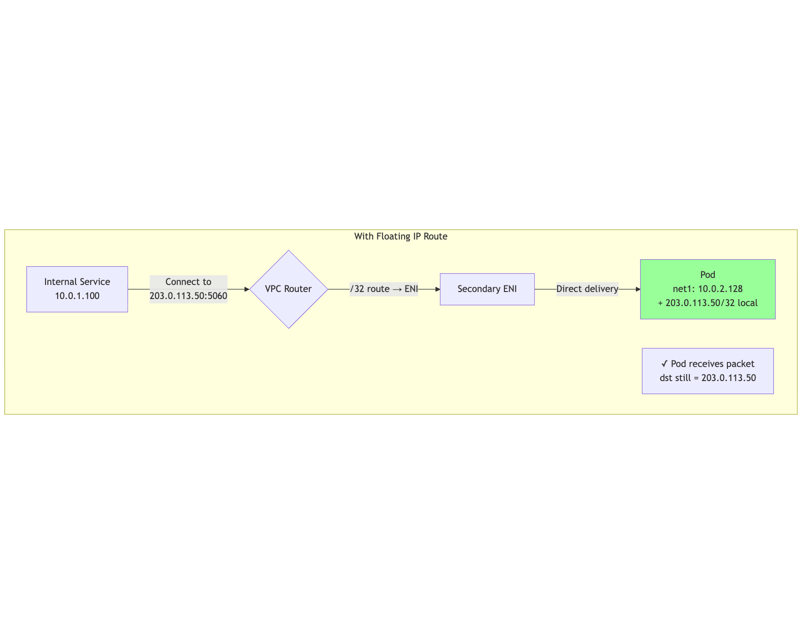


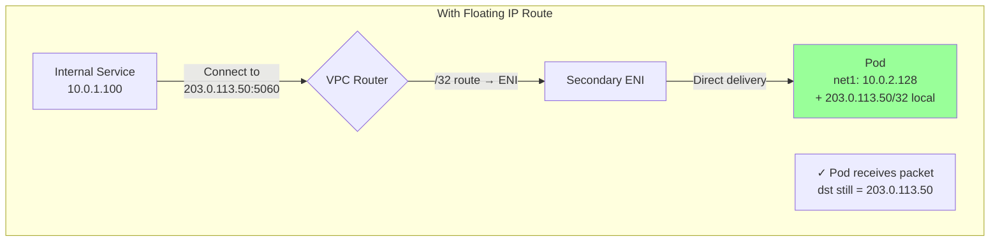
```mermaid
flowchart TB
    subgraph "With Floating IP Route"
        InternalClient[Internal Service<br/>10.0.1.100]
        Pod[Pod<br/>net1: 10.0.2.128<br/>+ 203.0.113.50/32 local]
        
        InternalClient -->|"Connect to<br/>203.0.113.50:5060"| VPCRouter{VPC Router}
        VPCRouter -->|"/32 route → ENI"| ENI[Secondary ENI]
        ENI -->|"Direct delivery"| Pod
        
        Note[✓ Pod receives packet<br/>dst still = 203.0.113.50]
    end
    
    style Pod fill:#9f9
```


### Implementation: Floating IP Sidecar

Since pods are dynamic, we can't use static Terraform routes. Instead, we use a **Kubernetes native sidecar container** that:

1. **On startup:** Creates the VPC route and configures the pod
2. **On shutdown:** Automatically cleans up (guaranteed by native sidecar lifecycle)

```yaml
apiVersion: v1
kind: Pod
metadata:
  name: sip-server
  annotations:
    k8s.v1.cni.cncf.io/networks: telecom-net-az1
spec:
  initContainers:
  # Native sidecar (restartPolicy: Always) - runs for pod lifetime
  # Kubernetes guarantees it terminates AFTER main containers
  - name: floating-ip-manager
    image: my-registry/floating-ip-manager:latest
    restartPolicy: Always  # Makes this a native sidecar
    securityContext:
      capabilities:
        add: ["NET_ADMIN"]
    env:
    - name: INTERFACE
      value: "net1"
    - name: ROUTE_TABLE_IDS
      value: "rtb-abc123,rtb-def456"  # VPC route tables to update
    - name: EIP_POOL_TAG
      value: "telecom-pool"
    volumeMounts:
    - name: shared
      mountPath: /shared
  
  containers:
  - name: sip-server
    image: my-registry/sip-server:latest
    env:
    - name: PUBLIC_IP_FILE
      value: "/shared/public-ip"
    volumeMounts:
    - name: shared
      mountPath: /shared
      readOnly: true

  volumes:
  - name: shared
    emptyDir: {}
```



```python
#!/usr/bin/env python3
"""
Floating IP Manager Sidecar

Manages EIP association and VPC route table entries for pod lifetime.
Cleanup is guaranteed by Kubernetes native sidecar lifecycle.
"""

import boto3
import signal
import sys
import subprocess
import os
import time

ec2 = boto3.client('ec2')

# State for cleanup
state = {
    'public_ip': None,
    'allocation_id': None,
    'association_id': None,
    'eni_id': None,
    'route_table_ids': [],
}


def get_interface_ip(interface: str) -> str:
    """Get IP address assigned to interface by Whereabouts."""
    result = subprocess.run(
        ['ip', '-4', '-j', 'addr', 'show', interface],
        capture_output=True, text=True
    )
    import json
    data = json.loads(result.stdout)
    return data[0]['addr_info'][0]['local']


def find_eni_by_ip(private_ip: str) -> str:
    """Find ENI ID that has this private IP."""
    resp = ec2.describe_network_interfaces(
        Filters=[{'Name': 'addresses.private-ip-address', 'Values': [private_ip]}]
    )
    return resp['NetworkInterfaces'][0]['NetworkInterfaceId']


def allocate_eip(pool_tag: str) -> dict:
    """Find available EIP from tagged pool or allocate new one."""
    # Try to find unassociated EIP with matching tag
    resp = ec2.describe_addresses(
        Filters=[
            {'Name': 'tag:Pool', 'Values': [pool_tag]},
            {'Name': 'association-id', 'Values': ['']}  # Unassociated
        ]
    )
    if resp['Addresses']:
        return resp['Addresses'][0]
    
    # Allocate new EIP if pool is empty
    resp = ec2.allocate_address(Domain='vpc', TagSpecifications=[{
        'ResourceType': 'elastic-ip',
        'Tags': [{'Key': 'Pool', 'Value': pool_tag}]
    }])
    return resp


def setup(interface: str, route_table_ids: list, pool_tag: str):
    """Setup EIP association and floating IP routes."""
    
    # 1. Get pod's net1 IP (assigned by Whereabouts)
    private_ip = get_interface_ip(interface)
    print(f"Pod private IP: {private_ip}")
    
    # 2. Find the ENI
    eni_id = find_eni_by_ip(private_ip)
    state['eni_id'] = eni_id
    print(f"ENI ID: {eni_id}")
    
    # 3. Get EIP from pool
    eip = allocate_eip(pool_tag)
    state['public_ip'] = eip['PublicIp']
    state['allocation_id'] = eip['AllocationId']
    print(f"Public IP: {state['public_ip']}")
    
    # 4. Associate EIP with private IP on ENI
    resp = ec2.associate_address(
        AllocationId=state['allocation_id'],
        NetworkInterfaceId=eni_id,
        PrivateIpAddress=private_ip,
        AllowReassociation=False
    )
    state['association_id'] = resp['AssociationId']
    
    # 5. Add /32 routes to VPC route tables (floating IP)
    for rtb_id in route_table_ids:
        try:
            ec2.create_route(
                RouteTableId=rtb_id,
                DestinationCidrBlock=f"{state['public_ip']}/32",
                NetworkInterfaceId=eni_id
            )
            state['route_table_ids'].append(rtb_id)
            print(f"Added route in {rtb_id}")
        except ec2.exceptions.ClientError as e:
            if 'RouteAlreadyExists' in str(e):
                ec2.replace_route(
                    RouteTableId=rtb_id,
                    DestinationCidrBlock=f"{state['public_ip']}/32",
                    NetworkInterfaceId=eni_id
                )
                state['route_table_ids'].append(rtb_id)
    
    # 6. Add public IP as local address on interface
    subprocess.run([
        'ip', 'addr', 'add', f"{state['public_ip']}/32", 'dev', interface
    ], check=True)
    
    # 7. Add source routing rule for public IP
    subprocess.run([
        'ip', 'rule', 'add', 'from', f"{state['public_ip']}/32", 
        'table', 'telecom', 'priority', '100'
    ], check=True)
    
    # 8. Write public IP for main container
    with open('/shared/public-ip', 'w') as f:
        f.write(state['public_ip'])
    
    print(f"Setup complete: {state['public_ip']}")


def cleanup():
    """Remove routes and disassociate EIP."""
    print("Cleaning up...")
    
    # Remove VPC routes
    for rtb_id in state['route_table_ids']:
        try:
            ec2.delete_route(
                RouteTableId=rtb_id,
                DestinationCidrBlock=f"{state['public_ip']}/32"
            )
            print(f"Removed route from {rtb_id}")
        except Exception as e:
            print(f"Failed to remove route: {e}")
    
    # Disassociate EIP (returns it to pool)
    if state['association_id']:
        try:
            ec2.disassociate_address(AssociationId=state['association_id'])
            print(f"Disassociated EIP {state['public_ip']}")
        except Exception as e:
            print(f"Failed to disassociate: {e}")
    
    print("Cleanup complete")


def main():
    interface = os.environ.get('INTERFACE', 'net1')
    route_table_ids = os.environ.get('ROUTE_TABLE_IDS', '').split(',')
    pool_tag = os.environ.get('EIP_POOL_TAG', 'telecom-pool')
    
    # Handle termination signals
    signal.signal(signal.SIGTERM, lambda *_: (cleanup(), sys.exit(0)))
    signal.signal(signal.SIGINT, lambda *_: (cleanup(), sys.exit(0)))
    
    try:
        setup(interface, route_table_ids, pool_tag)
        
        # Keep running until terminated
        # Native sidecar lifecycle ensures we run until main container exits
        while True:
            time.sleep(60)
            
    except Exception as e:
        print(f"Setup failed: {e}")
        cleanup()
        sys.exit(1)


if __name__ == '__main__':
    main()
```


### Why Native Sidecars?

Kubernetes 1.28+ supports **native sidecar containers** (`restartPolicy: Always` in init containers). This provides critical guarantees:

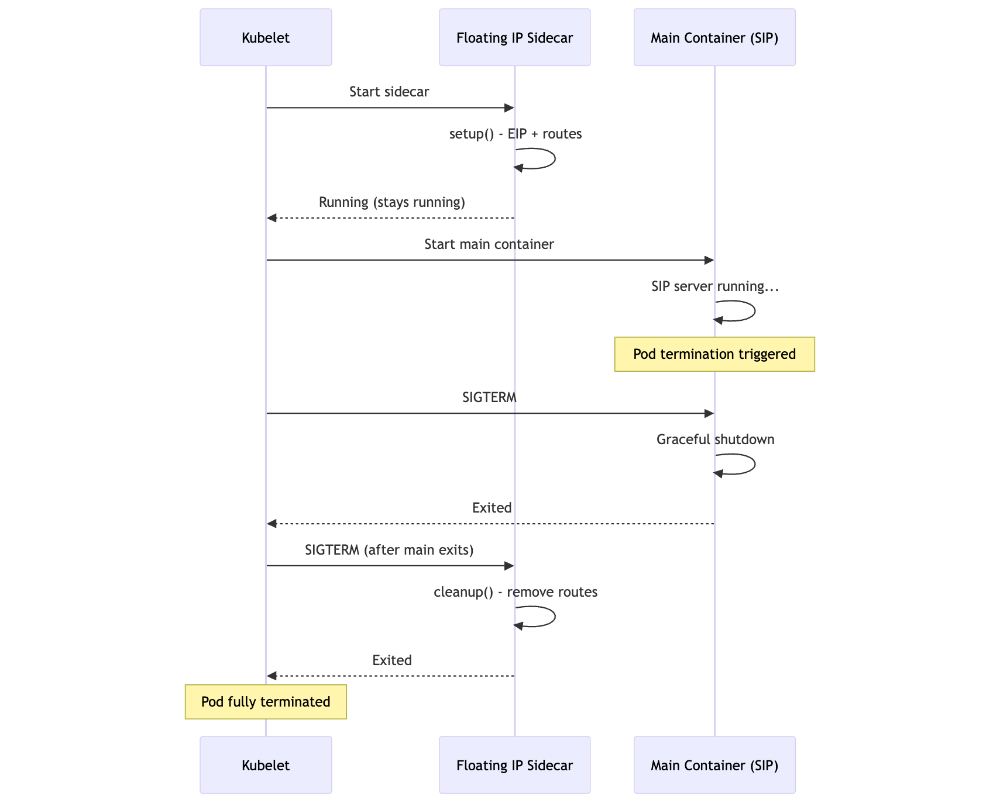


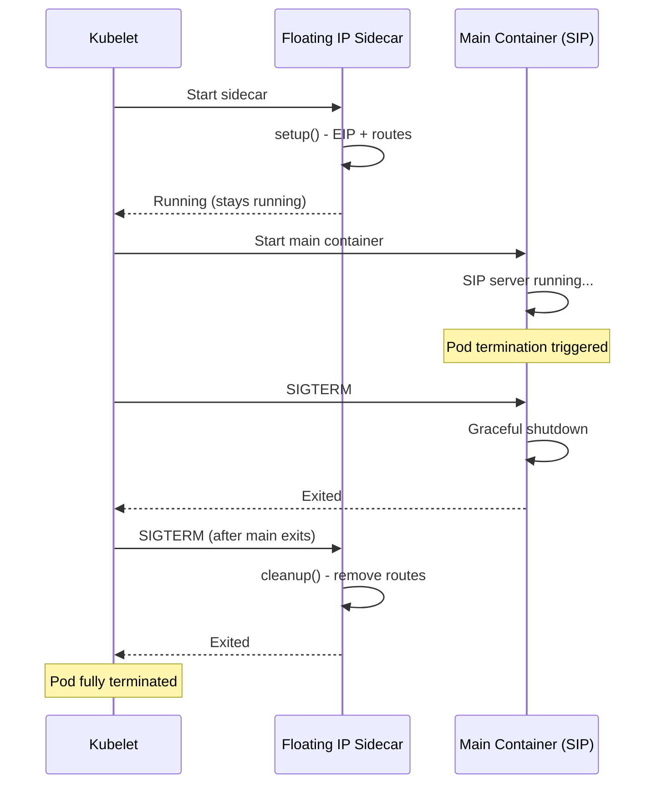
```mermaid
sequenceDiagram
    participant K as Kubelet
    participant S as Floating IP Sidecar
    participant M as Main Container (SIP)
    
    K->>S: Start sidecar
    S->>S: setup() - EIP + routes
    S-->>K: Running (stays running)
    
    K->>M: Start main container
    M->>M: SIP server running...
    
    Note over M: Pod termination triggered
    
    K->>M: SIGTERM
    M->>M: Graceful shutdown
    M-->>K: Exited
    
    K->>S: SIGTERM (after main exits)
    S->>S: cleanup() - remove routes
    S-->>K: Exited
    
    Note over K: Pod fully terminated
```


**Key benefit:** The sidecar receives SIGTERM *after* the main container exits, guaranteeing cleanup even if the main app crashes.

### Required IAM Permissions

The sidecar needs an IAM role (via IRSA or node role) with:

```json
{
  "Version": "2012-10-17",
  "Statement": [
    {
      "Effect": "Allow",
      "Action": [
        "ec2:DescribeAddresses",
        "ec2:AllocateAddress",
        "ec2:AssociateAddress",
        "ec2:DisassociateAddress",
        "ec2:DescribeNetworkInterfaces",
        "ec2:CreateRoute",
        "ec2:ReplaceRoute",
        "ec2:DeleteRoute"
      ],
      "Resource": "*"
    }
  ]
}
```

Now the pod can:
- Receive traffic destined to `203.0.113.50` from anywhere (Internet or VPC)
- Bind sockets directly to the public IP  
- Send traffic sourced from the public IP via the correct path
- **Automatically clean up routes when the pod terminates**

---

## The tcpdump Revelation: Two Destination Addresses

Once everything was working, I discovered an important operational nuance.

### Running tcpdump Inside the Pod

**Traffic from Internet (via IGW):**

```bash
$ tcpdump -i net1 udp port 5060
# 198.51.100.50.5060 > 10.0.2.128.5060: UDP
#                       ^^^^^^^^^^^
#                       Private IP (DNAT by IGW)
```

**Traffic from VPC (via floating IP route):**

```bash
$ tcpdump -i net1 udp port 5060  
# 10.0.1.100.5060 > 203.0.113.50.5060: UDP
#                   ^^^^^^^^^^^^^^
#                   Public IP (no DNAT, direct route)
```

### Application Implications

Your application may receive traffic addressed to **two different IPs** depending on the source. Options:

| Approach | Implementation | Pros | Cons |
|----------|---------------|------|------|
| Bind to `0.0.0.0` | `bind("0.0.0.0", 5060)` | Simple, accepts all | May accept unwanted traffic |
| Bind to both IPs | Two listeners | Explicit control | More code |
| iptables DNAT | Normalize to one address | App unchanged | Additional iptables rules |

**Option 3 (iptables normalization)** keeps application code simple:

```bash
# Redirect traffic to public IP → private IP
iptables -t nat -A PREROUTING -i net1 \
  -d 203.0.113.50 -j DNAT --to-destination 10.0.2.128

# Now application only binds to private IP
# but accepts traffic to both addresses transparently
```

---

## Node Bootstrap and Infrastructure

### Node Initialization Script

The secondary ENI must be attached and configured before Multus can use it:

```bash
#!/bin/bash
# Node bootstrap additions for Multus support

set -e

INSTANCE_ID=$(curl -s http://169.254.169.254/latest/meta-data/instance-id)
REGION=$(curl -s http://169.254.169.254/latest/meta-data/placement/region)

# Wait for secondary ENI (attached by ASG lifecycle hook or Terraform)
echo "Waiting for secondary ENI..."
while true; do
  SECONDARY_ENI=$(aws ec2 describe-network-interfaces \
    --region "$REGION" \
    --filters "Name=attachment.instance-id,Values=$INSTANCE_ID" \
              "Name=tag:Purpose,Values=multus-telecom" \
    --query 'NetworkInterfaces[0].NetworkInterfaceId' \
    --output text)
  
  if [ "$SECONDARY_ENI" != "None" ] && [ -n "$SECONDARY_ENI" ]; then
    break
  fi
  sleep 5
done

echo "Secondary ENI: $SECONDARY_ENI"

# Disable source/dest check
aws ec2 modify-network-interface-attribute \
  --region "$REGION" \
  --network-interface-id "$SECONDARY_ENI" \
  --no-source-dest-check

# Tag ENI so VPC CNI ignores it
aws ec2 create-tags \
  --region "$REGION" \
  --resources "$SECONDARY_ENI" \
  --tags Key=node.k8s.amazonaws.com/no_manage,Value=true

# Configure sysctl for Multus
cat > /etc/sysctl.d/99-multus.conf << EOF
net.ipv4.conf.all.rp_filter = 2
net.ipv4.conf.default.rp_filter = 2
net.ipv4.ip_forward = 1
EOF
sysctl --system

echo "Multus networking configured"
```

### Untainter DaemonSet

Prevent pod scheduling before Multus is ready using a taint:

```yaml
apiVersion: apps/v1
kind: DaemonSet
metadata:
  name: multus-untainter
  namespace: kube-system
spec:
  selector:
    matchLabels:
      app: multus-untainter
  template:
    metadata:
      labels:
        app: multus-untainter
    spec:
      tolerations:
      - key: "multus-not-ready"
        operator: "Exists"
        effect: "NoSchedule"
      hostNetwork: true
      serviceAccountName: multus-untainter
      containers:
      - name: untainter
        image: bitnami/kubectl:latest
        command:
        - /bin/sh
        - -c
        - |
          NODE_NAME=$(hostname)
          echo "Waiting for Multus config..."
          while [ ! -f /host/etc/cni/net.d/00-multus.conf ]; do
            sleep 5
          done
          echo "Multus ready, removing taint from $NODE_NAME"
          kubectl taint nodes "$NODE_NAME" multus-not-ready- || true
          sleep infinity
        volumeMounts:
        - name: cni-conf
          mountPath: /host/etc/cni/net.d
          readOnly: true
      volumes:
      - name: cni-conf
        hostPath:
          path: /etc/cni/net.d
```

Add the taint to your node group:

```yaml
# Karpenter NodePool or EKS managed node group
taints:
- key: multus-not-ready
  effect: NoSchedule
```

---

## References

- [Amazon EKS Multus Support][eks-multus]
- [EKS Multus Installation Guide][eks-multus-guide]
- [Automated IP Management for Multus Pods][ip-management-article]
- [Whereabouts IPAM][whereabouts]
- [Floating Virtual IP on EKS][floating-ip]
- [GCP Multus with ipvlan][gcp-multus]

[eks-multus]: https://aws.amazon.com/blogs/containers/amazon-eks-now-supports-multus-cni/
[eks-multus-guide]: https://github.com/aws-samples/eks-install-guide-for-multus
[ip-management-article]: https://aws.amazon.com/blogs/industries/automated-ip-address-management-for-multus-workers-and-pods/
[whereabouts]: https://github.com/k8snetworkplumbingwg/whereabouts
[floating-ip]: https://aws.amazon.com/blogs/industries/automated-application-failover-across-availability-zones-with-floating-virtual-ip-on-amazon-eks/
[gcp-multus]: https://cloud.google.com/kubernetes-engine/docs/concepts/multus-ipvlan-whereabouts

