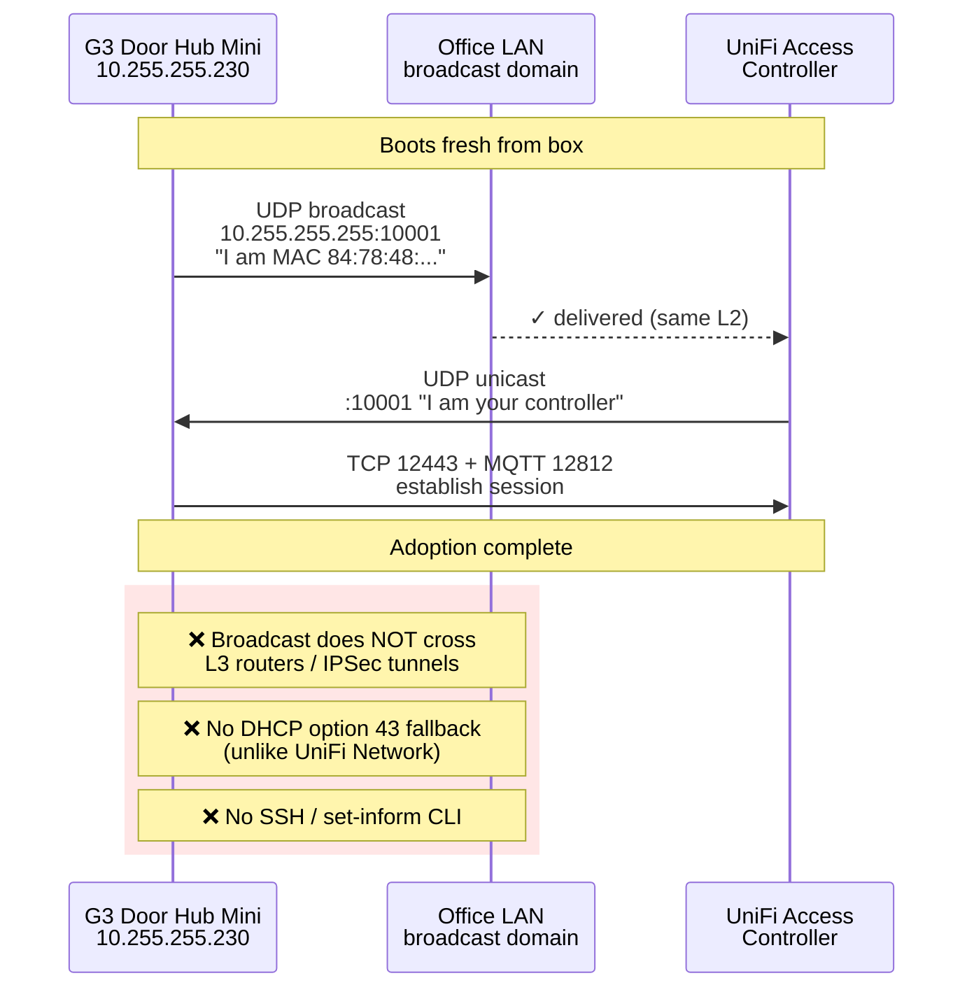
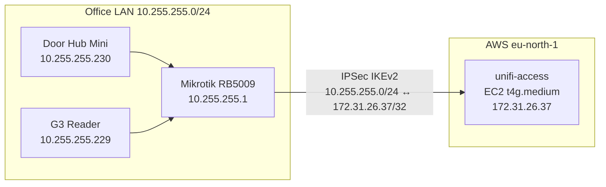
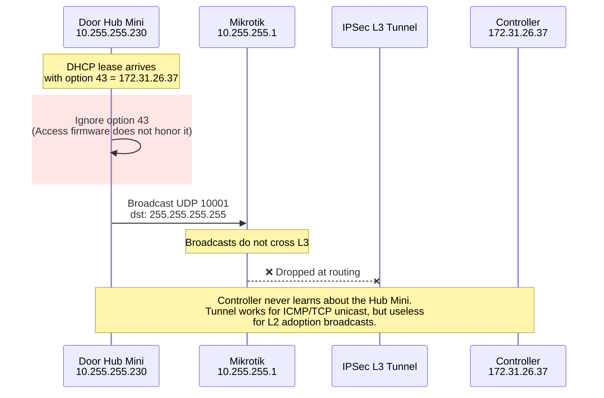
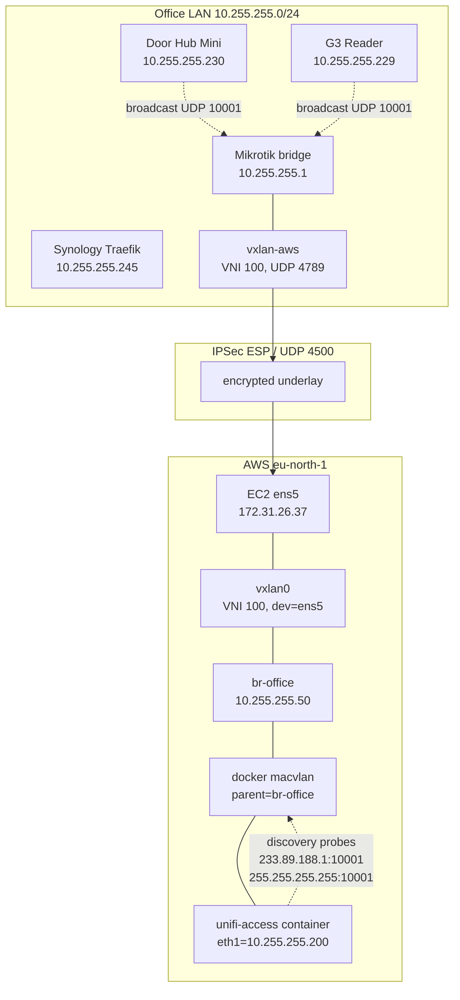
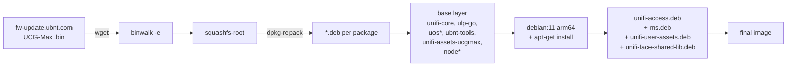
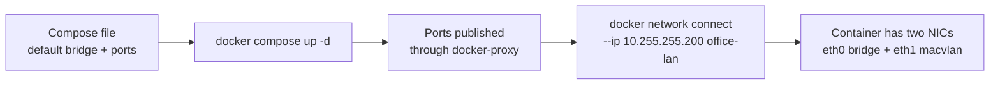
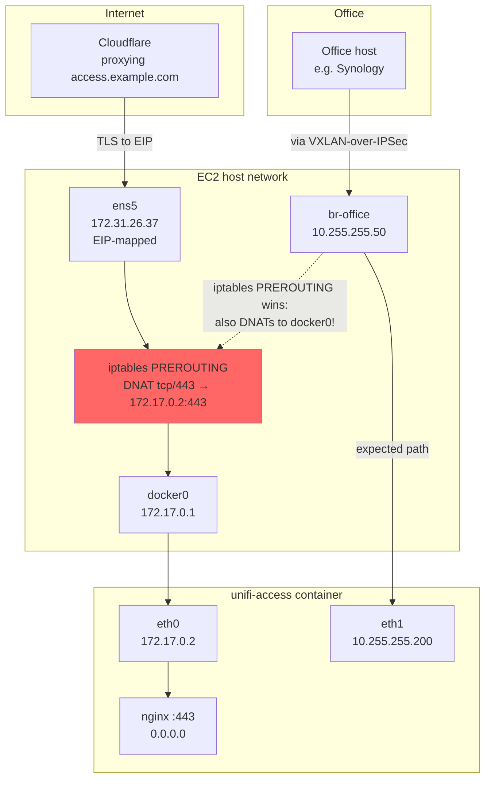
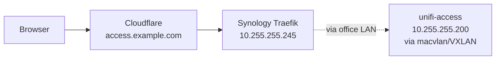
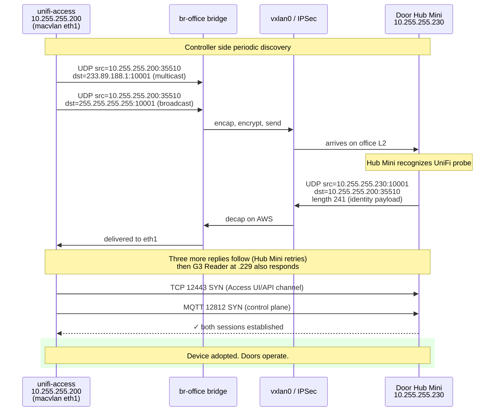
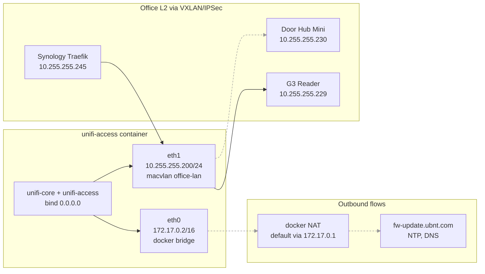

## The Constraint

I had a G3 Starter Kit on the desk: one UA-G3 Door Hub Mini, one UA-G3 Wall reader. The plan was to run the UniFi Access controller in Docker on the office Synology NAS, keep everything on the local LAN, and let the door hardware adopt there.

Ubiquiti officially does not support this. They sell consoles with Access pre-installed and tell you to run it there. The [dciancu/unifi-protect-unvr-docker-arm64][dciancu] repository proves the application layer can be lifted off a console image; nobody has done it for Access, and the device adoption story is materially different from Protect.

That was the constraint I started from: a docker controller, a door hub that had to adopt through L2 discovery, and a NAS that looked like the right host until the architecture requirement broke it. AWS only entered the story after the local Synology path failed.

The examples below use real values from the deployment, sanitized only where they would not help a reader reproduce the design.

---

## What "Adoption" Actually Means for Access

UniFi Access bootstrapping starts with local discovery: devices broadcast on UDP `10001`, and in this unsupported container setup the Hub Mini only offered itself to a controller that answered from the same L2 broadcast domain. Ubiquiti's own port list calls `10001/udp` the Access device discovery path ([docs][ubnt-access-getting-started]).

That sounds the same as Network adoption, but it is not. UniFi Network firmware honors **DHCP option 43** as a fallback (a controller IP encoded as `01 04 <ip-bytes>`), and the devices have a `set-inform` CLI over SSH. Access devices have neither. A community-confirmed [thread][reddit-opt43] documents this directly:

> "Access needs to see the other device in the same VLAN (broadcast domain)."

I tested option 43 anyway. The MikroTik sent it, the lease included the encoded controller IP, the Hub Mini ignored it. No `set-inform`, no SSH, no fallback. The device only adopted once the controller could participate in the L2 discovery exchange. After adoption, normal controller-to-device traffic can be L3-routed; the first discovery step was the hard constraint.

That single fact controls every networking decision in this story.






---

## Wrong Assumption 1: Run It on the Synology

The first idea was the obvious one. We had a DSM 7.2.2 box on the office LAN, with Portainer, Traefik, the existing service mesh, and plenty of CPU. Why deploy anywhere else?

Ubiquiti only publishes Access for arm64. Synology is x86_64. The expected workaround was QEMU user-mode emulation through `binfmt_misc`:

```bash
docker run --privileged --rm tonistiigi/binfmt --install arm64
docker run --platform=linux/arm64 alpine uname -m
# expected: aarch64
```

The first command failed:

```
installing: arm64 cannot register "/usr/bin/qemu-aarch64" to
/proc/sys/fs/binfmt_misc/register: write /proc/sys/fs/binfmt_misc/register:
invalid argument

supported:
  - linux/amd64
  - linux/amd64/v2
  - linux/amd64/v3
  - linux/386
```

Probing the kernel directly showed why:

```bash
docker run --rm --privileged --platform=linux/amd64 alpine \
  sh -c 'ls -la /proc/sys/fs/binfmt_misc/; cat /proc/sys/fs/binfmt_misc/status'

# dr-xr-xr-x    2 root     root             0 May 23 19:36 .
# (no 'register' or 'status' files)
# cat: can't open '/proc/sys/fs/binfmt_misc/status': No such file or directory
```

The `binfmt_misc` filesystem is mounted, but it is read-only and the `register`/`status` interface is gone. Synology's kernel (4.4.302+) is built with `binfmt_misc` deliberately locked down. No userspace can register a new format, with or without privileges, with or without IAM equivalents.

VMM was the next instinct: run a Linux ARM VM on the Synology. VMM uses KVM, which can only virtualize the host architecture. Without nested full-system QEMU (which DSM VMM does not expose), an arm64 VM on Intel Synology is not an option.

The Synology had to come out of the picture as the controller host.

---

## Wrong Assumption 2: AWS arm64 + IPSec L3 + DHCP Option 43

The next plan was cleaner architecturally. We have AWS, we have arm64 instances (`t4g.medium`), and we have a Mikrotik RB5009 with a static public IP that already terminates one IPSec tunnel.

The design looked like this:











The IPSec tunnel came up cleanly. From Mikrotik with an explicit source address, pings reached the controller at 10ms:

```
SEQ HOST                                     SIZE TTL TIME       STATUS
  0 172.31.26.37                               56  64 10ms260us
  1 172.31.26.37                               56  64 10ms404us
sent=3 received=3 packet-loss=0%
```

I configured DHCP option 43 on the Mikrotik to hand out the controller IP to UniFi devices:

```routeros
/ip dhcp-server option add name=unifi-controller code=43 value=0x0104ac1f1a25
/ip dhcp-server network set [find address=10.255.255.0/24] dhcp-option=unifi-controller
```

`0x01 04 ac 1f 1a 25` decodes as sub-option 1, length 4, controller IP `172.31.26.37`. The lease confirmed the option was offered. The Hub Mini took the lease and ignored the option.

Several controller-side captures showed the same thing: the Hub Mini was reachable, the IPSec tunnel was healthy, and no device traffic ever reached the controller. The community thread was right.

The discovery model was the architectural constraint, not a knob to tune. Either the controller had to be on the same L2 broadcast domain as the door hardware, or the broadcast domain had to be extended to where the controller was.

---

## The Shape That Matched the Protocol

The fix had to bring the controller container into the office broadcast domain at L2, while keeping its lifecycle in AWS. The shape that worked:

1. Keep the IPSec tunnel as the underlay - it already exists, it is encrypted, and it terminates at known endpoints.
2. Build a VXLAN tunnel between Mikrotik and the EC2 host, with VXLAN packets riding inside the IPSec tunnel.
3. Bridge the VXLAN endpoint into the office LAN on the Mikrotik side, and into a Linux bridge on the EC2 side.
4. Attach the docker container to the Linux bridge through a `macvlan` network, giving it a real `10.255.255.x` address.






The mental model that helped was this:

> The controller does not need to be in AWS. It needs to be unreachable from anywhere except the office LAN, and to look to the door hardware exactly like a host on `10.255.255.0/24`.

The L2 bridge made that true. AWS became invisible from the protocol's point of view.

---

## Building the Container Image

The application layer was the dciancu Protect approach with Access surgery on top.

The base layer comes from extracting a UCG-Max firmware binary - which is publicly downloadable and `binwalk`able - through `dpkg-repack` against the unpacked rootfs:






The Protect repo's pattern handles most of the heavy lifting. Access required a small number of additional patches inside the image, baked in at build time. These exist as `if ! sed -i ... exit 1` guards so a future firmware version that drifts from the pattern fails the build loudly instead of silently breaking at runtime.

### Patch 1: ustorage gRPC fallback

UniFi Core polls a gRPC server on `127.0.0.1:11052` for storage information. That server only exists on real UniFi consoles. Without intervention, the setup wizard fails with:

```
[grpc] Failed to connect to the gRPC server: 14 UNAVAILABLE:
No connection established. Last error: Error: connect ECONNREFUSED 127.0.0.1:11052.
   at ServiceClientImpl.storageSettings (...)
```

Protect's sed flips a JS conditional so the application takes the "shell ustorage" path instead:

```bash
sed -i '/return at()?s.push/{s//return at(),!0?s.push/;h};${x;/./{x;q0};x;q1}' \
    /usr/share/unifi-core/app/service.js
```

The patched path calls `/usr/bin/ustorage` and `/sbin/mdadm`, which I ship as fake responses generating plausible disk/RAID JSON.

### Patch 2: pre-setup nginx hostname allowlist

UniFi Core ships with a pre-setup nginx that redirects anything except `unifi`, `localhost`, or a raw IP to `https://unifi`:

```nginx
if ($host !~* ^(unifi|localhost|[0-9]+\.[0-9]+\.[0-9]+\.[0-9]+|\[[a-f0-9:]+\])$) {
    return 302 $scheme://unifi;
}
```

A reverse-proxied hostname like `access.example.com` hits this regex and bounces. The build relaxes it so any non-empty `$host` passes:

```bash
sed -i 's|host !~\* \^(unifi|host !~* ^(.+|' \
    /usr/share/unifi-core/http/site-setup.conf
```

The file is then in `/usr/share/...`, which is the template directory. After a factory reset, UniFi Core copies the template into `/data/unifi-core/config/http/`, preserving the patch.

### Patch 3: console identity

The hardware identity layer in UniFi OS is a script at `/sbin/ubnt-tools`. The original `ubnt-tools id` reports the actual board sysid. My shim writes a configurable identity based on the `DEVICE` env var (`UNVR`, `UCG_MAX`, `UDM_PRO_MAX`, etc).

The first attempt used `UCG_MAX` because the extracted firmware was UCG-Max. The setup wizard immediately broke with "Unexpected error during setup" because UCG-Max has `hasGateway: true` in its features and the wizard tried to run gateway-only steps (WAN probe, UDAPI client) that fail in a container. Switching the identity to `UNVR` (sysid `0xea16`, no gateway features) made the wizard skip those steps. That matches what Protect users do in docker.

### What the post-install block actually applies

```dockerfile
RUN echo 'exit 0' > /usr/sbin/policy-rc.d \
    && if ! sed -i '/return at()?s.push/{s//return at(),!0?s.push/;h};${x;/./{x;q0};x;q1}' \
         /usr/share/unifi-core/app/service.js; then \
         echo 'ERROR: ustorage sed pattern not found' && exit 1; \
    fi \
    && if ! sed -i 's|host !~\* \^(unifi|host !~* ^(.+|' \
         /usr/share/unifi-core/http/site-setup.conf; then \
         echo 'ERROR: site-setup.conf hostname patch failed' && exit 1; \
    fi \
    && mv /sbin/mdadm /sbin/mdadm.orig \
    && mv /sbin/ubnt-tools /sbin/ubnt-tools.orig \
    && systemctl enable storage_disk dbpermissions fix_hosts \
         fix_apt_ubiquiti_sources init_console init_device \
    && echo -e '\n\nexport PGHOST=127.0.0.1\n' \
         >> /usr/lib/ulp-go/scripts/envs.sh
```

That covers it. Image is ~2.4 GB, runs as the Protect-pattern Debian-11 systemd container, with `unifi-access.service`, `unifi-core.service`, and two PostgreSQL clusters (`main` and `access` on ports 5432 and 5435).

---

## VXLAN Underlay

The VXLAN tunnel uses UDP 4789. With both endpoints having explicit unicast addresses, the inner Ethernet frames travel inside outer UDP packets between `10.255.255.1` (Mikrotik LAN side) and `172.31.26.37` (EC2 private IP).

The existing IPSec policy is `10.255.255.0/24 ↔ 172.31.26.37/32`. VXLAN outer packets between those two addresses match the policy, so they ride encrypted inside ESP. No new IPSec policy was needed; the L2 extension reuses the existing L3 tunnel as its transport.

### Mikrotik side

```routeros
/interface vxlan
add name=vxlan-aws vni=100 port=4789 mtu=1380 local-address=10.255.255.1

/interface vxlan vteps
add interface=vxlan-aws remote-ip=172.31.26.37

/interface bridge port
add bridge=bridge interface=vxlan-aws

/ip firewall filter
add chain=input action=accept protocol=udp dst-port=4789 \
    src-address=172.31.26.37/32 place-before=0 \
    comment="VXLAN from AWS via IPSec"
```

The `local-address=10.255.255.1` is important. Without it, Mikrotik picks the source IP for VXLAN outer packets based on the egress interface (the WAN), and the resulting tuple does not match the IPSec policy. Forcing the LAN IP keeps everything inside the policy's transform set.

### EC2 side

The first attempt looked like this:

```bash
ip link add vxlan0 type vxlan id 100 \
    remote 10.255.255.1 local 172.31.26.37 dstport 4789 nolearning
ip link set vxlan0 master br-office
```

VXLAN packets *arrived* from Mikrotik. Nothing went the other way. The kernel was silently dropping outbound encapsulation.

Two issues:

**`nolearning` plus an empty FDB.** With learning off and no manual entries, the kernel had no idea where to send broadcasts and unknown unicast. The fix is to add a default flood entry:

```bash
bridge fdb append 00:00:00:00:00:00 dev vxlan0 dst 10.255.255.1
```

**No explicit `dev`.** Without `dev ens5`, the kernel does a generic route lookup for the outer destination `10.255.255.1` and finds that `10.255.255.0/24` is reachable through `br-office`. The VXLAN outer packet routes back into the bridge, where it loops. The fix is to bind the underlay to a specific egress device:

```bash
ip link add vxlan0 type vxlan id 100 \
    remote 10.255.255.1 local 172.31.26.37 dstport 4789 dev ens5
```

With both fixes:

```bash
ip link add br-office type bridge
ip link set br-office mtu 1380 up
ip addr add 10.255.255.50/24 dev br-office

ip link add vxlan0 type vxlan id 100 \
    remote 10.255.255.1 local 172.31.26.37 dstport 4789 dev ens5
ip link set vxlan0 mtu 1380 master br-office up

bridge fdb append 00:00:00:00:00:00 dev vxlan0 dst 10.255.255.1
```

A `tcpdump` on `ens5` after this is more honest than any documentation:

```
22:24:52.110815 IP 172.31.26.37.4500 > 194.126.118.207.4500:
    UDP-encap: ESP(spi=0x00607012,seq=0x80), length 120
22:24:52.252695 IP 194.126.118.207.4500 > 172.31.26.37.4500:
    UDP-encap: ESP(spi=0xc291d279,seq=0x186), length 136
22:24:52.252695 IP 10.255.255.1.50999 > 172.31.26.37.4789:
    VXLAN, flags [I] (0x08), vni 100
    STP 802.1w, Rapid STP, ...
22:24:55.861464 IP 10.255.255.1.48863 > 172.31.26.37.4789:
    VXLAN, flags [I] (0x08), vni 100
    ARP, Request who-has 10.255.255.230 tell 10.255.255.230
```

STP frames and the Hub Mini's gratuitous ARP both arrive over the encrypted VXLAN tunnel. The L2 extension is alive.

A useful red herring during this debugging: the IPSec tunnel uses NAT-T because the EC2 instance lives behind AWS's network address translation. So encrypted traffic shows up as `udp port 4500`, not raw ESP. A `tcpdump` filter that only matches `esp` returns nothing.

### Persistence

VXLAN created with `ip link` does not survive a reboot. A small systemd unit owns the lifecycle:

```ini
# /etc/systemd/system/vxlan-office.service
[Unit]
Description=VXLAN office-bridge to Mikrotik (L2 extension over IPSec)
After=network.target strongswan-starter.service
Wants=strongswan-starter.service

[Service]
Type=oneshot
RemainAfterExit=yes
ExecStart=/usr/local/sbin/vxlan-office-up.sh
ExecStop=/usr/local/sbin/vxlan-office-down.sh

[Install]
WantedBy=multi-user.target
```

```bash
# /usr/local/sbin/vxlan-office-up.sh
#!/bin/bash
set -e
ip link show br-office >/dev/null 2>&1 || ip link add br-office type bridge
ip link set br-office mtu 1380 up
ip addr add 10.255.255.50/24 dev br-office 2>/dev/null || true

ip link del vxlan0 2>/dev/null || true
ip link add vxlan0 type vxlan id 100 \
    remote 10.255.255.1 local 172.31.26.37 dstport 4789 dev ens5
ip link set vxlan0 mtu 1380 master br-office up

bridge fdb append 00:00:00:00:00:00 dev vxlan0 dst 10.255.255.1
```

`Wants=strongswan-starter.service` ensures the IPSec tunnel comes up first. Without that ordering, the VXLAN socket is open before the underlay can carry packets, and Mikrotik silently drops the first batch.

---

## MTU Accounting

The encapsulation chain adds bytes at three layers. Counting them honestly:

| Layer | Overhead | Notes |
|---|---|---|
| Outer Ethernet | 14 | Standard |
| Outer IP | 20 | IPv4 |
| Outer UDP (VXLAN) | 8 | dstport 4789 |
| VXLAN header | 8 | VNI |
| Inner Ethernet | 14 | The frame the bridge actually carries |
| IPSec NAT-T overhead | ~30 | UDP 4500 + ESP header + IV + ICV |

A 1500-byte underlay leaves 1500 − (20+8+8+14+30) ≈ **1420** bytes for the inner payload that the macvlan-attached container can use. I chose **1380** as the bridge/VXLAN MTU to leave headroom and avoid path-MTU surprises.

If you do not set MTU on both `br-office` and `vxlan-aws`, TCP traffic over the L2 bridge will hang under load when packets fragment and the IPSec path drops the fragments.

---

## Docker Multi-Network Trap

Two networks were needed:

- A **default bridge** for outbound traffic and Internet access (image pulls, ACME, NTP, etc).
- The **office-lan macvlan** with parent=`br-office`, so the container gets a 10.255.255.x address on the bridged L2.

The natural Compose definition for that is:

```yaml
services:
  unifi-access:
    image: unifi-access-docker-arm64:stable
    networks:
      default: {}
      office-lan:
        ipv4_address: 10.255.255.200
    ports:
      - "443:443/tcp"
      - "80:80/tcp"
      - "8080:8080/tcp"
      - "12442-12443:12442-12443/tcp"

networks:
  default: {}
  office-lan:
    external: true
```

This deploys. The container starts, gets both NICs, listens on the right ports inside the container. From `docker ps`:

```
NAMES          PORTS
unifi-access   80/tcp, 443/tcp, 8080/tcp, 12442-12443/tcp
```

That output is wrong. There is no `0.0.0.0:443->443/tcp`. The ports are *exposed* but not *published*. On the host, `ss -tlnp` shows no docker-proxy listening anywhere.

This is the docker-compose-v2 multi-network port-publish bug. When a service has both a bridge and a macvlan network declared in the same Compose service, the `ports:` block silently drops to "expose only".

The workaround is a two-phase deploy: Compose declares only the bridge with ports, and the macvlan is attached post-up:






```bash
docker compose -f docker-compose.cloud.yml up -d
docker network connect --ip 10.255.255.200 office-lan unifi-access
```

After this:

```
NAMES          PORTS
unifi-access   0.0.0.0:443->443/tcp, 0.0.0.0:80->80/tcp, ...
```

```
$ docker exec unifi-access ip -brief addr
eth0@if31  UP  172.17.0.2/16
eth1@if15  UP  10.255.255.200/24
```

UniFi Core's nginx listens on `0.0.0.0:443` inside the container. It binds on both NICs. Cloudflare can reach the EIP through the bridge NIC via docker-proxy. The Hub Mini at `10.255.255.230` can reach the controller directly through the macvlan NIC because both are on the same L2 broadcast domain.

---

## Then I Broke It

The Cloudflare proxy returned 521 ("origin unreachable") a little later. The web path through the EIP had stopped working.






The cause was docker-proxy itself. When `-p 443:443` publishes a port, docker installs an iptables DNAT rule that matches **destination port** without constraining the destination IP. The rule looks roughly like:

```
DNAT  tcp  *  *  0.0.0.0/0  0.0.0.0/0  tcp dpt:443  to:172.17.0.2:443
```

That matches traffic destined for the EIP and also matches traffic destined for the macvlan IP `10.255.255.200`. From the office, a request to `https://10.255.255.200` arrives on `br-office`, gets DNATed to `172.17.0.2:443`, and the kernel forwards it to the docker bridge instead of delivering it to the macvlan NIC that the LAN client expected.

The two access paths conflict. The docker-proxy DNAT wins because PREROUTING runs before the bridge forwarding decision.

The fix had two parts:

**Remove docker-proxy port publishing entirely.** No `-p` flags, no `ports:` in compose. The container is reachable only through its macvlan IP on the office LAN.

**Front the web tier through the existing Synology Traefik instead.** The Synology lives on the same office LAN as the macvlan. From Traefik's perspective, the controller looks like any other LAN host; it just happens to be answered by something in AWS:






The Security Group on the EC2 also got much smaller. Web access does not enter through the EIP anymore, so 80/443 from the Internet are not needed. Access ports do not need direct allowlists from the office subnet either, because that traffic now arrives encapsulated as VXLAN inside IPSec - the SG only sees the outer IPSec/UDP-4500 packets.

Final inbound rules:

| Proto | Port | Source | Purpose |
|---|---|---|---|
| UDP | 500 | Mikrotik public IP | IKE |
| UDP | 4500 | Mikrotik public IP | IPSec NAT-T |
| ESP (50) | - | Mikrotik public IP | ESP |
| ICMP | - | 10.255.255.0/24 | Diagnostics over L2 |

Everything else is denied. The controller has no Internet-exposed application surface. Its public identity is mediated by Cloudflare and Synology Traefik, not by an Internet-facing socket on the controller itself.

---

## The Discovery Handshake, Live

After the L2 bridge and macvlan attachment, `tcpdump` on `vxlan0` from the EC2 side captured the full UniFi discovery dance:

```
22:30:58.954333 IP 10.255.255.200.35510 > 233.89.188.1.10001:
    UDP, length 4
22:30:58.954387 IP 10.255.255.200.35510 > 10.255.255.255.10001:
    UDP, length 4

22:30:58.965433 IP 10.255.255.230.10001 > 10.255.255.200.35510:
    UDP, length 241
22:30:58.976442 IP 10.255.255.229.10001 > 10.255.255.200.35510:
    UDP, length 212
22:30:58.977665 IP 10.255.255.229.44119 > 255.255.255.255.10001:
    UDP, length 212
```

The first two lines are the controller (10.255.255.200) sending its discovery probes to UniFi's multicast group `233.89.188.1:10001` and the LAN broadcast `255.255.255.255:10001`. The next three are the Hub Mini at `.230` and the G3 Reader at `.229` responding directly with their identity payloads.

This is the protocol working as Ubiquiti designed it. Nothing about the controller's actual location in AWS is visible from this trace; the L2 extension makes the topology look local.

Sessions established cleanly after that:

```
$ docker exec unifi-access ss -tnp state established | grep 10.255
tcp 0  26400  10.255.255.200:12443  10.255.255.230:51802  unifi-access-ap
tcp 0  0      10.255.255.200:12812  10.255.255.230:51799  unifi-access-ap
```

The Hub Mini holds two TCP sessions to the controller: 12443 for the Access UI/API channel and 12812 for MQTT control commands. Real-time door operations flow over 12812.

---






## Mikrotik Bridge Counters Lie

A late-night debugging detour cost a real hour:

```
/interface print stats where name=vxlan-aws
0 RS vxlan-aws   RX-BYTE=0   TX-BYTE=28894   TX-PACKET=410
```

The RX counter on vxlan-aws was zero. The TX counter was incrementing rapidly. By all visible evidence, traffic was leaving Mikrotik for AWS but nothing was coming back.

The bridge host table told a different story:

```
/interface bridge host print where on-interface=vxlan-aws
#  MAC-ADDRESS         BRIDGE  REMOTE-IP
0  22:0C:29:0C:2F:11   bridge  (local)
1  4A:51:CF:46:03:91   bridge  172.31.26.37
2  62:F0:60:4C:FB:10   bridge  172.31.26.37
```

The bridge had clearly learned the AWS-side MAC addresses, including the docker container's macvlan MAC, with REMOTE-IP correctly pointing at the EC2 private address. That can only happen from incoming VXLAN packets.

On RouterOS 7.19.1 in this setup, `/interface print stats` lied for the VXLAN interface. The bridge-level statistics were correct. Trust `/interface bridge host` and `/interface bridge port print stats`, not `/interface print stats` when troubleshooting VXLAN.

---

## Why the Container Has Two NICs

The container ends up with two interfaces inside it, and both matter for different reasons:

| Interface | Subnet | Used by | Why it exists |
|---|---|---|---|
| `eth0` | 172.17.0.0/16 (docker bridge) | outbound HTTPS, ACME-ish lookups, container's own Internet | Default route, gives the container Internet access |
| `eth1` | 10.255.255.0/24 (macvlan / VXLAN bridge) | UDP 10001 discovery, MQTT 12812, Access UI 12443, ARP | The actual L2 identity that door hardware sees |

The application binds on `0.0.0.0` so it answers on both. The L2 broadcast traffic only arrives on `eth1`. Outbound DNS, cert refreshes, ulp-go cloud chatter all leave through `eth0`'s default route, get NATed by docker bridge to the host's ens5, and reach the Internet without crossing the IPSec tunnel.

That separation also means a Synology Traefik route, talking to the controller as `10.255.255.200`, never touches AWS billing for egress. Everything in the office LAN ↔ controller direction stays on LAN-equivalent ports of the office bridge, which is just a VXLAN tunnel that happens to encrypt over the AWS NAT-T path.






---

## What I Would Validate Before Trusting It

Working in this layered topology means there are several places where a single configuration error gives the wrong-but-plausible answer. I would not trust the design until all of these pass on a clean restart:

**IPSec underlay:**

```bash
ip xfrm state | grep -A2 reqid
ipsec statusall | grep -E "ESTABLISHED|INSTALLED"
```

**VXLAN encapsulation:**

```bash
# On EC2: outer encrypted packets should be flowing both directions
tcpdump -ni ens5 "udp port 4500 or udp port 4789"

# Inside the tunnel: bridge-relevant frames
tcpdump -ni vxlan0 "udp port 10001 or arp"
```

**Bridge state, both ends:**

```bash
# AWS side
bridge fdb show dev vxlan0
ip neigh show dev br-office

# Mikrotik side
/interface bridge host print where on-interface=vxlan-aws
```

**End-to-end L2 reachability:**

```bash
# From AWS host
ping -I br-office 10.255.255.230   # the Hub Mini

# From Mikrotik
/ping address=10.255.255.200 src-address=10.255.255.1
```

**UniFi-level adoption:**

```bash
docker exec unifi-access ss -tnp state established | grep -E ":(12443|12812)"
docker exec unifi-access journalctl -u unifi-access --since "5 minutes ago" \
    | grep -iE "adopt|inform|84:78"
```

If any of these regress, the layer that broke is usually obvious from where the trace stops.

---

## What This Design Commits You To

This design gives a cloud-hosted Access controller adoption parity with a local one, at the cost of explicit network plumbing.

The useful properties:

- The G3 Door Hub Mini adopts and operates exactly as it would on a Ubiquiti console - no fork of its firmware, no SSH, no manual `set-inform`.
- The controller container is unreachable from the Internet directly. The only public surface is what Cloudflare and Synology Traefik expose.
- Door operations continue for already-synced credentials if AWS becomes unavailable. The controller is needed for new changes and sync, not for every local unlock decision.
- The architecture is reproducible. The VXLAN/bridge/macvlan bits are vanilla Linux primitives; the Mikrotik bits are stock RouterOS.

The explicit constraints:

- MTU has to be set consistently at three layers (bridge, vxlan, container interface). Forget one and TCP flows hang under load.
- The IPSec tunnel is on the critical path. Lose IPSec, the VXLAN encapsulation has nowhere to go, all adoption traffic stops within DPD timeout.
- Multi-network Compose with `macvlan` plus `ports:` silently breaks port publishing. The two-phase `compose up + docker network connect` pattern works around it but the failure mode is invisible until you check `docker ps`.
- Docker's port-publish DNAT competes with macvlan direct access. You can have one or the other; combining them through the same iptables PREROUTING chain leaves at least one path broken.
- In my RouterOS 7.19.1 run, VXLAN interface counters lied. Use bridge-level stats.
- The Synology kernel does not let you run `binfmt_misc`-registered foreign-arch binaries, regardless of privileges. arm64 workloads need a real arm64 host.

For a homelab access control system that should not depend on Ubiquiti consoles or on bringing the controller indoors, this is the simplest design I could find that respects the actual protocol constraints instead of fighting them.

---

## References

- [dciancu/unifi-protect-unvr-docker-arm64][dciancu] - the foundation pattern this work extends
- [UniFi Access on UniFi Consoles - support article][ubnt-access-consoles]
- [Getting Started with UniFi Access - ports and communication model][ubnt-access-getting-started]
- [DHCP Option 43 for UniFi Access devices - r/UNIFI thread][reddit-opt43]
- [Linux VXLAN man page][linux-vxlan]
- [RouterOS 7 VXLAN documentation][routeros-vxlan]
- [Docker macvlan driver][docker-macvlan]
- [strongSwan NAT traversal][strongswan-nat-t]
- [VXLAN: RFC 7348][rfc-vxlan]

[dciancu]: https://github.com/dciancu/unifi-protect-unvr-docker-arm64
[ubnt-access-consoles]: https://help.ui.com/hc/en-us/articles/22230509487639-UniFi-Consoles-with-UniFi-Access-Support
[ubnt-access-getting-started]: https://help.ui.com/hc/en-us/articles/17452334269975-Getting-Started-with-UniFi-Access
[reddit-opt43]: https://www.reddit.com/r/UNIFI/comments/16v6js7/is_dhcp_option_43_supported_by_unifi_door_access/
[linux-vxlan]: https://www.man7.org/linux/man-pages/man8/ip-link.8.html
[routeros-vxlan]: https://help.mikrotik.com/docs/spaces/ROS/pages/100007937/VXLAN
[docker-macvlan]: https://docs.docker.com/network/drivers/macvlan/
[strongswan-nat-t]: https://docs.strongswan.org/docs/5.9/features/natTraversal.html
[rfc-vxlan]: https://www.rfc-editor.org/rfc/rfc7348
