## Preamble: The Key Was the First Problem

This did not start as a VXLAN project.

We got a small office with one physical ABLOY key. One key is fine until more than one person needs to enter the office, open it for a delivery, or get in after hours. The obvious fix was to copy the key a few times.

Then we checked the price.

Making four proper copies of that ABLOY key was expensive enough that the UniFi Access G3 Starter Kit started to look reasonable. Instead of paying for more metal keys, we could get a door hub, a reader, NFC cards, mobile unlocks, logs, and something that was at least possible to manage like the rest of the office infrastructure.

So the plan was simple:

1. install the G3 kit on the office door;
2. run the Access controller somewhere local;
3. add users;
4. stop thinking about keys.

That plan lasted until setup.

The kit was not just a reader and a relay. UniFi Access expects an Access application running on a supported UniFi console. We did not have one on-site, and waiting for more hardware was not attractive. The door hardware was already on the desk, the office still had one key, and this was supposed to be a quick fix.

So the lab plan became: run UniFi Access in Docker.

At first this sounded like an application problem. Extract the right packages, make the services start, expose the web UI, and adopt the devices. The existing UniFi Protect Docker work suggested that this was at least possible.

It turned out the hard part was not starting the application.

The hard part was making a Docker container look, from the door controller’s point of view, like a real UniFi console sitting on the same office LAN.

That is where the story actually begins: one expensive key copy quote, one unsupported Docker controller, and a door system that cared much more about Layer 2 discovery than I expected.

## The First Constraint: Access Wanted a Console

With that context, the first target was obvious: keep everything local. The office already had a Synology NAS, Docker, Portainer, Traefik, and the rest of the small-service stack. If Access could run there, the network would stay boring.

Ubiquiti officially does not support this. They sell consoles with Access pre-installed and list the compatible console models in their own documentation ([docs][ubnt-access-consoles]). The [dciancu/unifi-protect-unvr-docker-arm64][dciancu] repository proves the application layer can be lifted off a console image; nobody has done it for Access, and the device adoption story is materially different from Protect.

This post is the path from that wrong assumption to the final shape: UniFi Access running on AWS arm64, attached to the office broadcast domain through VXLAN-over-IPSec and a single Docker macvlan interface.

The final design has three layers:

1. Underlay: Mikrotik to AWS IPSec.
2. L2 extension: VXLAN over that IPSec tunnel.
3. Container identity: UniFi Access attached only to the office bridge through macvlan.

Most of the debugging pain came from confusing those layers. A ping proved the underlay. UDP discovery proved L2. A stable reader proved MTU and management traffic. The web UI proved only the browser path.

The examples below use real values from the deployment, sanitized only where they would not help a reader reproduce the design.

---

## What "Adoption" Actually Means for Access

UniFi Access is not purely L2 forever. Ubiquiti documents the device ports as `10001/udp` for discovery, `8080` for adoption, `12443` for HTTPS device communication, and `12812` for MQTT messaging. The same page says Access Control Hubs communicate with the Access application over IP, while readers and hubs must stay on the same L2 network ([docs][ubnt-access-getting-started]).

The part that broke this unsupported Docker deployment was the first discovery/adoption path. In this setup, the Hub Mini only offered itself to a controller that answered from the same discovery domain.

That sounds the same as Network adoption, but it is not. UniFi Network firmware honors **DHCP option 43** as a fallback (a controller IP encoded as `01 04 <ip-bytes>`), and the devices have a `set-inform` CLI over SSH. Access devices have neither. A community-confirmed [thread][reddit-opt43] documents this directly:

> "Access needs to see the other device in the same VLAN (broadcast domain)."

I tested option 43 anyway. The MikroTik sent it, the lease included the encoded controller IP, the Hub Mini ignored it. No `set-inform`, no SSH, no useful fallback for this case. The device only adopted once the controller could participate in the discovery exchange.

That single fact controls every networking decision in this story.

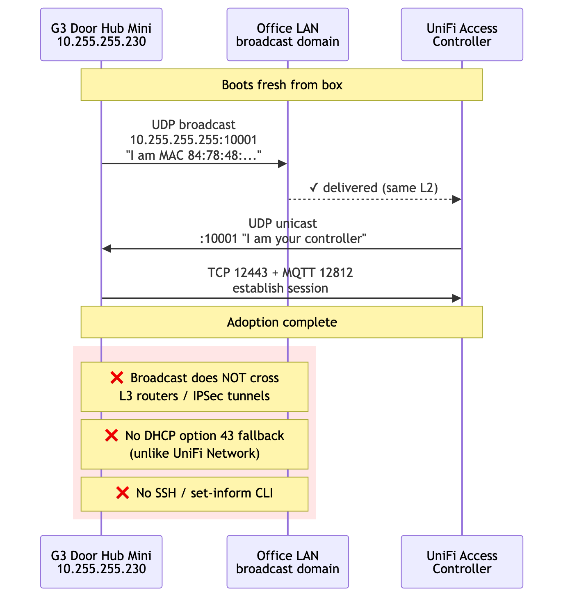


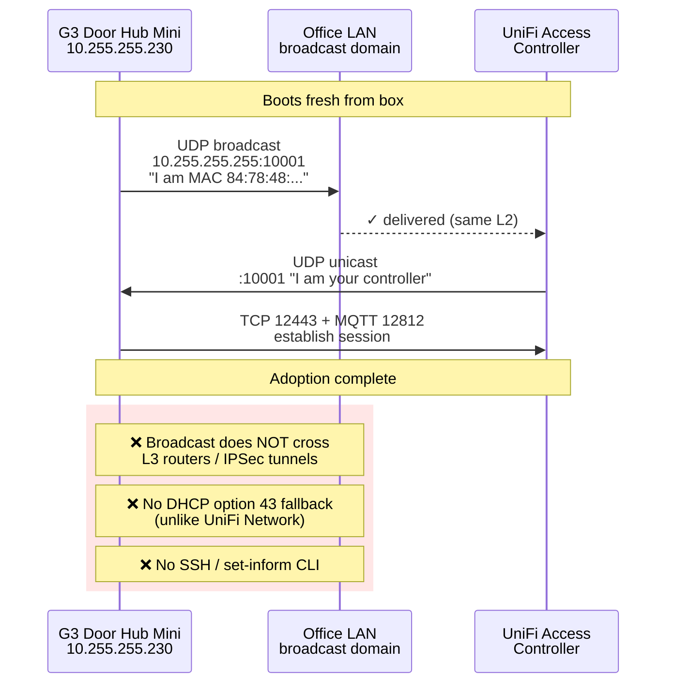


---

## Dead End 1: The Local NAS Was the Wrong CPU

The first idea was the obvious one. We had a DSM 7.2.2 box on the office LAN, with Portainer, Traefik, the existing service mesh, and plenty of CPU. Why deploy anywhere else?

Ubiquiti only publishes Access for arm64. Synology is x86_64. The expected workaround was QEMU user-mode emulation through `binfmt_misc`:

```bash
docker run --privileged --rm tonistiigi/binfmt --install arm64
docker run --platform=linux/arm64 alpine uname -m
# expected: aarch64
```

The first command failed:

```
installing: arm64 cannot register "/usr/bin/qemu-aarch64" to
/proc/sys/fs/binfmt_misc/register: write /proc/sys/fs/binfmt_misc/register:
invalid argument

supported:
  - linux/amd64
  - linux/amd64/v2
  - linux/amd64/v3
  - linux/386
```

Probing the kernel directly showed why:

```bash
docker run --rm --privileged --platform=linux/amd64 alpine \
  sh -c 'ls -la /proc/sys/fs/binfmt_misc/; cat /proc/sys/fs/binfmt_misc/status'

# dr-xr-xr-x    2 root     root             0 May 23 19:36 .
# (no 'register' or 'status' files)
# cat: can't open '/proc/sys/fs/binfmt_misc/status': No such file or directory
```

The `binfmt_misc` filesystem is mounted, but it is read-only and the `register`/`status` interface is gone. Synology's kernel (4.4.302+) is built with `binfmt_misc` deliberately locked down. No userspace can register a new format, with or without privileges, with or without IAM equivalents.

VMM was the next instinct: run a Linux ARM VM on the Synology. VMM uses KVM, which can only virtualize the host architecture. Without nested full-system QEMU (which DSM VMM does not expose), an arm64 VM on Intel Synology is not an option.

The Synology had to come out of the picture as the controller host.

---

## Dead End 2: A Working L3 Tunnel Still Did Not Carry Discovery

The next plan was cleaner architecturally. We have AWS, we have arm64 instances (`t4g.medium`), and we have a Mikrotik RB5009 with a static public IP that already terminates one IPSec tunnel.

The design looked like this:

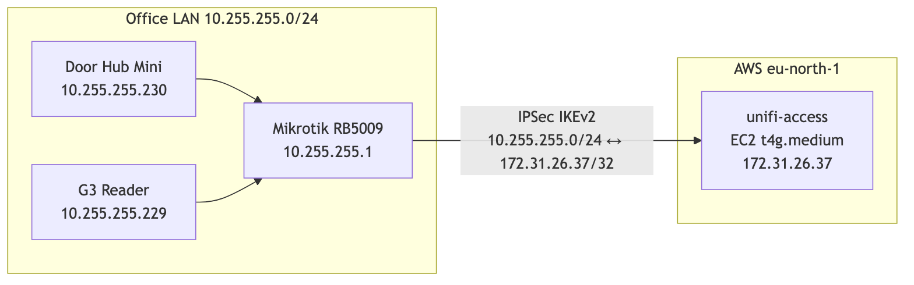


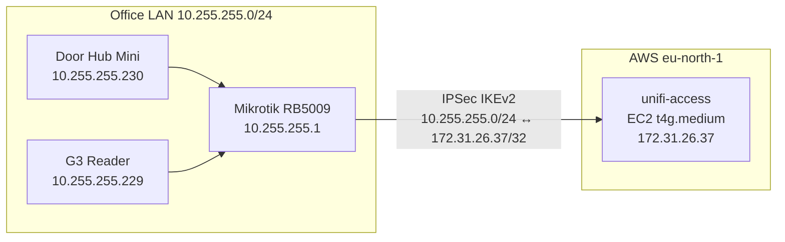


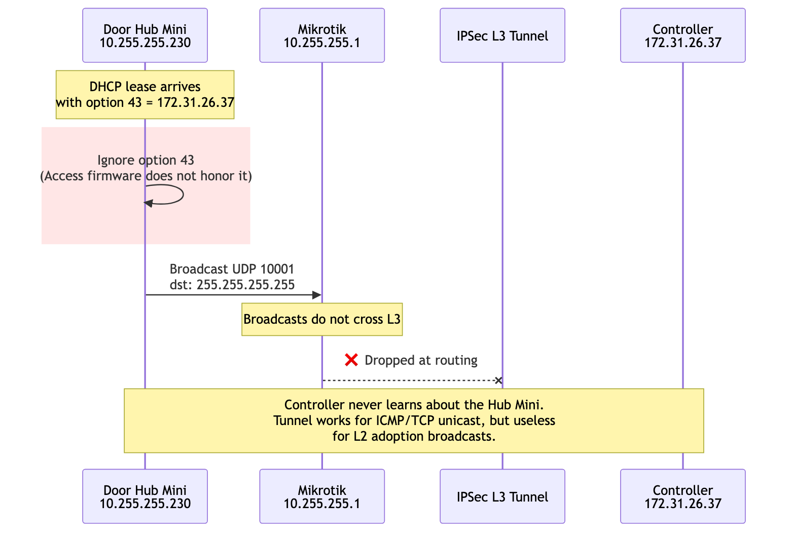


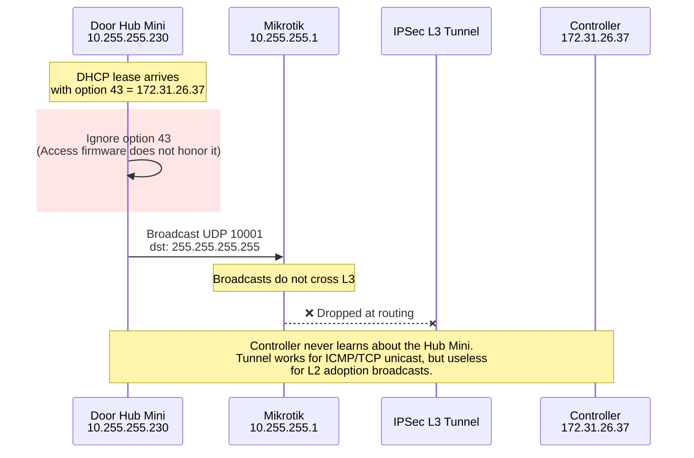


The IPSec tunnel came up cleanly. From Mikrotik with an explicit source address, pings reached the controller at 10ms:

```
SEQ HOST                                     SIZE TTL TIME       STATUS
  0 172.31.26.37                               56  64 10ms260us
  1 172.31.26.37                               56  64 10ms404us
sent=3 received=3 packet-loss=0%
```

I configured DHCP option 43 on the Mikrotik to hand out the controller IP to UniFi devices:

```routeros
/ip dhcp-server option add name=unifi-controller code=43 value=0x0104ac1f1a25
/ip dhcp-server network set [find address=10.255.255.0/24] dhcp-option=unifi-controller
```

`0x01 04 ac 1f 1a 25` decodes as sub-option 1, length 4, controller IP `172.31.26.37`. The lease confirmed the option was offered. The Hub Mini took the lease and ignored the option.

Several controller-side captures showed the same thing: the Hub Mini was reachable, the IPSec tunnel was healthy, and no device traffic ever reached the controller. The community thread was right.

The discovery model was the architectural constraint, not a knob to tune. Either the controller had to be on the same L2 broadcast domain as the door hardware, or the broadcast domain had to be extended to where the controller was.

---

## The Shape That Matched the Protocol: Extend L2, Do Not Fight It

The fix had to bring the controller container into the office broadcast domain at L2, while keeping its lifecycle in AWS. The shape that worked:

1. Keep the IPSec tunnel as the underlay - it already exists, it is encrypted, and it terminates at known endpoints.
2. Build a VXLAN tunnel between Mikrotik and the EC2 host, with VXLAN packets riding inside the IPSec tunnel.
3. Bridge the VXLAN endpoint into the office LAN on the Mikrotik side, and into a Linux bridge on the EC2 side.
4. Attach the docker container to the Linux bridge through a `macvlan` network, giving it a real `10.255.255.x` address.

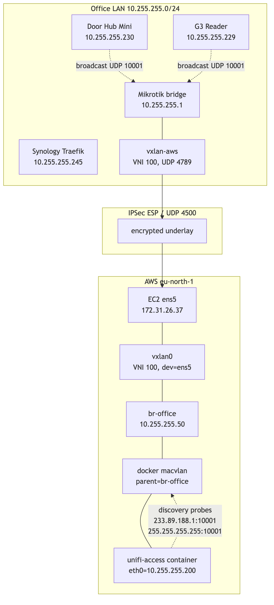





The mental model that helped was this:

> The controller does not need to be in AWS. It needs to be unreachable from anywhere except the office LAN, and to look to the door hardware exactly like a host on `10.255.255.0/24`.

The L2 bridge made that true. AWS became invisible from the protocol's point of view.

---

## About the Controller Image

The controller image is not the main subject of this post. It deserves its own write-up.

For context, I built it from arm64 UniFi OS packages using the same broad approach as the existing UniFi Protect container work. Access needed several console-assumption patches: storage reporting, pre-setup hostname handling, and console identity. The final image runs UniFi Core, UniFi Access, and the required PostgreSQL services inside a Debian arm64 systemd container.

The important networking fact is this: the container could run, and it could be attached to a Docker macvlan network with `10.255.255.200/24`. Everything below is about making that address behave like a real office LAN host.

The image path is a separate article. That write-up is now [Vol 2: Sixty Seconds to Nothing][vol2]. It covers making UniFi Access believe Docker is a console: firmware extraction, package repacking, `ustorage` and `mdadm` shims, the `UNVR` identity trick, nginx setup patches, PostgreSQL clusters, and the build-time guards that keep future firmware upgrades honest.

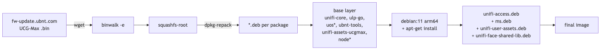


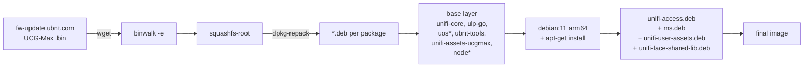


---

## Building the L2 Extension

The VXLAN tunnel uses UDP 4789. With both endpoints having explicit unicast addresses, the inner Ethernet frames travel inside outer UDP packets between `10.255.255.1` (Mikrotik LAN side) and `172.31.26.37` (EC2 private IP). Linux VXLAN is UDP-based, and the kernel documentation shows the IANA-assigned `4789` port in its example ([docs][kernel-vxlan-docs]).

The existing IPSec policy is `10.255.255.0/24 ↔ 172.31.26.37/32`. VXLAN outer packets between those two addresses match the policy, so they ride encrypted inside ESP. No new IPSec policy was needed; the L2 extension reuses the existing L3 tunnel as its transport.

### Mikrotik side

```routeros
/interface vxlan
add name=vxlan-aws vni=100 port=4789 mtu=1380 local-address=10.255.255.1

/interface vxlan vteps
add interface=vxlan-aws remote-ip=172.31.26.37

/interface bridge port
add bridge=bridge interface=vxlan-aws

/ip firewall filter
add chain=input action=accept protocol=udp dst-port=4789 \
    src-address=172.31.26.37/32 place-before=0 \
    comment="VXLAN from AWS via IPSec"
```

The `local-address=10.255.255.1` is important. Without it, Mikrotik picks the source IP for VXLAN outer packets based on the egress interface (the WAN), and the resulting tuple does not match the IPSec policy. Forcing the LAN IP keeps everything inside the policy's transform set.

### EC2 side

The first attempt looked like this:

```bash
ip link add vxlan0 type vxlan id 100 \
    remote 10.255.255.1 local 172.31.26.37 dstport 4789 nolearning
ip link set vxlan0 master br-office
```

VXLAN packets *arrived* from Mikrotik. Nothing went the other way. The kernel was silently dropping outbound encapsulation.

Two issues:

**`nolearning` plus an empty FDB.** With learning off and no manual entries, the kernel had no idea where to send broadcasts and unknown unicast. The fix is to add a default flood entry:

```bash
bridge fdb append 00:00:00:00:00:00 dev vxlan0 dst 10.255.255.1
```

**No explicit `dev`.** Without `dev ens5`, the kernel does a generic route lookup for the outer destination `10.255.255.1` and finds that `10.255.255.0/24` is reachable through `br-office`. The VXLAN outer packet routes back into the bridge, where it loops. The fix is to bind the underlay to a specific egress device:

```bash
ip link add vxlan0 type vxlan id 100 \
    remote 10.255.255.1 local 172.31.26.37 dstport 4789 dev ens5
```

With both fixes:

```bash
ip link add br-office type bridge
ip link set br-office mtu 1380 up
ip addr add 10.255.255.50/24 dev br-office

ip link add vxlan0 type vxlan id 100 \
    remote 10.255.255.1 local 172.31.26.37 dstport 4789 dev ens5
ip link set vxlan0 mtu 1380 master br-office up

bridge fdb append 00:00:00:00:00:00 dev vxlan0 dst 10.255.255.1
```

A `tcpdump` on `ens5` after this is more honest than any documentation:

```
22:24:52.110815 IP 172.31.26.37.4500 > 194.126.118.207.4500:
    UDP-encap: ESP(spi=0x00607012,seq=0x80), length 120
22:24:52.252695 IP 194.126.118.207.4500 > 172.31.26.37.4500:
    UDP-encap: ESP(spi=0xc291d279,seq=0x186), length 136
22:24:52.252695 IP 10.255.255.1.50999 > 172.31.26.37.4789:
    VXLAN, flags [I] (0x08), vni 100
    STP 802.1w, Rapid STP, ...
22:24:55.861464 IP 10.255.255.1.48863 > 172.31.26.37.4789:
    VXLAN, flags [I] (0x08), vni 100
    ARP, Request who-has 10.255.255.230 tell 10.255.255.230
```

STP frames and the Hub Mini's gratuitous ARP both arrive over the encrypted VXLAN tunnel. The L2 extension is alive.

A useful red herring during this debugging: the IPSec tunnel uses NAT-T because the EC2 instance lives behind AWS's network address translation. So encrypted traffic shows up as `udp port 4500`, not raw ESP. A `tcpdump` filter that only matches `esp` returns nothing.

### Persistence

VXLAN created with `ip link` does not survive a reboot. A small systemd unit owns the lifecycle:

```ini
# /etc/systemd/system/vxlan-office.service
[Unit]
Description=VXLAN office-bridge to Mikrotik (L2 extension over IPSec)
After=network.target strongswan-starter.service
Wants=strongswan-starter.service

[Service]
Type=oneshot
RemainAfterExit=yes
ExecStart=/usr/local/sbin/vxlan-office-up.sh
ExecStop=/usr/local/sbin/vxlan-office-down.sh

[Install]
WantedBy=multi-user.target
```

```bash
# /usr/local/sbin/vxlan-office-up.sh
#!/bin/bash
set -e
ip link show br-office >/dev/null 2>&1 || ip link add br-office type bridge
ip link set br-office mtu 1380 up
ip addr add 10.255.255.50/24 dev br-office 2>/dev/null || true

ip link del vxlan0 2>/dev/null || true
ip link add vxlan0 type vxlan id 100 \
    remote 10.255.255.1 local 172.31.26.37 dstport 4789 dev ens5
ip link set vxlan0 mtu 1380 master br-office up

bridge fdb append 00:00:00:00:00:00 dev vxlan0 dst 10.255.255.1
```

`Wants=strongswan-starter.service` ensures the IPSec tunnel comes up first. Without that ordering, the VXLAN socket is open before the underlay can carry packets, and Mikrotik silently drops the first batch.

---

## MTU: The Calculation Was Right, the Fix Was in the Wrong Place

The first VXLAN version made discovery work. That was misleading.

I had already reduced `br-office` and `vxlan0` to 1380, so I assumed the encapsulation problem was handled. The reader proved otherwise. It adopted, showed "Getting Ready", then went offline when Access started pushing real config over the management channel.

The first version of my MTU math was also too confident. Ethernet headers are on the wire, but they are not part of the `1500` byte IP MTU. VXLAN is different because it carries an inner Ethernet frame inside UDP. IPSec NAT-T then wraps the VXLAN packet again; strongSwan documents ESP-in-UDP NAT-T as inserting an eight-byte UDP header on port `4500` ([docs][strongswan-nat-t]).

The useful way to count it is from the narrowest public IP path, assuming a normal 1500-byte WAN MTU:

| Component | Bytes | Counted where |
|---|---:|---|
| Public outer IPv4 | 20 | The real WAN packet |
| UDP 4500 NAT-T | 8 | The real WAN packet |
| ESP header, IV, trailer, auth tag, padding | variable | The real WAN packet; depends on the IPSec proposal |
| VXLAN carrier IPv4 | 20 | The protected packet inside IPSec |
| UDP 4789 | 8 | The protected packet inside IPSec |
| VXLAN header | 8 | The protected packet inside IPSec |
| Inner Ethernet header | 14 | The bridged frame carried by VXLAN |
| Inner IP packet | `M` | What the container interface MTU controls |

So the rough ceiling for the container-facing MTU is:

```text
M <= 1500 - (20 + 8 + ESP_OVERHEAD + 20 + 8 + 8 + 14)
M <= 1422 - ESP_OVERHEAD
```

`ESP_OVERHEAD` is not a single constant. It depends on cipher mode, IV size, integrity tag, padding, and NAT-T details. The exact number mattered less than the lesson: VXLAN-over-IPSec made the safe payload smaller, and path-MTU discovery through this stack was not something I wanted the door controller to depend on.

First I lowered `br-office`, `vxlan0`, and Mikrotik's `vxlan-aws` to 1380. Discovery packets crossed the tunnel, so it looked fixed. Then the G3 reader went offline during post-adoption management. ARP, UDP discovery, SYN/SYN-ACK, and small TLS records survived. Larger controller pushes did not.

This was the point where detection and debugging had to separate:

| Signal | What it proved |
|---|---|
| UDP `10001` replies from `.229` and `.230` on `vxlan0` | L2 discovery was working |
| TCP connect and TLS handshake to the reader | Firewalling and basic routing were working |
| Hub stayed online while G3 fell offline | The controller process was not globally dead |
| Access logs showed repeated config / broker update failures | The failure was after adoption, during device management |
| Large TLS application data stalled or reset | The path was still not safe for full-size TCP payloads |

The capture point that mattered was the EC2 side of the L2 extension:

```bash
tcpdump -ni vxlan0 host 10.255.255.229 and '(udp port 10001 or tcp)'
```

Capturing on `vxlan0` shows the inner office traffic after VXLAN decapsulation. That made it possible to see both facts at once: discovery packets were crossing the bridge correctly, but the post-adoption TCP flow was not surviving once real payloads started.

The missing interface was inside the container:

```bash
docker exec unifi-access ip -brief link show eth1
# eth1@if15  UP  ...  mtu 1500
```

So the topology looked like this:

```text
container eth1 MTU 1500
    -> macvlan
    -> br-office MTU 1380
    -> vxlan0 MTU 1380
    -> IPSec NAT-T underlay
```

That is enough to pass ARP, UDP discovery, SYN/SYN-ACK, and small TLS records. It is not enough to make every post-adoption controller push reliable. TCP peers can negotiate an MSS that is too large for the real encapsulated path, then the larger segments or fragments disappear in the VXLAN-over-IPSec path. The user-facing result is not "MTU error"; it is "reader offline".

The fix was not another tunnel knob. It was lowering the container-facing NIC:

```bash
docker exec unifi-access ip link set dev eth1 mtu 1200
```

That forced a safer TCP MSS on the actual device-management path:

```bash
docker exec unifi-access ss -tnpi dst 10.255.255.229
# ... mss:1160 ...
```

After that, the reader stayed connected long enough for Access to push config and firmware. The G3 reader upgraded to `v3.18.11.0`; the Hub Mini upgraded to `v1.5.14.0`.

The image still carries a small systemd timer because Docker can recreate the macvlan interface and lose the manual MTU. The timer detects the interface by the expected office IP instead of assuming Docker will call it `eth0` or `eth1`:

```bash
network_ip="${ACCESS_MNGT_NETWORK_IP:-10.255.255.200}"
device_mtu="${ACCESS_DEVICE_MTU:-1200}"

network_id="$(ip -o -4 addr show | awk -v ip="$network_ip" '
    {
        split($4, address, "/")
        if (address[1] == ip) {
            print $2
            exit
        }
    }
')"

if ip link show "$network_id" >/dev/null 2>&1; then
    current_mtu="$(cat "/sys/class/net/$network_id/mtu")"
    if [ "$current_mtu" -gt "$device_mtu" ]; then
        ip link set dev "$network_id" mtu "$device_mtu"
    fi
fi
```

The reliable proof was this sequence:

1. L2 discovery frames visible on `vxlan0`.
2. Adoption started but G3 went offline during post-adoption management.
3. The container macvlan MTU was still too high while the VXLAN/IPSec path was smaller.
4. Lowering the macvlan interface to 1200 changed TCP MSS and the broker/config push survived.
5. Access upgraded the G3 firmware, after which the same database could be rolled forward to the newer 5.x UniFi OS image without readopting devices.

The lesson is that "device visible" is only a discovery test. For Access, the real acceptance test is stricter: discovery, adoption, config push, firmware push, and long-lived MQTT all have to work over the same encapsulated path.

---

## The Last Trap: The Container Had Two Identities

At this point I thought two networks were needed:

- A **default bridge** for outbound traffic and Internet access.
- The **office-lan macvlan** with parent=`br-office`, so the container gets a `10.255.255.x` address on the bridged L2.

The mental model was understandable. Docker bridge networks use port publishing to make container ports reachable outside the host ([docs][docker-port-publishing]). Docker macvlan bridge mode makes the container appear physically attached to the network ([docs][docker-macvlan]). Access seemed to need both: bridge for public web ingress, macvlan for door hardware.

The natural Compose definition was:

```yaml
services:
  unifi-access:
    image: unifi-access-docker-arm64:stable
    networks:
      default: {}
      office-lan:
        ipv4_address: 10.255.255.200
    ports:
      - "443:443/tcp"
      - "80:80/tcp"
      - "8080:8080/tcp"
      - "12442-12443:12442-12443/tcp"

networks:
  default: {}
  office-lan:
    external: true
```

This deployed. The container started, got both NICs, and listened on the right ports inside the container. But from `docker ps`:

```
NAMES          PORTS
unifi-access   80/tcp, 443/tcp, 8080/tcp, 12442-12443/tcp
```

There was no `0.0.0.0:443->443/tcp`. The ports were exposed, not published. On the host, `ss -tlnp` showed no docker-proxy listening anywhere.

In my Compose/Engine version, this combination behaved like a bug: the service had both networks, but the published ports were only exposed, not bound on the host. I worked around it by doing the deploy in two phases: Compose declared only the bridge network with ports, then I attached the macvlan after the container was running.

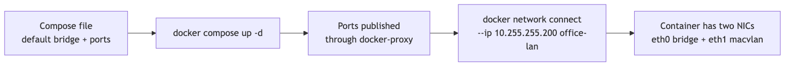


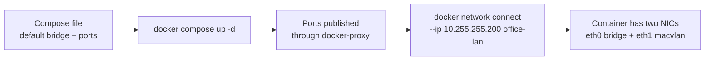


```bash
docker compose -f docker-compose.cloud.yml up -d
docker network connect --ip 10.255.255.200 office-lan unifi-access
```

After this:

```
NAMES          PORTS
unifi-access   0.0.0.0:443->443/tcp, 0.0.0.0:80->80/tcp, ...
```

```
$ docker exec unifi-access ip -brief addr
eth0@if31  UP  172.17.0.2/16
eth1@if15  UP  10.255.255.200/24
```

That got the web UI working and the devices adopting, but it gave UniFi OS two local identities. UniFi Core's nginx listened on `0.0.0.0:443` inside the container. Cloudflare could reach the EIP through the bridge NIC. The Hub Mini could reach `10.255.255.200` through macvlan. Access could also see `172.17.x.x` / `172.18.x.x` and sometimes use that address in controller identity, management network selection, and invite-link generation.

The controller API exposed the symptom:

```bash
curl -sS http://127.0.0.1:12080/api/v2/settings | jq .
curl -sS http://127.0.0.1:12080/api/v2/info \
    | jq -c '{host:.data.host.ip, wan:.data.host.wan_ip}'
```

The other problem was packet path. Docker documents that it creates firewall rules for bridge networks and port publishing, while no such rules are created for `macvlan` networks ([docs][docker-firewalls]). In my two-NIC workaround, those worlds overlapped.

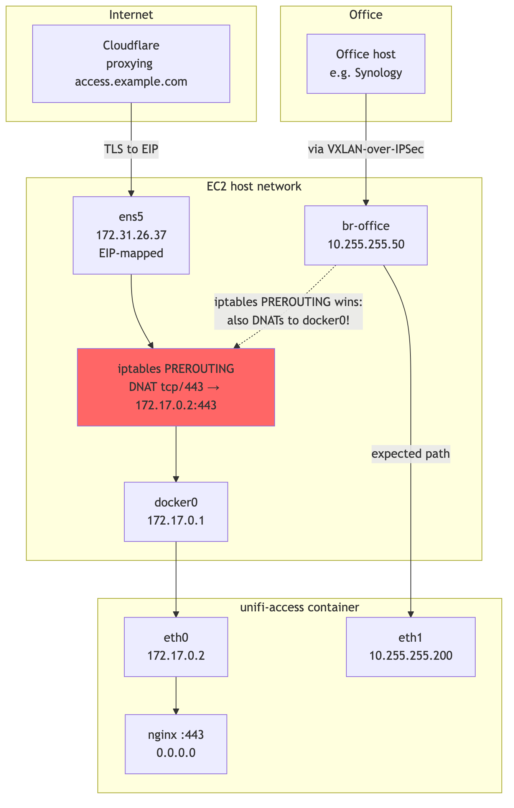


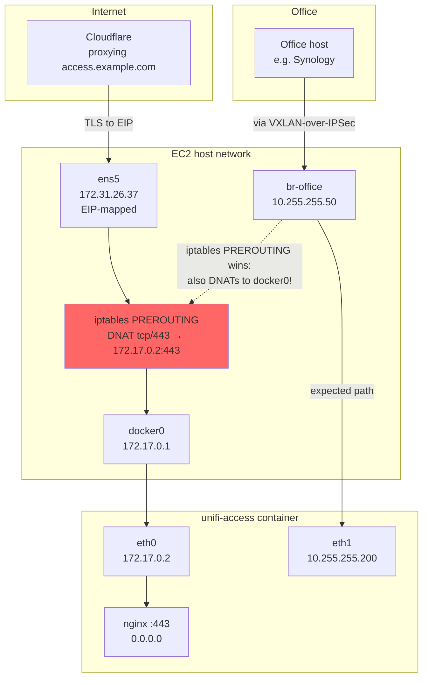


The observed DNAT rule was broad enough to match traffic by destination port:

```
DNAT  tcp  *  *  0.0.0.0/0  0.0.0.0/0  tcp dpt:443  to:172.17.0.2:443
```

That matched traffic destined for the EIP and also matched traffic destined for the macvlan IP `10.255.255.200`. From the office, a request to `https://10.255.255.200` arrived on `br-office`, got DNATed to `172.17.0.2:443`, and the kernel forwarded it to the docker bridge instead of delivering it to the macvlan NIC that the LAN client expected.

The final fix was to remove the second identity:

- no docker bridge network
- no `ports:` block
- one macvlan interface
- default route through the office gateway
- web ingress through the existing Synology Traefik on the LAN

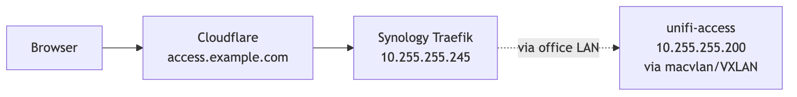


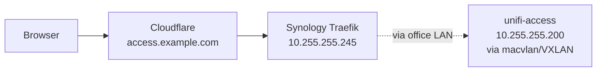


The durable Compose shape is boring:

```yaml
services:
  unifi-os:
    image: unifi-os-docker-arm64:stable
    networks:
      office-lan:
        ipv4_address: 10.255.255.200

networks:
  office-lan:
    external: true
```

The final container has one network interface:

| Interface | Subnet | Used by | Why it exists |
|---|---|---|---|
| `eth0` | 10.255.255.0/24 (macvlan / VXLAN bridge) | UDP 10001 discovery, MQTT 12812, Access UI 12443, outbound HTTPS, DNS, firmware checks | The only L2 identity UniFi OS and the door hardware should see |

The clean post-restart check looks like this:

```bash
$ docker exec unifi-os ip -brief addr
lo      UNKNOWN  127.0.0.1/8 ::1/128
eth0    UP       10.255.255.200/24

$ docker exec unifi-os ip route
default via 10.255.255.1 dev eth0
10.255.255.0/24 dev eth0 proto kernel scope link src 10.255.255.200

$ docker exec unifi-os curl -sS http://127.0.0.1:12080/api/v2/info \
    | jq -c '{host:.data.host.ip, wan:.data.host.wan_ip}'
{"host":"10.255.255.200","wan":"10.255.255.200"}
```

The Security Group on the EC2 also got much smaller. Web access does not enter through the EIP anymore, so 80/443 from the Internet are not needed. Access ports do not need direct allowlists from the office subnet either, because that traffic now arrives encapsulated as VXLAN inside IPSec - the SG only sees the outer IPSec/UDP-4500 packets.

Final inbound rules:

| Proto | Port | Source | Purpose |
|---|---|---|---|
| UDP | 500 | Mikrotik public IP | IKE |
| UDP | 4500 | Mikrotik public IP | IPSec NAT-T |
| ESP (50) | - | Mikrotik public IP | ESP |
| ICMP | - | 10.255.255.0/24 | Diagnostics over L2 |

Everything else is denied. The controller has no Internet-exposed application surface. Its public identity is mediated by Cloudflare and Synology Traefik, not by an Internet-facing socket on the controller itself.

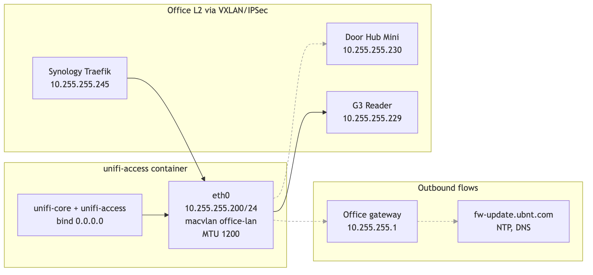


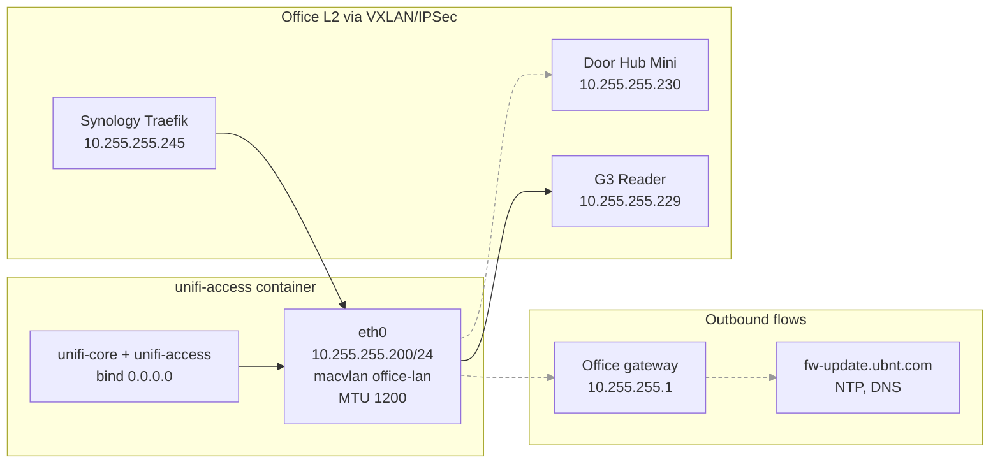


---

## The Discovery Handshake, Live

After the L2 bridge and macvlan attachment, `tcpdump` on `vxlan0` from the EC2 side captured the full UniFi discovery dance:

```
22:30:58.954333 IP 10.255.255.200.35510 > 233.89.188.1.10001:
    UDP, length 4
22:30:58.954387 IP 10.255.255.200.35510 > 10.255.255.255.10001:
    UDP, length 4

22:30:58.965433 IP 10.255.255.230.10001 > 10.255.255.200.35510:
    UDP, length 241
22:30:58.976442 IP 10.255.255.229.10001 > 10.255.255.200.35510:
    UDP, length 212
22:30:58.977665 IP 10.255.255.229.44119 > 255.255.255.255.10001:
    UDP, length 212
```

The first two lines are the controller (10.255.255.200) sending its discovery probes to UniFi's multicast group `233.89.188.1:10001` and the LAN broadcast `255.255.255.255:10001`. The next three are the Hub Mini at `.230` and the G3 Reader at `.229` responding directly with their identity payloads.

This is the protocol working as Ubiquiti designed it. Nothing about the controller's actual location in AWS is visible from this trace; the L2 extension makes the topology look local.

Sessions established cleanly after that:

```
$ docker exec unifi-access ss -tnp state established | grep 10.255
tcp 0  26400  10.255.255.200:12443  10.255.255.230:51802  unifi-access-ap
tcp 0  0      10.255.255.200:12812  10.255.255.230:51799  unifi-access-ap
```

The Hub Mini holds two TCP sessions to the controller: 12443 for the Access UI/API channel and 12812 for MQTT control commands. Real-time door operations flow over 12812.

---

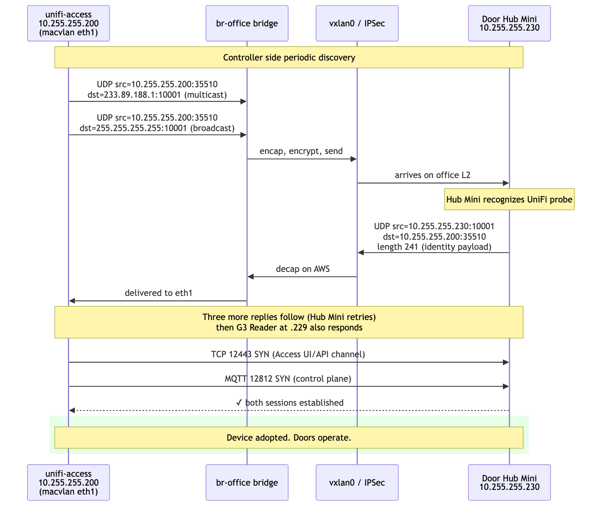





## Mikrotik Bridge Counters Lie

A late-night debugging detour cost a real hour:

```
/interface print stats where name=vxlan-aws
0 RS vxlan-aws   RX-BYTE=0   TX-BYTE=28894   TX-PACKET=410
```

The RX counter on vxlan-aws was zero. The TX counter was incrementing rapidly. By all visible evidence, traffic was leaving Mikrotik for AWS but nothing was coming back.

The bridge host table told a different story:

```
/interface bridge host print where on-interface=vxlan-aws
#  MAC-ADDRESS         BRIDGE  REMOTE-IP
0  22:0C:29:0C:2F:11   bridge  (local)
1  4A:51:CF:46:03:91   bridge  172.31.26.37
2  62:F0:60:4C:FB:10   bridge  172.31.26.37
```

The bridge had clearly learned the AWS-side MAC addresses, including the docker container's macvlan MAC, with REMOTE-IP correctly pointing at the EC2 private address. That can only happen from incoming VXLAN packets.

On RouterOS 7.19.1 in this setup, `/interface print stats` lied for the VXLAN interface. The bridge-level statistics were correct. Trust `/interface bridge host` and `/interface bridge port print stats`, not `/interface print stats` when troubleshooting VXLAN.

## What I Would Validate Before Trusting It

Working in this layered topology means there are several places where a single configuration error gives the wrong-but-plausible answer. I would not trust the design until all of these pass on a clean restart:

**IPSec underlay:**

```bash
ip xfrm state | grep -A2 reqid
ipsec statusall | grep -E "ESTABLISHED|INSTALLED"
```

**VXLAN encapsulation:**

```bash
# On EC2: outer encrypted packets should be flowing both directions
tcpdump -ni ens5 "udp port 4500 or udp port 4789"

# Inside the tunnel: bridge-relevant frames
tcpdump -ni vxlan0 "udp port 10001 or arp"
```

**Bridge state, both ends:**

```bash
# AWS side
bridge fdb show dev vxlan0
ip neigh show dev br-office

# Mikrotik side
/interface bridge host print where on-interface=vxlan-aws
```

**End-to-end L2 reachability:**

```bash
# From AWS host
ping -I br-office 10.255.255.230   # the Hub Mini

# From Mikrotik
/ping address=10.255.255.200 src-address=10.255.255.1
```

**UniFi-level adoption:**

```bash
docker exec unifi-access ss -tnp state established | grep -E ":(12443|12812)"
docker exec unifi-access journalctl -u unifi-access --since "5 minutes ago" \
    | grep -iE "adopt|inform|84:78"
```

**Container management path:**

```bash
docker exec unifi-access ip -brief addr
docker exec unifi-access sh -c \
    'iface=$(ip -o -4 addr show | awk '"'"'$4 ~ /^10\\.255\\.255\\.200\\// {print $2; exit}'"'"'); cat /sys/class/net/$iface/mtu'
docker exec unifi-access curl -sS http://127.0.0.1:12080/api/v2/settings \
    | jq -c '{controller_ip:.data.controller_ip,
              mngt_network_id:.data.mngt_network_id,
              discovery_broadcast_ips:.data.discovery_broadcast_ips}'
```

If any of these regress, the layer that broke is usually obvious from where the trace stops.

---

## What This Design Commits You To

This design gives a cloud-hosted Access controller adoption parity with a local one, at the cost of explicit network plumbing.

The useful properties:

- The G3 Door Hub Mini adopts and operates exactly as it would on a Ubiquiti console - no fork of its firmware, no SSH, no manual `set-inform`.
- The controller container is unreachable from the Internet directly. The only public surface is what Cloudflare and Synology Traefik expose.
- Door operations continue for already-synced credentials if AWS becomes unavailable. The controller is needed for new changes and sync, not for every local unlock decision.
- The architecture is reproducible. The VXLAN/bridge/macvlan bits are vanilla Linux primitives; the Mikrotik bits are stock RouterOS.

The explicit constraints:

- MTU has to be set consistently at three layers (bridge, vxlan, container interface). Forget one and TCP flows hang under load.
- The IPSec tunnel is on the critical path. Lose IPSec, the VXLAN encapsulation has nowhere to go, all adoption traffic stops within DPD timeout.
- In my Compose/Engine version, `macvlan` plus `ports:` exposed ports without publishing them, and the bridge interface later leaked into UniFi OS controller identity. For this design, use a single macvlan network and no published EC2 ports.
- Docker's port-publish DNAT competes with macvlan direct access. You can have one or the other; combining them through the same iptables PREROUTING chain leaves at least one path broken.
- The container's outbound Internet path now depends on the office gateway accepting `10.255.255.200` as a normal LAN host. Verify firmware-update URLs from inside the container after every network change.
- In my RouterOS 7.19.1 run, VXLAN interface counters lied. Use bridge-level stats.
- The Synology kernel does not let you run `binfmt_misc`-registered foreign-arch binaries, regardless of privileges. arm64 workloads need a real arm64 host.

For a homelab access control system that should not depend on Ubiquiti consoles or on bringing the controller indoors, this is the simplest design I could find that respects the actual protocol constraints instead of fighting them.

---

## References

- [dciancu/unifi-protect-unvr-docker-arm64][dciancu] - the foundation pattern this work extends
- [Vol 2: Sixty Seconds to Nothing][vol2]
- [UniFi Access on UniFi Consoles - support article][ubnt-access-consoles]
- [Getting Started with UniFi Access - ports and communication model][ubnt-access-getting-started]
- [DHCP Option 43 for UniFi Access devices - r/UNIFI thread][reddit-opt43]
- [Linux VXLAN kernel documentation][kernel-vxlan-docs]
- [Linux VXLAN man page][linux-vxlan]
- [RouterOS 7 VXLAN documentation][routeros-vxlan]
- [Docker macvlan driver][docker-macvlan]
- [Docker port publishing][docker-port-publishing]
- [Docker packet filtering and firewalls][docker-firewalls]
- [strongSwan NAT traversal][strongswan-nat-t]
- [VXLAN: RFC 7348][rfc-vxlan]

[dciancu]: https://github.com/dciancu/unifi-protect-unvr-docker-arm64
[vol2]: /posts/2026/05/26/unifi-access-unvr-daemons/
[ubnt-access-consoles]: https://help.ui.com/hc/en-us/articles/22230509487639-UniFi-Consoles-with-UniFi-Access-Support
[ubnt-access-getting-started]: https://help.ui.com/hc/en-us/articles/17452334269975-Getting-Started-with-UniFi-Access
[reddit-opt43]: https://www.reddit.com/r/UNIFI/comments/16v6js7/is_dhcp_option_43_supported_by_unifi_door_access/
[kernel-vxlan-docs]: https://docs.kernel.org/networking/vxlan.html
[linux-vxlan]: https://www.man7.org/linux/man-pages/man8/ip-link.8.html
[routeros-vxlan]: https://help.mikrotik.com/docs/spaces/ROS/pages/100007937/VXLAN
[docker-macvlan]: https://docs.docker.com/engine/network/drivers/macvlan/
[docker-port-publishing]: https://docs.docker.com/engine/network/port-publishing/
[docker-firewalls]: https://docs.docker.com/engine/network/packet-filtering-firewalls/
[strongswan-nat-t]: https://docs.strongswan.org/docs/latest/features/natTraversal.html
[rfc-vxlan]: https://www.rfc-editor.org/rfc/rfc7348
