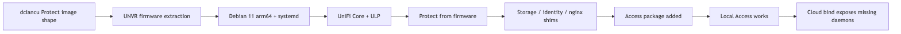
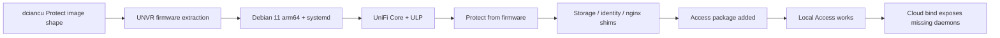
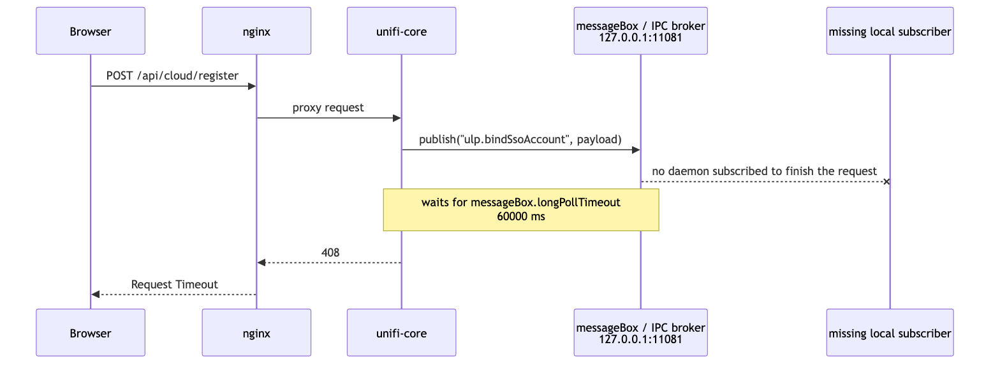
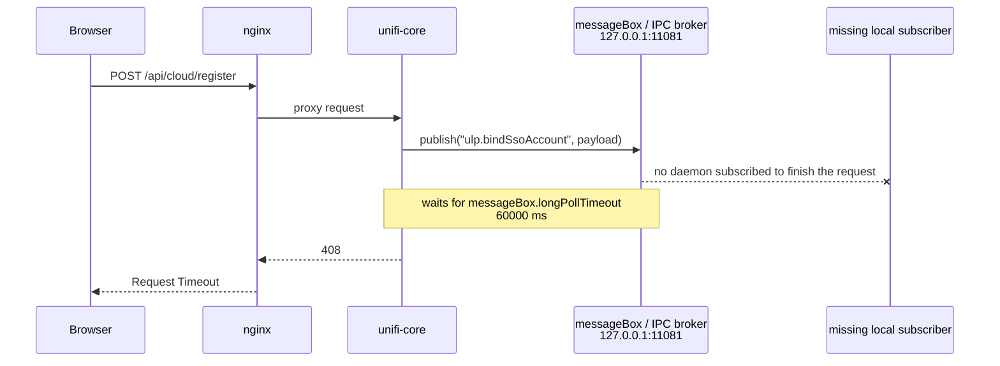
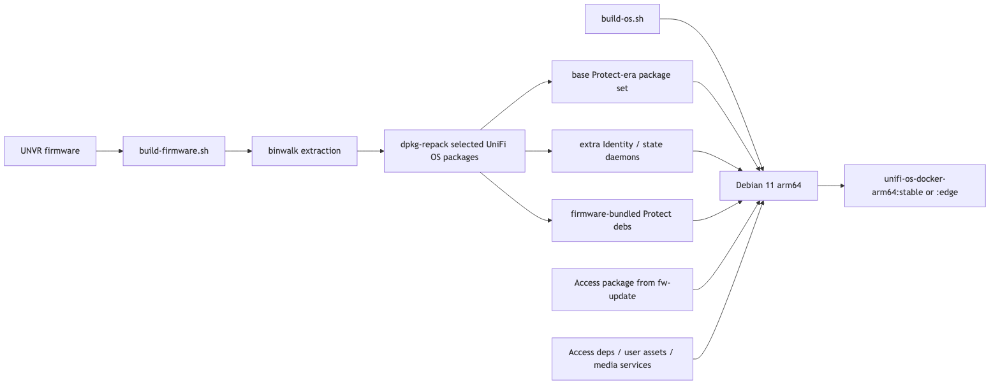
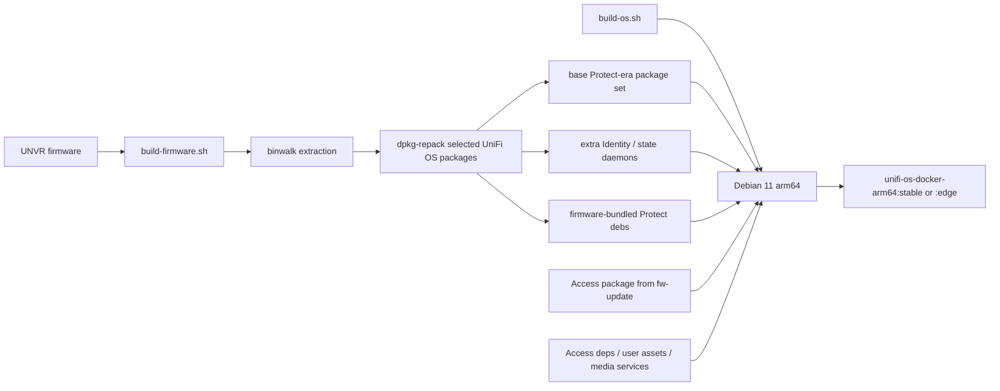
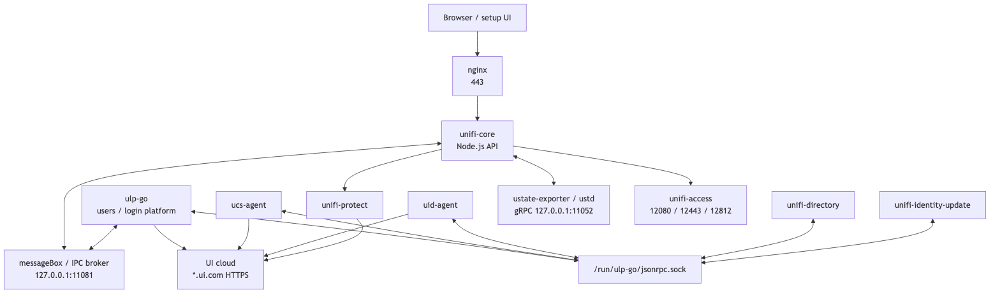
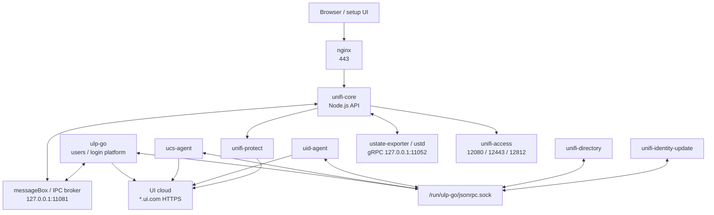

## Preamble: Access on Top of a Protect Container

This did not start as a clean-room UniFi OS container project.

The starting point was much more practical: take the already working [dciancu/unifi-protect-unvr-docker-arm64][dciancu] image shape and add Access on top of it.

That upstream project had already solved the boring but painful parts:

1. extract UNVR firmware;
2. repack the required UniFi OS `.deb` packages;
3. install them into an ARM64 Debian image;
4. run systemd as PID 1 inside a privileged container;
5. fake enough UNVR hardware identity and storage state for UniFi OS to boot;
6. run Protect from the firmware bundle.

So the first Access attempt was intentionally small. Keep the Protect container shape, install the Access package and its obvious dependencies, add the launcher/nginx bits, and see how far it gets.

The annoying part was that it got very far.

The UniFi OS wizard completed. Access opened. After the network work from Vol 1, the Hub Mini and G3 reader adopted. Door unlock worked. Logs were ugly in places, but nothing looked fundamentally dead.

That made the project feel mostly finished.

Then we started adding capabilities.

Not just “can the local door open”, but:

- can the console sign in with a Ubiquiti account;
- can ownership state sync back from UI cloud;
- can Access and Identity agree on users;
- can the log noise be reduced instead of hidden;
- can the image carry Protect and Access in one UNVR-shaped userspace;
- can the repo become something reproducible instead of a one-off patched container.

That is where the first image stopped being enough.

The lesson of this post is not “how to start Access once”. The first image already did that. The lesson is what changed when the goal moved from an Access app running inside a Protect-style container to a fuller UniFi OS console shape.

---

## It Booted. It Adopted Doors. Then It Tried to Phone Home.

[Vol 1][vol1] was the network story.

Access adoption did not care that the controller was reachable over a normal routed tunnel. It cared that discovery looked local. The final shape was VXLAN-over-IPSec, a Linux bridge on the AWS side, and one Docker macvlan interface that made the controller appear as `10.255.255.200` on the office LAN.

That solved the physical part of the problem. The Hub Mini and G3 reader could discover the controller, adopt, receive config, and stay online.

The image looked solved too.

The controller booted. The UniFi OS wizard completed. Access opened. The door hardware adopted. Door unlocks worked.

Then I clicked **Sign in with Ubiquiti Account**.

The browser waited for one minute and returned:

```text
408 Request Timeout
```

Not five seconds. Not “somewhere around a minute”.

Almost exactly sixty seconds.

The obvious logs did not say “wrong package”, “missing daemon”, or “cloud rejected this fake console”. The browser SSO flow itself finished. The failure happened after that, when UniFi Core tried to bind the signed-in UI account to the local console.

That became the second half of the project.

Vol 1 made the network look like the office LAN. Vol 2 is about making Docker look enough like a UniFi console that UniFi Core, Access, Identity, and UI cloud could agree on what the console was.

Ubiquiti does not support this deployment model. Their self-hosting docs allow UniFi OS Server for Network and some UniFi OS features, but state that other applications such as Protect and Access must run on a compatible UniFi Console. Their Access docs also say setup requires a UniFi Console that supports the Access application. This post is about an unsupported lab build, not a production recommendation.

---

## The Pattern We Copied

The upstream Protect image was the parent pattern, not a random reference.

It already showed that a UNVR-shaped userspace could run in Docker if the image kept enough of UniFi OS intact. It downloaded UNVR firmware, extracted UniFi-maintained packages, carried `unifi-core`, `ulp-go`, `uos*`, `unifi-directory`, `unifi-assets-unvr`, Node packages, and installed Protect from the firmware bundle.

My first mental model was simple:

```text
Protect-in-Docker
    -> add Access package
    -> add Access dependencies
    -> patch launcher / nginx
    -> keep the same UNVR identity
    -> done
```

That was a reasonable starting point because the local app path really did work.

It was also incomplete. Protect and Access share the same UniFi OS shell, but they do not exercise the same internal workflows. Protect could be useful with the smaller upstream daemon set. Access cloud ownership pushed deeper into the Identity and credential side of UniFi OS.







---

## The First Image Looked Better Than It Was

The first Access-on-Protect image was good enough to be deceptive.

It had the usual console shims:

| Patch | Why it existed |
|---|---|
| `ustorage` sed patch in `service.js` | Push one storage path away from a missing local gRPC service and into a shell-command fallback. |
| `/usr/bin/ustorage` shim | Return plausible disk and space JSON when UniFi Core shells out. |
| `/sbin/mdadm` and `/usr/sbin/smartctl` shims | Fake RAID and SMART responses that real console hardware would normally provide. |
| `/sbin/ubnt-tools` identity shim | Report a UNVR-shaped console identity instead of whatever container hardware actually looks like. |
| nginx setup hostname patch | Allow reverse-proxied hostnames instead of redirecting every non-`unifi` host to `https://unifi`. |
| PostgreSQL relocation | Persist UniFi Core and Access databases under mounted `/data`, not ephemeral image paths. |
| timesync overrides | Let systemd time sync run in a container. Cloud auth and bad clocks do not mix. |

None of that was wasted work. Those patches got the image far enough to pass setup, run Access, and operate a door.

But “the door opens” was only the first capability.

The next capability was cloud ownership. That required more than the Access app and more than the Protect-era shims. It required local UniFi OS daemons that could consume Identity and credential messages from UniFi Core.

The bug only appeared when the local console tried to become a cloud-managed console.

That is a nastier class of failure. Local services can look mostly fine while one internal request/reply chain is missing a subscriber.

---

## The Symptom: Exactly Sixty Seconds

The user-visible failure was boring:

```text
POST /api/cloud/register
408 Request Timeout
```

The useful part was the timing.

The nginx-side request time was basically one minute:

```text
POST /api/cloud/register
status=408
request_time=60.001
upstream_response_time=-
```

The `u_rt=-` part matters. This was not a normal upstream HTTP service returning an error. From nginx's point of view, there was no useful upstream response.

That sent me down two wrong paths first.

The wrong paths are worth keeping in the story because they teach the difference between loud logs and blocking logs.

---

## Dead End 1: The Storage gRPC Error Was Loud, Not Causal

The loudest error was this:

```text
[grpc] Failed to connect to the gRPC server:
14 UNAVAILABLE: No connection established.
Last error: Error: connect ECONNREFUSED 127.0.0.1:11052
```

It repeated every few seconds.

That looked guilty. A local gRPC service was missing. A cloud-register API was timing out. Easy conclusion: fix storage and cloud sign-in will work.

But the timing did not match.

The `11052` error happened before the cloud-register attempt, during the cloud-register attempt, and after the cloud-register attempt. It was background noise from an incomplete console image, not the exact thing holding `/api/cloud/register` open for sixty seconds.

The repo still carries the inherited storage workaround because it is needed for setup paths:

```bash
grep -c 'return at(),!0' /usr/share/unifi-core/app/service.js
# 1
```

The sed patch forces one UniFi Core storage path into a shell-command fallback. The `/usr/bin/ustorage` shim then returns disk, space, and config JSON.

But that patch never meant “all storage/state calls are fixed”. Other state paths still tried to talk to a real console daemon on `127.0.0.1:11052`.

The later UNVR rebuild did fix this noise by including `ustate-exporter` and `ustd`. That was good, but it was not the root cause of the 408.

| Signal | What it proved | What it did not prove |
|---|---|---|
| `ECONNREFUSED 127.0.0.1:11052` | A local UniFi OS storage/state daemon was missing. | It did not explain the exact 60-second cloud-register timeout. |
| `ustorage` sed patch present | One setup-breaking storage path was redirected to the shell shim. | It did not cover every storage/state RPC. |
| Wizard completed | The storage failure was survivable for setup. | It did not mean the console service graph was complete. |

---

## Dead End 2: `ulp-go` Was Alive

The next suspect was `ulp-go`, the Users/Login Platform service.

The request looked like a UI account bind operation, so `ulp-go` seemed like the obvious place to look.

But `ulp-go` was not dead.

It was running. It had local connections to UniFi Core's IPC port. Its status showed it was configured. Its log had the normal startup lines:

```text
init wsClient
Connected to server
Subscribe event success
controllerStatus: READY
isConfigured: true
```

During the exact sixty seconds where `/api/cloud/register` hung, `ulp-go` did not log a failed outbound request. It did not log a token rejection. It did not crash.

It was just quiet.

That broke my first model of the flow. I had assumed something like this:

```text
unifi-core
    -> HTTP request
    -> ulp-go
    -> UI cloud
```

The actual shape was closer to this:

```text
unifi-core handler
    -> publish internal message
    -> wait for local subscriber reply
    -> no subscriber replies
    -> timeout
```

A healthy `ulp-go` process did not prove that every `ulp.*` or cloud-binding topic had a consumer.

---

## The Number That Explained the Timeout

The useful clue was a config value, not a stack trace.

Inside UniFi Core:

```yaml
messageBox:
  maxSubscriptionBacklog: 1000
  subscriptionReaperInterval: 30000
  longPollTimeout: 60000
  keepAliveTimeout: 60000
```

The API call waited sixty seconds because the handler was waiting on a messageBox request/reply path.

The chain looked like this:

```text
POST /api/cloud/register
    -> unifi-core handler
    -> publish("ulp.bindSsoAccount", payload)
    -> wait for response
    -> no local subscriber answers
    -> messageBox.longPollTimeout
    -> 408
```

That was the important inversion.

The browser-visible failure did not mean “UI cloud rejected the console”. It meant UniFi Core published an internal message and nobody in the local container answered it.

Reverse-engineering this out of `service.js` was ugly. In this UniFi Core build, `service.js` is a large minified blob. Every diagnostic involves grepping for strings around anonymous variables and then trying to reconstruct intent from call shape.

But the timeout made the architecture visible.







The missing piece was not another nginx route. It was not a firewall rule. It was not the public cloud endpoint.

It was the local UniFi OS daemon graph.

---

## The Package Set Was the Real Bug

The firmware family was not the problem anymore. We were already using the right family: UNVR.

The problem was that the first Access image treated the upstream Protect package selection as enough of UniFi OS.

For Protect, that selection is practical: core OS packages, `ulp-go`, directory, assets, UOS helpers, Node packages, and the Protect application from the firmware bundle. That is enough to make Protect useful inside the UNVR-shaped container.

Access raised the bar.

The 408 showed that local Access was not the same as a complete console identity flow. UniFi Core published an internal message for SSO binding, then waited for a local daemon to answer. The app was present. The web UI was present. The door device path was present. The local subscriber for the cloud-ownership path was not.

So the rebuild did not mean “switch away from the Protect pattern”. It meant extend the Protect pattern in the direction it was already pointing:

```text
UNVR firmware is still the source
UNVR identity is still the runtime lie
Protect still comes from the firmware bundle
Access is installed on top
but the extracted daemon set must be larger
```

That changed the target from:

```text
make Access start
```

to:

```text
make UniFi OS complete enough for Access, Identity, and cloud ownership
```

Those are not the same thing.

---

## The Daemons That Made It a Console

The rebuild stayed with UNVR firmware, but pulled in the missing UniFi OS support packages instead of only the smaller Protect-era selection.

The critical additions were not application packages. They were the daemons around the application.

| Package / daemon | Role | Why it mattered |
|---|---|---|
| `ucs-agent` | UniFi Credential Server agent | Handles credential and SSO ownership workflows that the cloud-bind path depends on. |
| `uid-agent` | UniFi Identity agent | Connects local identity state, users, and UID flows. |
| `unifi-identity-update` | Identity update worker | Keeps local identity state synchronized after setup and sign-in. |
| `ucore-setup-listener` | Post-setup hook listener | Handles “console configured” transitions after the wizard. |
| `ustate-exporter` | Local state exporter | Provides the gRPC endpoint UniFi Core was polling on `127.0.0.1:11052`. |
| `ustd` | Storage/status daemon | Part of the local state and storage path. |
| `ubnt-rpsd` | RPC subprocess / hardware-related daemon | Comes with the console graph; may be cosmetic or hardware-only in Docker. |
| `ubnt-ucp4cpp` | UCP4 protocol library | Shared device protocol dependency used by UniFi apps. |
| `unifi-directory`, `unifi-hal`, `ubnt-common`, `libubnt*` | Shared platform libraries/services | Support the daemon graph above. |

The current repo extracts the selected UNVR packages explicitly instead of copying every `.deb` blindly:

```dockerfile
cp ubnt-archive-keyring_* ubnt-tools_* ubnt-ucp4cpp_* ubnt-rpsd_* \
   ubnt-common_* ubnt-binmecpp_* ubnt-disk-smart-mon_* \
   unifi-core_* ulp-go_* unifi-assets-unvr_* unifi-directory_* unifi-hal_* \
   unifi-email-templates-all_* unifi-identity-update_* \
   uos_* uos-agent_* uos-discovery-client_* \
   ucs-agent_* uid-agent_* ucore-setup-listener_* uled-control_* \
   ustate-exporter_* ustd_* ubnd_* \
   c2lib_* libcurlpp_* libsodiumpp_* libubnt_* libuled_* simple-pid_* \
   analytic-report-go_* ble-http-transport_* \
   python3-unifi-console-protos_* \
   node* ../debs/
```

This manifest is intentionally explicit. If Ubiquiti renames or removes a package, I want the build to fail loudly.

There is one practical footnote: the line between “hardware-only” and “required dependency” is not always clean. Some packages look like they should be skipped in a container but still satisfy service dependencies. That is why the validation suite matters more than trying to reason about every package name in isolation.

---

## Why the Protect Pattern Worked Anyway

This is not a criticism of the Protect container pattern.

The parent project solved a different problem. It built a UNVR-shaped userspace for Protect, and Protect's normal paths were satisfied enough for that application.

Access made the gap visible because its cloud sign-in path exercised more of the Identity and credential side of UniFi OS.

So the lesson is not:

```text
Protect-in-Docker is incomplete.
```

The lesson is:

```text
Access uses more of the console identity stack than the first copied image included.
```

The first build could adopt doors because the local Access service worked. It could not finish cloud ownership because the local message-bus consumer chain was incomplete.

---

## The Rebuild: Protect Plus Access, With the Missing Daemons

The fix was not to abandon the upstream image shape.

The fix was to make the image more honest about what it wanted to be: a UNVR-shaped UniFi OS userspace with both Protect and Access, plus the support daemons that Access needs for Identity and cloud ownership.

The repo now builds in two stages:

1. `build-firmware.sh` downloads or uses a selected UNVR firmware image, extracts the firmware, and writes generated artifacts under `firmware/<series>/`.
2. `build-os.sh` installs the extracted packages, plus Protect and Access, into a Debian 11 ARM64 systemd image.

There is also a single-file multi-stage `Dockerfile` for users who want `docker build .`, but the split scripts are easier to debug.







The stable build uses pinned Access and AI-feature package URLs where needed, and installs Protect from the firmware bundle. The edge build resolves newer app packages from Ubiquiti's firmware update endpoints. That gives two useful modes:

| Build mode | Use it when |
|---|---|
| `BUILD_STABLE=1` | You want a known baseline and fewer moving parts. |
| `BUILD_EDGE=1` | You are testing newer Access/Protect packages or chasing a bug fixed upstream. |

Access is downloaded on top because UNVR firmware does not bundle it in the same way it bundles Protect. Protect comes from the UNVR firmware extraction, so the repo installs both apps into one image.

That gives the image a clearer identity:

```text
UNVR-shaped UniFi OS userspace
    + Protect from UNVR firmware
    + Access from fw-update package
    + extra Identity and state daemons Access needs
```

The important design choice is that the repo keeps the upstream Protect inheritance visible. This is not “my own UniFi OS from scratch”. It is the Protect container pattern expanded until Access cloud ownership stopped timing out.

---

## The Swap That Proved the Theory

I did not replace the old container blindly.

The old image stayed around as rollback:

```bash
docker rename unifi-access unifi-access-v0.2.0
```

The persistent state stayed mounted:

```text
/srv/unifi-access/srv
/srv/unifi-access/data
/srv/unifi-access/persistent
```

The new image started with the same state and the same office-facing network identity from Vol 1.

The first surprise was that cloud activation was already true after restart:

```bash
docker exec unifi-os systemctl show ulp-go -p StatusText | \
  grep -oE 'standardActivated":[a-z]+|ucsAgentVersion":"[^"]+"'
```

Expected shape:

```text
standardActivated":true
ucsAgentVersion":"1.6.98+733"
```

I had not clicked the cloud sign-in button again.

That changed the interpretation of the earlier 408.

The browser-visible `/api/cloud/register` request had timed out locally, but the server-side cloud claim had apparently completed. The missing part was local state convergence. The old image had no daemon to consume the internal message and flip the local state. The new one did.

The evidence table looked much better:

| Check | Result |
|---|---|
| `ulp-go` status | `standardActivated: true` |
| `ucsAgentVersion` | Present |
| `ulp-go-app` outbound TLS | Established to UI cloud |
| `uid-agent-app` outbound TLS | Established to UI cloud |
| `unifi-protect` outbound TLS | Established to UI cloud |
| `127.0.0.1:11052` | Listening |
| repeated `ECONNREFUSED 127.0.0.1:11052` | Gone |
| Access device sessions | Still established on `12443` / `12812` |

Example checks:

```bash
docker exec unifi-os ss -tnp state established | grep ':443'

docker exec unifi-os ss -ltnp | grep 11052

docker exec unifi-os tail -n 20 /data/unifi-core/logs/grpc.log
```

The log line that mattered:

```text
call cloud api https://cell3.api.identity.ui.com/standard/api/v1/public/console/ownership/check [POST] success
```

That was the answer to the title.

The sixty-second timeout was not “UI cloud hates Docker”. It was “UniFi Core is waiting for a local console daemon that is missing”.

---

## The Last Mile: Registered Is Not Connected

The daemon rebuild fixed the sixty-second bind timeout, but it exposed one more trap.

Cloud registration and cloud connection are different states.

After the Ubiquiti account flow completed, UniFi Core had clearly registered the console:

```text
2026-05-26T16:38:03+03: registering device for cloud access
2026-05-26T16:38:04+03: registered device for cloud access: deviceId=<device-id>, ownerId=<owner-id>
```

But the console still did not appear in the cloud list, and cloud-backed operations failed locally:

```text
Can't publish to "api/v1/create-auth-token/...", cloud connection not established
Can't publish to "api/v1/create-invitation/<device-id>", cloud connection not established
```

That made the state machine clearer:

| State | What it means |
|---|---|
| Cloud account bind succeeded | Ubiquiti accepted the ownership request. |
| `standardActivated: true` | Local ULP state knows the console is owned. |
| Cloud connection established | UniFi Core has a live cloud transport and can publish operations. |

The broken value was hiding in UniFi Core's settings:

```yaml
anonymous_device_id: "Ubiquiti system tools\nCopyright 2006-2024, Ubiquiti, Inc. <support@ui.com>\n...\thwaddr"
```

That value should have been a stable UUID. Instead, a failed identity-helper path had persisted `ubnt-tools` banner/help text as the anonymous console ID. `/data/uuid.txt` already had a valid UUID; UniFi Core was just not using it.

The durable fix had two parts:

1. `ubnt-tools id <file>` now writes the same generated board identity to the requested file that `ubnt-tools id` prints to stdout.
2. `init_console.sh` now repairs missing, `null`, or non-UUID `anonymous_device_id` values back to the stable `/data/uuid.txt` value.

After repairing the live settings file and restarting `uos-agent` plus `unifi-core`, the cloud log changed shape:

```text
2026-05-27T00:09:10+03: Device connected to cloud
subscribe device/<device-id>
subscribe $aws/things/<device-id>/shadow/name/+/update/delta
subscribe device/<device-id>/client/#
subscribe d/<device-id>/c/#
subscribe device/<device-id>/ping
subscribe device/<device-id>/application/+
subscribe d/proxy/<device-id>/#
Successful sync owner to cloud
```

At that point `unifi-core` also had an established MQTT/TLS connection to `:8883`, and the log stopped producing fresh `cloud connection not established` errors.

That is the distinction I wish I had checked earlier: a successful account bind proves ownership, not necessarily a usable cloud transport.

---

## Local Repo Defaults vs the Cloud Topology

The public repo defaults to host networking:

```yaml
network_mode: host
```

That is the right default for most Linux users. If the container runs on a local ARM64 host on the same LAN as the Access devices, host networking is the simplest way to make discovery and adoption work.

The cloud deployment from Vol 1 is different. There the container does not live on the office LAN, so host networking on the EC2 instance would only expose AWS interfaces. The cloud version still needs the macvlan/VXLAN shape:

```text
Office LAN
    -> VXLAN-over-IPSec
    -> br-office on EC2
    -> Docker macvlan parent=br-office
    -> unifi-os container IP 10.255.255.200
```

The repo README documents both ideas:

| Deployment | Network mode |
|---|---|
| Local Linux host on the real LAN | `network_mode: host` |
| macOS Docker Desktop lab UI | NATed VM, UI-only; no real hardware adoption |
| Cloud or routed deployment | Explicit L2 extension, bridge, and macvlan-only container |

The warning from Vol 1 still applies: do not attach both the default Docker bridge and the office macvlan. UniFi OS can see the bridge address, select it as controller identity, and generate device or invitation URLs pointing at an unreachable `172.x.x.x` address.

One identity is boring. Boring is good.

---

## The Network Repair Timer Stayed

The rebuilt image still carries the Access network repair timer.

This is a Vol 1 lesson that became repo code.

The timer runs once shortly after boot and then every minute:

```ini
[Timer]
OnBootSec=20s
OnUnitActiveSec=1min
AccuracySec=10s
Persistent=true
```

The service calls:

```text
/usr/sbin/configure_unifi_access_network.sh
```

The script resolves the Access management interface in this order:

1. explicit `ACCESS_MNGT_NETWORK_ID`;
2. interface holding `ACCESS_MNGT_NETWORK_IP`;
3. default-route interface.

Then it lowers the interface MTU if it is larger than `ACCESS_DEVICE_MTU`, defaulting to `1200`:

```bash
device_mtu="${ACCESS_DEVICE_MTU:-1200}"
```

Finally, if the Access API is up, it checks `/api/v2/networks` and `/api/v2/settings`, then updates `mngt_network_id` when needed.

That timer exists because discovery success was not enough. Small UDP discovery packets worked even when larger post-adoption TLS/MQTT flows did not. Docker could recreate the macvlan interface with an unsafe MTU, and Access could drift back to the wrong management network selection.

So the image keeps repairing the two things that made the reader stable:

```text
correct device-facing interface
safe device-facing MTU
```

---

## The IPC Map I Wish I Had First

This is the model that made the failure understandable.

It is not a full UniFi OS spec. It is the map that was useful for debugging this container.







The split that matters:

| Path | What it proves when healthy |
|---|---|
| Browser → nginx → `unifi-core` | The UI/API entrypoint works. |
| `unifi-core` → messageBox `:11081` | Core can publish internal requests. |
| `ulp-go` connected to `:11081` | ULP is alive, but not necessarily the handler for every topic. |
| `ulp-go` / agents → `/run/ulp-go/jsonrpc.sock` | Identity daemons can share local state. |
| `unifi-core` → `127.0.0.1:11052` | Storage/state exporter path works. |
| agents → `*.ui.com:443` | Local console identity stack can reach UI cloud. |

The trap was assuming that one healthy service meant the whole chain was healthy.

`ulp-go` was alive. It just was not enough.

---

## Current Patch Catalog

The UNVR rebuild reduced the number of things that had to be faked, but it did not remove all patches.

This is still Docker pretending to be a console.

| Patch / shim | Where | Without it |
|---|---|---|
| `ustorage` sed patch | `os.Dockerfile`, `/usr/share/unifi-core/app/service.js` | Setup can hit storage paths that expect real console hardware. |
| `/usr/bin/ustorage` shim | `files/usr/bin/ustorage` | Shell fallback has nothing useful to call. |
| `mdadm` shim | `files/sbin/mdadm` | RAID probes fail or return nonsense. |
| `smartctl` shim | `files/usr/sbin/smartctl` | SMART checks fail or block on missing hardware. |
| `ubnt-tools id` shim | `files/sbin/ubnt-tools` | UniFi OS sees the wrong board identity, and file-output callers can poison persistent identity state with non-UUID text. |
| nginx setup hostname patch | `/usr/share/unifi-core/http/site-setup.conf` | Reverse-proxied setup hostnames redirect to `https://unifi`. |
| PostgreSQL cluster handling | `patch_db.sh`, `dbpermissions.service` | Core/app state can land in the wrong place or wrong ownership after restart. |
| systemd time sync overrides | systemd drop-ins | Time sync can refuse to run in a container. |
| `init_console` / `init_device` | oneshot services | Device identity and env-driven console settings are not persisted cleanly; a bad `anonymous_device_id` can survive restarts and block cloud transport. |
| `fix_hosts.service` | `fix_hosts.sh` | Docker rewrites `/etc/hosts`; local resolution can drift. |
| apt source repair | `fix_apt_ubiquiti_sources.sh` | Ubiquiti apt metadata can lag package expectations during app installs or updates. |
| `pg-cluster-upgrade` `rm -f` → `rm -rf` | sed in `os.Dockerfile` | Cluster upgrade can leave directories that block re-init. |
| `uled-ctrl` stub | touched executable in `os.Dockerfile` | LED-control calls can fail on hardware that does not exist. |
| Access nginx route installer | `install_unifi_access_route.sh` | Access can run but fail to appear or proxy correctly through the UniFi OS launcher in some rollback/core combinations. |
| Access network timer | `unifi-access-network.timer` | Wrong management interface or unsafe MTU can return after boot. |

Some of these patches are ugly.

That is fine.

The dangerous thing is not an ugly patch. The dangerous thing is a silent patch that keeps applying after upstream code moved.

Every sed should fail loudly when its anchor disappears:

```bash
if ! sed -i 's|old-pattern|new-pattern|' /path/to/file; then
    echo "ERROR: expected patch pattern not found"
    exit 1
fi
```

The repo follows this pattern for the storage and nginx setup patches. That should stay non-negotiable.

---

## Validation Suite

A clean boot is not proof.

For this image, validation has to prove the app, the console service graph, cloud ownership, and device traffic.

### 1. Package inventory

```bash
docker run --rm unifi-os-docker-arm64:stable dpkg -l | \
  grep -iE 'unifi|ulp|ucs|uid|uos|ubnt|ucore|ustd|ustate'
```

Expected shape:

```text
unifi-core
ulp-go
ucs-agent
uid-agent
unifi-identity-update
ucore-setup-listener
ustate-exporter
ustd
unifi-access
unifi-protect
unifi-assets-unvr
```

Do not pin every version in the article. Pin versions in the repo or release notes.

### 2. Systemd health

```bash
docker exec unifi-os systemctl list-units \
  --type=service \
  --state=running \
  --no-pager | grep -iE 'ulp|ucs|uid|unifi|uos|ustate|ustd|ucore'
```

Expected: the identity and app daemons are running.

Not every hardware daemon matters in Docker. Treat hardware-only failures separately from identity/app failures.

### 3. Cloud activation state

```bash
docker exec unifi-os systemctl show ulp-go -p StatusText | \
  grep -oE 'standardActivated":[a-z]+|ucsAgentVersion":"[^"]+"'
```

Expected:

```text
standardActivated":true
ucsAgentVersion":"..."
```

If `standardActivated` stays false after a successful UI-account sign-in, the identity chain is still broken.

### 4. Cloud connectivity

```bash
docker exec unifi-os grep '^anonymous_device_id:' \
  /data/unifi-core/config/settings.yaml

docker exec unifi-os ss -tnp state established | grep -E ':(443|8883)'

docker exec unifi-os grep -E \
  'Device connected to cloud|Successful sync owner|cloud connection not established' \
  /data/unifi-core/logs/cloud.log | tail -n 40
```

Expected: `anonymous_device_id` is a UUID, identity-related processes have outbound TLS sessions to UI cloud endpoints, `unifi-core` has cloud MQTT/TLS on `:8883`, and there are no fresh `cloud connection not established` errors after connection.

This proves connectivity, not supportability.

### 5. Storage/state gRPC path

```bash
docker exec unifi-os ss -ltnp | grep 11052

docker exec unifi-os tail -n 20 /data/unifi-core/logs/grpc.log
```

Expected: `ustate-exporter` or the relevant state daemon is listening, and the endless `ECONNREFUSED 127.0.0.1:11052` loop is gone.

### 6. Access API and device ports

Ubiquiti documents these Access ports:

| Port | Proto | Purpose |
|---:|---|---|
| `10001` | UDP | device discovery |
| `8080` | TCP/HTTPS | device adoption |
| `12080` | HTTP | localhost Access API |
| `12443` | HTTPS | Access device communication |
| `12455` | HTTPS | OpenAPI when enabled |
| `12812` | MQTT | Access device messaging |

Check device sessions:

```bash
docker exec unifi-os ss -tnp state established | grep -E ':(12443|12812)'
```

Check local API:

```bash
docker exec unifi-os curl -sS http://127.0.0.1:12080/api/v2/settings | jq .
```

### 7. Network identity

For local host-network deployments, the expected address is the host LAN address.

For the Vol 1 cloud/macvlan deployment, the expected address is the office-LAN macvlan address:

```bash
docker exec unifi-os ip -brief addr

docker exec unifi-os curl -sS http://127.0.0.1:12080/api/v2/info | \
  jq -c '{host:.data.host.ip, wan:.data.host.wan_ip}'
```

Expected cloud/macvlan shape:

```json
{"host":"10.255.255.200","wan":"10.255.255.200"}
```

There should be no Docker bridge `172.x.x.x` address for UniFi OS to advertise.

### 8. MTU repair

```bash
docker exec unifi-os sh -c '
iface=$(ip -o -4 addr show | awk "$4 ~ /^10\\.255\\.255\\.200\\// {print \$2; exit}")
cat /sys/class/net/$iface/mtu
'
```

Expected cloud/VXLAN shape:

```text
1200
```

Small discovery packets are not enough. The acceptance test is discovery, adoption, config push, firmware push, and long-lived MQTT.

---

## What This Design Commits You To

This is not a small “Access container”.

It is closer to this:

```text
UNVR-shaped UniFi OS userspace inside Docker
```

That has consequences.

You now depend on a pinned UNVR firmware family. Every UniFi OS bump means extracting packages again, rebuilding, and checking whether package names or minified JavaScript anchors moved.

You inherit services you may not care about. Some are required by Identity or Access. Some exist because firmware packages depend on them. Some expect hardware that a container will never have.

You must disable UniFi OS and app auto-updates after setup. A normal console update can replace patched files, move dependencies, or make the sed anchors invalid.

You must keep backups of all persistent paths:

```text
/srv
/data
/persistent
```

Or in the repo's default local compose layout:

```text
./storage/srv
./storage/data
./storage/persistent
```

You must treat downgrades as unsafe. Access, Protect, PostgreSQL clusters, device firmware, and UniFi Core state do not all roll back cleanly.

The practical split:

| Failure | Treat as |
|---|---|
| `rpsd` failed because no RPS hardware exists | Usually cosmetic; mask or ignore after confirming no dependency. |
| `ustate-exporter` missing on `127.0.0.1:11052` | Real image defect. |
| `ucs-agent` missing | Real image defect. |
| `uid-agent` missing | Real image defect. |
| `standardActivated: false` after cloud sign-in | Real cloud/identity defect. |
| Docker bridge IP appears as controller identity | Real network/design defect. |
| Access device sessions on `12443` / `12812` are missing | Real device-management defect. |
| `ACCESS_DEVICE_MTU` not applied on VXLAN/IPSec path | Real transport defect. |

The final lesson is simple:

> A UniFi application is not the same thing as a UniFi console.

Vol 1 made the controller look local to the door hardware.

Vol 2 made the container look complete enough that UniFi Core, Identity, Access, and UI cloud could agree on the same console.

---

## References

- [Vol 1: Doors Don't Route][vol1]
- [Source repo: kuzaxak/unifi-access-unvr-docker-arm64][repo]
- [Parent repo: dciancu/unifi-protect-unvr-docker-arm64][dciancu]
- [Ubiquiti: Self-Hosting UniFi][ubnt-self-hosting]
- [Ubiquiti: UniFi Consoles with UniFi Access Support][ubnt-access-consoles]
- [Ubiquiti: Getting Started with UniFi Access][ubnt-access-getting-started]
- [ConnorsApps/unifi-os-helm SERVICES.md][unifi-os-helm-services]

[vol1]: /posts/2026/05/24/unifi-access-vxlan-over-ipsec/
[repo]: https://github.com/kuzaxak/unifi-access-unvr-docker-arm64
[dciancu]: https://github.com/dciancu/unifi-protect-unvr-docker-arm64
[ubnt-self-hosting]: https://help.ui.com/hc/en-us/articles/34210126298775-Self-Hosting-UniFi
[ubnt-access-consoles]: https://help.ui.com/hc/en-us/articles/22230509487639-UniFi-Consoles-with-UniFi-Access-Support
[ubnt-access-getting-started]: https://help.ui.com/hc/en-us/articles/17452334269975-Getting-Started-with-UniFi-Access
[unifi-os-helm-services]: https://github.com/ConnorsApps/unifi-os-helm/blob/main/SERVICES.md
